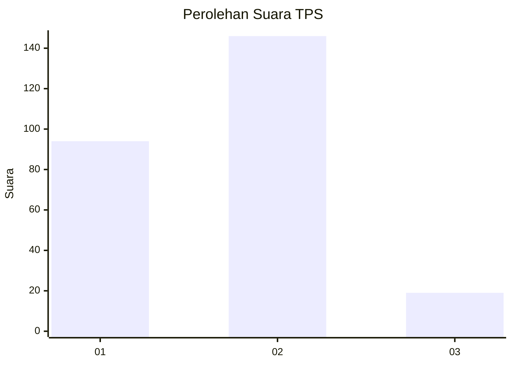

# Hasil

## Grafik

## Tabel

| No. | Nama Paslon    | Suara | Suara (raw) | Persentase |
|:--- |:-------------- | -----:| -----------:| ----------:|
| 1   | ANIES MUHAIMIN | 94    | [94][p-1]   | 36,29      |
| 2   | PRABOWO GIBRAN | 146   | [146][p-2]  | 56,37      |
| 3   | GANJAR MAHFUD  | 19    | [19][p-3]   | 7,34       |

[p-1]: https://github.com/gigit-pemilu/pemilu-2024/blob/main/pilpres/hitung-suara/sub/35-jawa-timur/sub/13-probolinggo/sub/23-tongas/sub/2005-curahdringu/sub/001-tps/sub/paslon-1.txt
[p-2]: https://github.com/gigit-pemilu/pemilu-2024/blob/main/pilpres/hitung-suara/sub/35-jawa-timur/sub/13-probolinggo/sub/23-tongas/sub/2005-curahdringu/sub/001-tps/sub/paslon-2.txt
[p-3]: https://github.com/gigit-pemilu/pemilu-2024/blob/main/pilpres/hitung-suara/sub/35-jawa-timur/sub/13-probolinggo/sub/23-tongas/sub/2005-curahdringu/sub/001-tps/sub/paslon-3.txt

## Foto C Plano

https://sirekap-obj-formc.kpu.go.id/f169/pemilu/ppwp/35/13/23/20/05/3513232005001-20240214-233350--3ed04f4b-f554-4447-9f07-fd218546fb66.jpg

https://sirekap-obj-formc.kpu.go.id/f169/pemilu/ppwp/35/13/23/20/05/3513232005001-20240214-233634--77daa32a-5f56-474d-9393-8c041721efd6.jpg

https://sirekap-obj-formc.kpu.go.id/f169/pemilu/ppwp/35/13/23/20/05/3513232005001-20240214-233818--8f5644b9-9aa7-48ce-bcea-d34189ae99f2.jpg

## Metadata

| Key        | Value               |
| ---------- | ------------------- |
| Time Stamp | 2024-02-24 22:31:28 |

