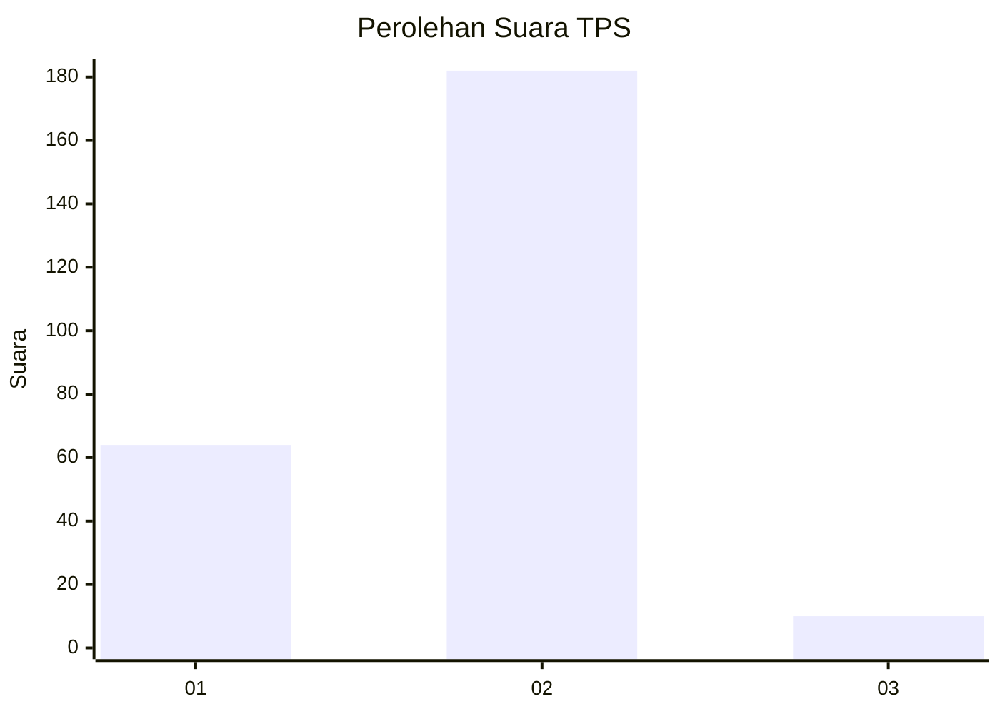
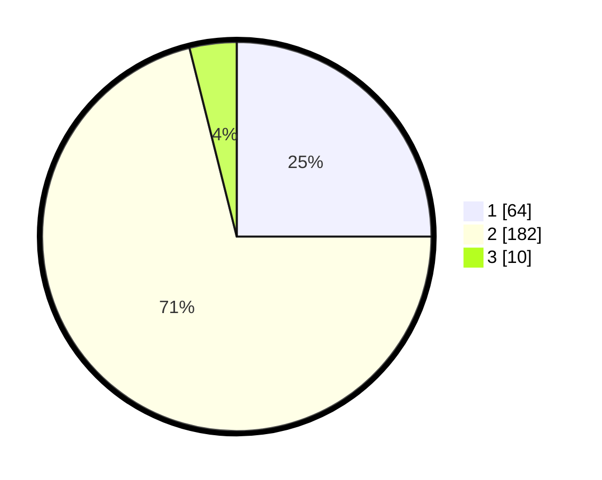

# Hasil

## Grafik

## Tabel

| No. | Nama Paslon    | Suara | Suara (raw) | Persentase |
|:--- |:-------------- | -----:| -----------:| ----------:|
| 1   | ANIES MUHAIMIN | 64    | [64][p-1]   | 25,00      |
| 2   | PRABOWO GIBRAN | 182   | [182][p-2]  | 71,09      |
| 3   | GANJAR MAHFUD  | 10    | [10][p-3]   | 3,91       |

[p-1]: https://github.com/gigit-pemilu/pemilu-2024-35-jawa-timur/blob/main/pilpres/hitung-suara/sub/35-jawa-timur/sub/13-probolinggo/sub/23-tongas/sub/2005-curahdringu/sub/002-tps/sub/paslon-1.txt
[p-2]: https://github.com/gigit-pemilu/pemilu-2024-35-jawa-timur/blob/main/pilpres/hitung-suara/sub/35-jawa-timur/sub/13-probolinggo/sub/23-tongas/sub/2005-curahdringu/sub/002-tps/sub/paslon-2.txt
[p-3]: https://github.com/gigit-pemilu/pemilu-2024-35-jawa-timur/blob/main/pilpres/hitung-suara/sub/35-jawa-timur/sub/13-probolinggo/sub/23-tongas/sub/2005-curahdringu/sub/002-tps/sub/paslon-3.txt

## Foto C Plano

https://sirekap-obj-formc.kpu.go.id/0de1/pemilu/ppwp/35/13/23/20/05/3513232005002-20240214-235957--b319b278-196d-4d76-9a0f-a41616171804.jpg

https://sirekap-obj-formc.kpu.go.id/0de1/pemilu/ppwp/35/13/23/20/05/3513232005002-20240215-000534--5def1763-706d-4785-bb8d-8a583ffc669d.jpg

https://sirekap-obj-formc.kpu.go.id/0de1/pemilu/ppwp/35/13/23/20/05/3513232005002-20240215-000624--2383ab91-8bcb-4c97-a5db-e8eef25158c3.jpg

## Metadata

| Key        | Value               |
| ---------- | ------------------- |
| Time Stamp | 2024-02-20 12:00:00 |

