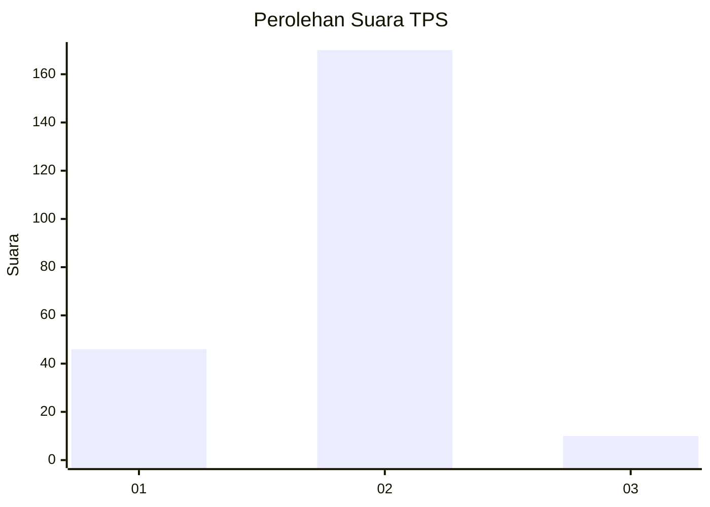
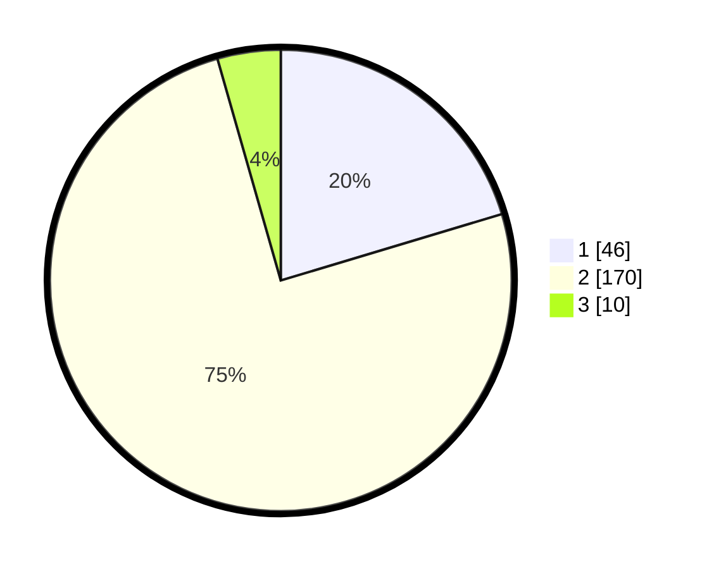

# Hasil

## Grafik

## Tabel

| No. | Nama Paslon    | Suara | Suara (raw) | Persentase |
|:--- |:-------------- | -----:| -----------:| ----------:|
| 1   | ANIES MUHAIMIN | 46    | [46][p-1]   | 20,35      |
| 2   | PRABOWO GIBRAN | 170   | [170][p-2]  | 75,22      |
| 3   | GANJAR MAHFUD  | 10    | [10][p-3]   | 4,42       |

[p-1]: https://github.com/gigit-pemilu/pemilu-2024/blob/main/pilpres/hitung-suara/sub/35-jawa-timur/sub/13-probolinggo/sub/23-tongas/sub/2006-wringinanom/sub/002-tps/sub/paslon-1.txt
[p-2]: https://github.com/gigit-pemilu/pemilu-2024/blob/main/pilpres/hitung-suara/sub/35-jawa-timur/sub/13-probolinggo/sub/23-tongas/sub/2006-wringinanom/sub/002-tps/sub/paslon-2.txt
[p-3]: https://github.com/gigit-pemilu/pemilu-2024/blob/main/pilpres/hitung-suara/sub/35-jawa-timur/sub/13-probolinggo/sub/23-tongas/sub/2006-wringinanom/sub/002-tps/sub/paslon-3.txt

## Foto C Plano

https://sirekap-obj-formc.kpu.go.id/cfb4/pemilu/ppwp/35/13/23/20/06/3513232006002-20240215-194438--a2a85de8-e79f-4fb2-9d9e-82f1882e56d1.jpg

https://sirekap-obj-formc.kpu.go.id/cfb4/pemilu/ppwp/35/13/23/20/06/3513232006002-20240215-194547--bf3d9d83-ac85-4fa8-b5e5-936c9c07ce2c.jpg

https://sirekap-obj-formc.kpu.go.id/cfb4/pemilu/ppwp/35/13/23/20/06/3513232006002-20240215-194722--7236fe27-bbf3-4abc-b961-63af159a1880.jpg

## Metadata

| Key        | Value               |
| ---------- | ------------------- |
| Time Stamp | 2024-02-25 23:00:00 |

