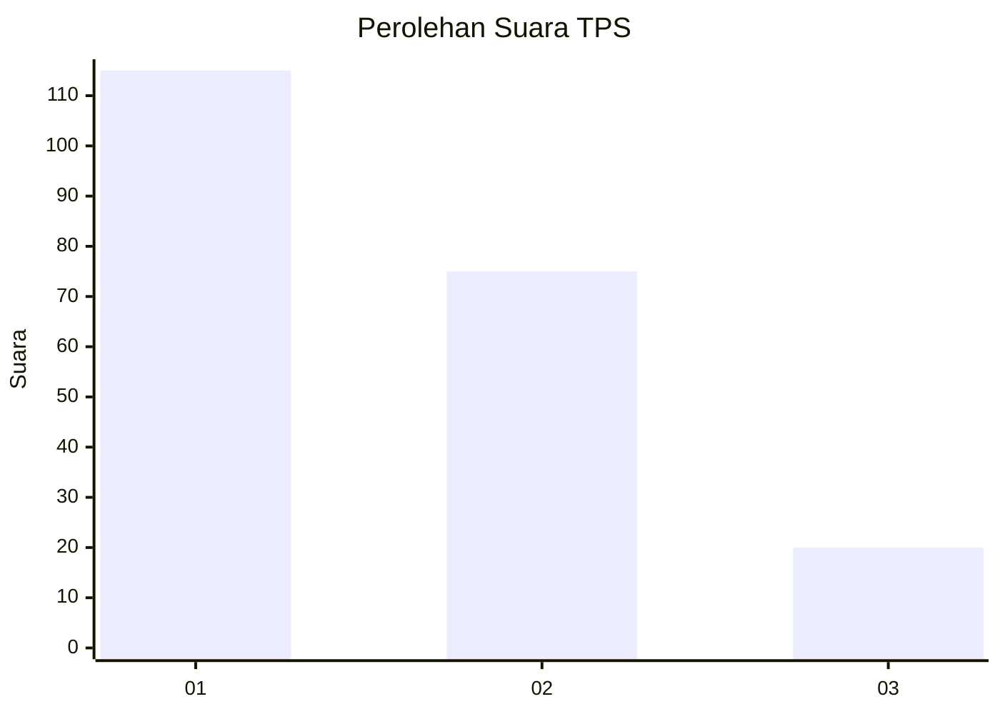
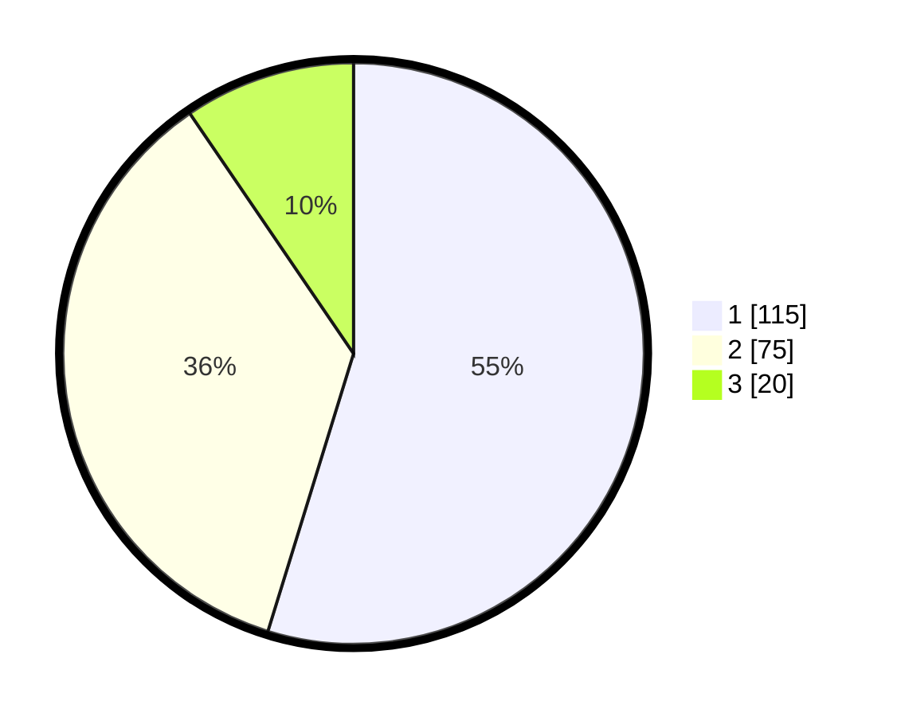

# Hasil

## Grafik

## Tabel

| No. | Nama Paslon    | Suara | Suara (raw) | Persentase |
|:--- |:-------------- | -----:| -----------:| ----------:|
| 1   | ANIES MUHAIMIN | 115   | [115][p-1]  | 54,76      |
| 2   | PRABOWO GIBRAN | 75    | [75][p-2]   | 35,71      |
| 3   | GANJAR MAHFUD  | 20    | [20][p-3]   | 9,52       |

[p-1]: https://github.com/gigit-pemilu/pemilu-2024-35-jawa-timur/blob/main/pilpres/hitung-suara/sub/35-jawa-timur/sub/13-probolinggo/sub/23-tongas/sub/2006-wringinanom/sub/017-tps/sub/paslon-1.txt
[p-2]: https://github.com/gigit-pemilu/pemilu-2024-35-jawa-timur/blob/main/pilpres/hitung-suara/sub/35-jawa-timur/sub/13-probolinggo/sub/23-tongas/sub/2006-wringinanom/sub/017-tps/sub/paslon-2.txt
[p-3]: https://github.com/gigit-pemilu/pemilu-2024-35-jawa-timur/blob/main/pilpres/hitung-suara/sub/35-jawa-timur/sub/13-probolinggo/sub/23-tongas/sub/2006-wringinanom/sub/017-tps/sub/paslon-3.txt

## Foto C Plano

https://sirekap-obj-formc.kpu.go.id/0c67/pemilu/ppwp/35/13/23/20/06/3513232006017-20240214-141327--dc3e0447-9cb2-4d13-a1fa-03b4390e4012.jpg

https://sirekap-obj-formc.kpu.go.id/0c67/pemilu/ppwp/35/13/23/20/06/3513232006017-20240217-214332--b747c3e9-aa31-4d31-8242-f0b568b22fa7.jpg

https://sirekap-obj-formc.kpu.go.id/0c67/pemilu/ppwp/35/13/23/20/06/3513232006017-20240217-214745--46b24640-db4a-4008-92da-d78d1883d5be.jpg

## Metadata

| Key        | Value               |
| ---------- | ------------------- |
| Time Stamp | 2024-02-20 21:00:00 |

