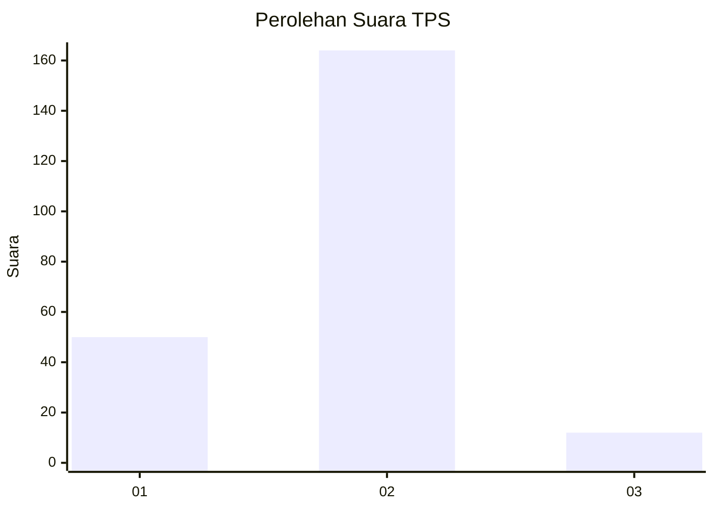
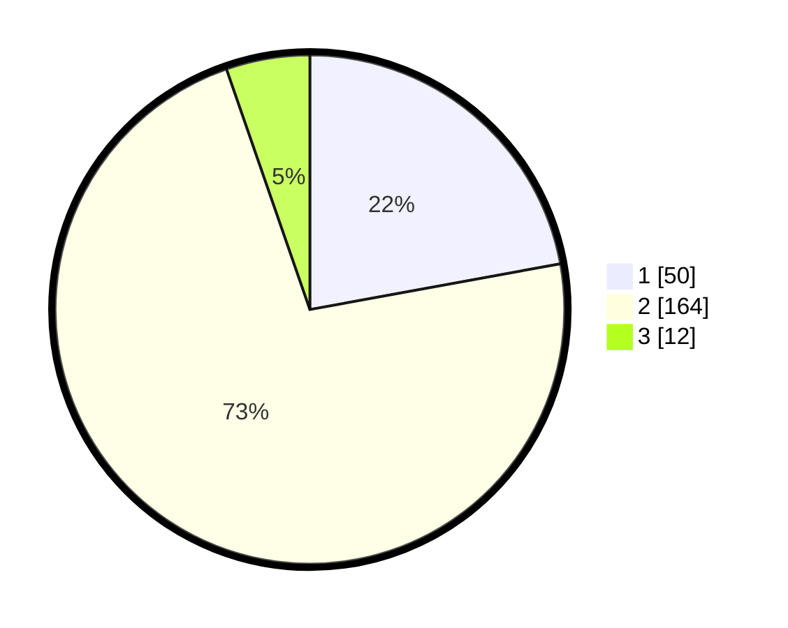

# Hasil

## Grafik

## Tabel

| No. | Nama Paslon    | Suara | Suara (raw) | Persentase |
|:--- |:-------------- | -----:| -----------:| ----------:|
| 1   | ANIES MUHAIMIN | 50    | [50][p-1]   | 22,12      |
| 2   | PRABOWO GIBRAN | 164   | [164][p-2]  | 72,57      |
| 3   | GANJAR MAHFUD  | 12    | [12][p-3]   | 5,31       |

[p-1]: https://github.com/gigit-pemilu/pemilu-2024/blob/main/pilpres/hitung-suara/sub/35-jawa-timur/sub/13-probolinggo/sub/23-tongas/sub/2007-sumberkramat/sub/003-tps/sub/paslon-1.txt
[p-2]: https://github.com/gigit-pemilu/pemilu-2024/blob/main/pilpres/hitung-suara/sub/35-jawa-timur/sub/13-probolinggo/sub/23-tongas/sub/2007-sumberkramat/sub/003-tps/sub/paslon-2.txt
[p-3]: https://github.com/gigit-pemilu/pemilu-2024/blob/main/pilpres/hitung-suara/sub/35-jawa-timur/sub/13-probolinggo/sub/23-tongas/sub/2007-sumberkramat/sub/003-tps/sub/paslon-3.txt

## Foto C Plano

https://sirekap-obj-formc.kpu.go.id/73ce/pemilu/ppwp/35/13/23/20/07/3513232007003-20240215-074925--ac3eb72e-afd4-412c-b099-9e203844d07e.jpg

https://sirekap-obj-formc.kpu.go.id/73ce/pemilu/ppwp/35/13/23/20/07/3513232007003-20240215-074747--47d08cd0-09a6-41d3-b79a-9ac87d262309.jpg

https://sirekap-obj-formc.kpu.go.id/73ce/pemilu/ppwp/35/13/23/20/07/3513232007003-20240215-075108--8bb93215-45a6-4563-8349-0edd0a56ff1a.jpg

## Metadata

| Key        | Value               |
| ---------- | ------------------- |
| Time Stamp | 2024-02-19 06:16:00 |

## DATA PEMILIH TETAP

Jumlah pemilih dalam DPT: **270**.
 * L: **22**.
 * P: **140**.

## DATA PENGGUNA HAK PILIH

Jumlah pengguna hak pilih dalam DPT: **234**.
 * L: **805**.
 * P: **123**.

Jumlah pengguna hak pilih dalam DPTb: **88**.
 * L: **808**.
 * P: **8**.

Jumlah pengguna hak pilih dalam DPK: **0**.
 * L: **80**.
 * P: **80**.

Jumlah pengguna hak pilih: **234**.
 * L: **807**.
 * P: **229**.

## JUMLAH SUARA SAH DAN TIDAK SAH

JUMLAH SELURUH SUARA SAH: **226**.

JUMLAH SUARA TIDAK SAH: **8**.

JUMLAH SELURUH SUARA SAH DAN SUARA TIDAK SAH: **234**.

