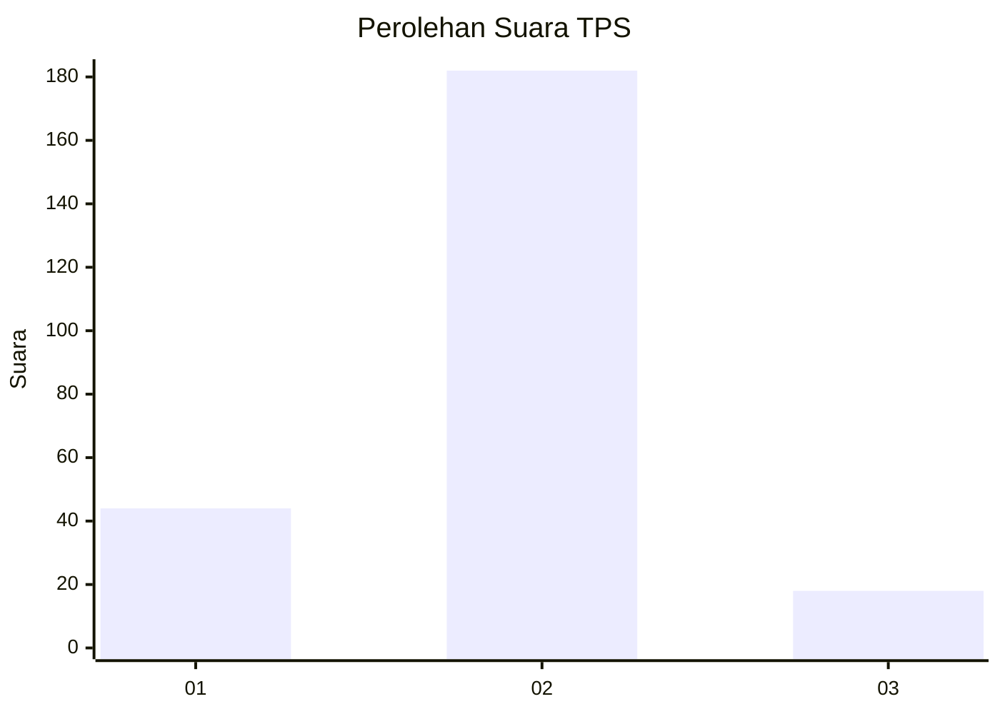
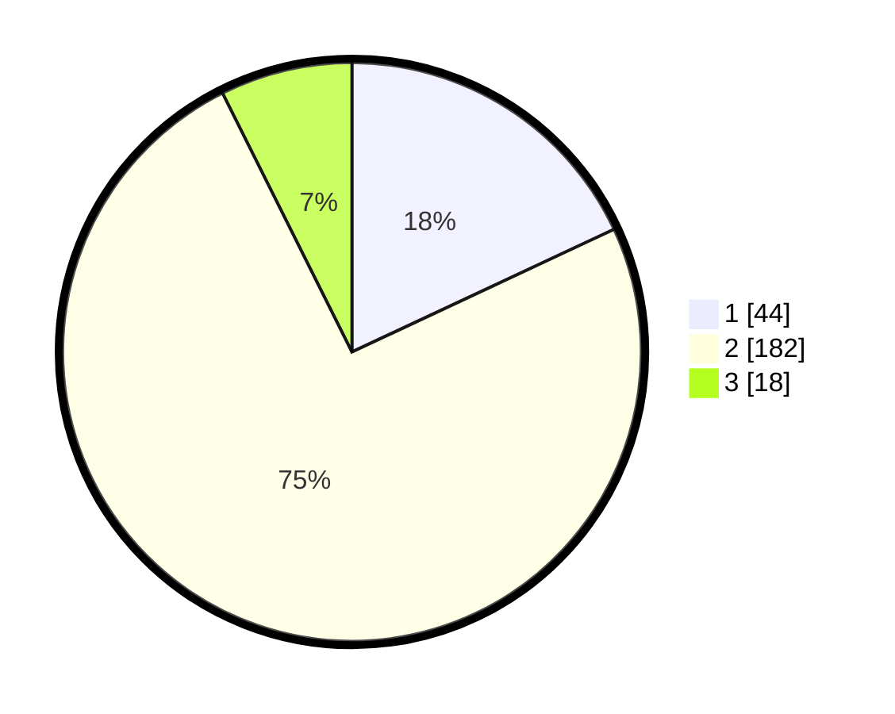

# Hasil

## Grafik

## Tabel

| No. | Nama Paslon    | Suara | Suara (raw) | Persentase |
|:--- |:-------------- | -----:| -----------:| ----------:|
| 1   | ANIES MUHAIMIN | 44    | [44][p-1]   | 18,03      |
| 2   | PRABOWO GIBRAN | 182   | [182][p-2]  | 74,59      |
| 3   | GANJAR MAHFUD  | 18    | [18][p-3]   | 7,38       |

[p-1]: https://github.com/gigit-pemilu/pemilu-2024/blob/main/pilpres/hitung-suara/sub/35-jawa-timur/sub/13-probolinggo/sub/23-tongas/sub/2008-tongas-wetan/sub/014-tps/sub/paslon-1.txt
[p-2]: https://github.com/gigit-pemilu/pemilu-2024/blob/main/pilpres/hitung-suara/sub/35-jawa-timur/sub/13-probolinggo/sub/23-tongas/sub/2008-tongas-wetan/sub/014-tps/sub/paslon-2.txt
[p-3]: https://github.com/gigit-pemilu/pemilu-2024/blob/main/pilpres/hitung-suara/sub/35-jawa-timur/sub/13-probolinggo/sub/23-tongas/sub/2008-tongas-wetan/sub/014-tps/sub/paslon-3.txt

## Foto C Plano

https://sirekap-obj-formc.kpu.go.id/e378/pemilu/ppwp/35/13/23/20/08/3513232008014-20240218-095942--aea856c2-6722-4be3-9089-bfd65d174561.jpg

https://sirekap-obj-formc.kpu.go.id/e378/pemilu/ppwp/35/13/23/20/08/3513232008014-20240214-184341--3c40c775-f8e1-40cc-8e5f-bbb397abe861.jpg

https://sirekap-obj-formc.kpu.go.id/e378/pemilu/ppwp/35/13/23/20/08/3513232008014-20240214-234108--34e47f8e-11e0-4c06-bdb5-f35e2446c2ac.jpg

## Metadata

| Key        | Value               |
| ---------- | ------------------- |
| Time Stamp | 2024-02-25 16:00:00 |

