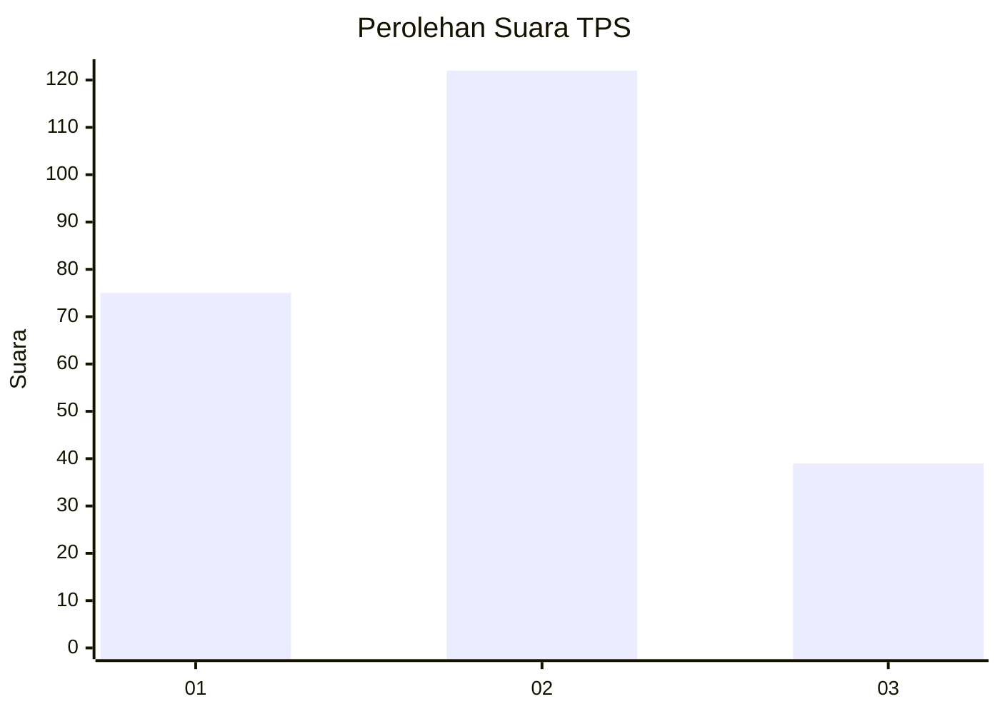
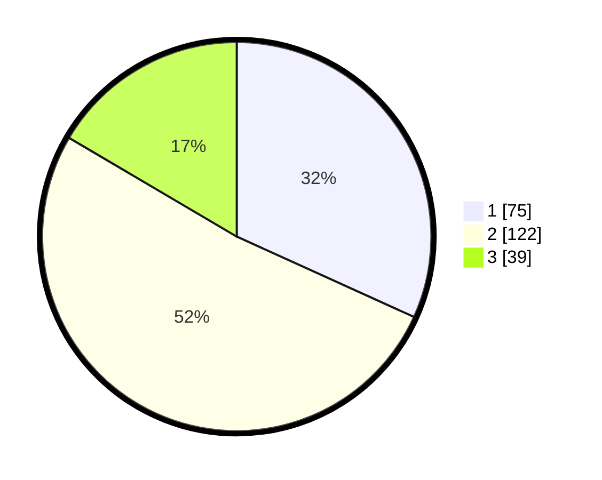

# Hasil

## Grafik

## Tabel

| No. | Nama Paslon    | Suara | Suara (raw) | Persentase |
|:--- |:-------------- | -----:| -----------:| ----------:|
| 1   | ANIES MUHAIMIN | 75    | [75][p-1]   | 31,78      |
| 2   | PRABOWO GIBRAN | 122   | [122][p-2]  | 51,69      |
| 3   | GANJAR MAHFUD  | 39    | [39][p-3]   | 16,53      |

[p-1]: https://github.com/gigit-pemilu/pemilu-2024/blob/main/pilpres/hitung-suara/sub/35-jawa-timur/sub/13-probolinggo/sub/23-tongas/sub/2011-tongas-kulon/sub/014-tps/sub/paslon-1.txt
[p-2]: https://github.com/gigit-pemilu/pemilu-2024/blob/main/pilpres/hitung-suara/sub/35-jawa-timur/sub/13-probolinggo/sub/23-tongas/sub/2011-tongas-kulon/sub/014-tps/sub/paslon-2.txt
[p-3]: https://github.com/gigit-pemilu/pemilu-2024/blob/main/pilpres/hitung-suara/sub/35-jawa-timur/sub/13-probolinggo/sub/23-tongas/sub/2011-tongas-kulon/sub/014-tps/sub/paslon-3.txt

## Foto C Plano

https://sirekap-obj-formc.kpu.go.id/2c33/pemilu/ppwp/35/13/23/20/11/3513232011014-20240217-123555--f33bf840-b51f-4e0c-aff8-a72f43586e18.jpg

https://sirekap-obj-formc.kpu.go.id/2c33/pemilu/ppwp/35/13/23/20/11/3513232011014-20240217-133258--5fbf2d83-8edb-4705-83d4-fde45053e7e7.jpg

https://sirekap-obj-formc.kpu.go.id/2c33/pemilu/ppwp/35/13/23/20/11/3513232011014-20240217-120843--2d232cc6-ad74-4eef-9d44-3dae0aa68b42.jpg

## Metadata

| Key        | Value               |
| ---------- | ------------------- |
| Time Stamp | 2024-02-24 22:31:28 |

