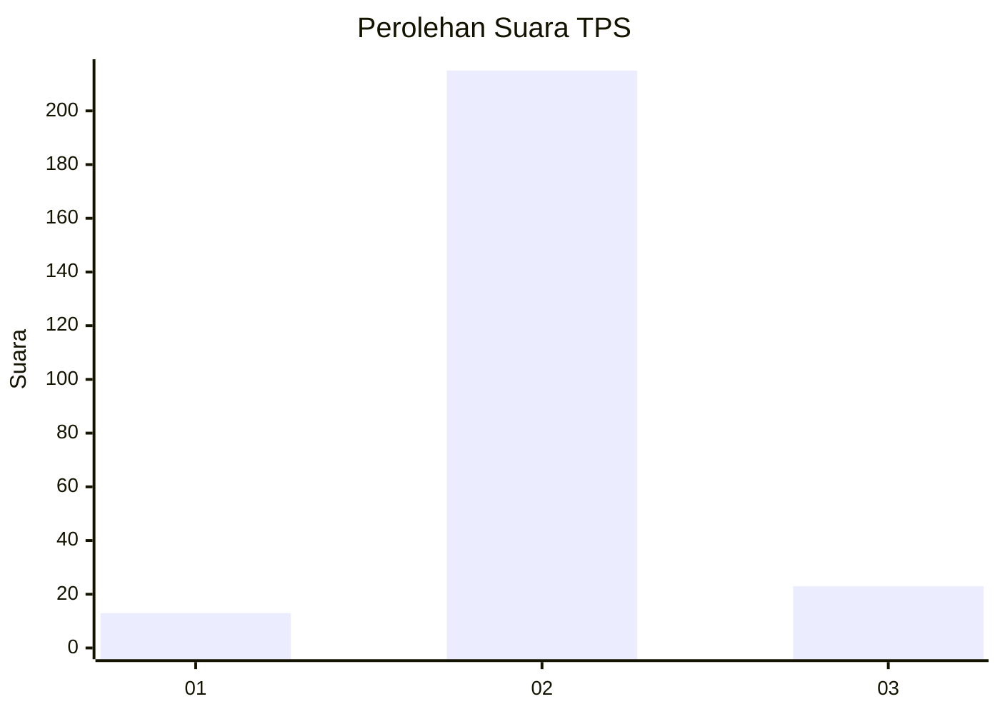
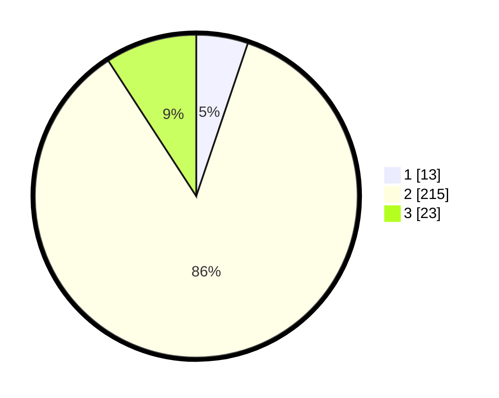

# Hasil

## Grafik

## Tabel

| No. | Nama Paslon    | Suara | Suara (raw) | Persentase |
|:--- |:-------------- | -----:| -----------:| ----------:|
| 1   | ANIES MUHAIMIN | 13    | [13][p-1]   | 5,18       |
| 2   | PRABOWO GIBRAN | 215   | [215][p-2]  | 85,66      |
| 3   | GANJAR MAHFUD  | 23    | [23][p-3]   | 9,16       |

[p-1]: https://github.com/gigit-pemilu/pemilu-2024/blob/main/pilpres/hitung-suara/sub/35-jawa-timur/sub/13-probolinggo/sub/23-tongas/sub/2012-curahtulis/sub/007-tps/sub/paslon-1.txt
[p-2]: https://github.com/gigit-pemilu/pemilu-2024/blob/main/pilpres/hitung-suara/sub/35-jawa-timur/sub/13-probolinggo/sub/23-tongas/sub/2012-curahtulis/sub/007-tps/sub/paslon-2.txt
[p-3]: https://github.com/gigit-pemilu/pemilu-2024/blob/main/pilpres/hitung-suara/sub/35-jawa-timur/sub/13-probolinggo/sub/23-tongas/sub/2012-curahtulis/sub/007-tps/sub/paslon-3.txt

## Foto C Plano

https://sirekap-obj-formc.kpu.go.id/a730/pemilu/ppwp/35/13/23/20/12/3513232012007-20240217-171425--3ef34d1a-b498-4c60-979a-5dbac1a44dd7.jpg

https://sirekap-obj-formc.kpu.go.id/a730/pemilu/ppwp/35/13/23/20/12/3513232012007-20240215-042342--cd1f0b29-82be-4b01-94a3-ac8cb0e837d9.jpg

https://sirekap-obj-formc.kpu.go.id/a730/pemilu/ppwp/35/13/23/20/12/3513232012007-20240217-212909--57ecaca5-9061-4632-ac55-7d240c48b002.jpg

## Metadata

| Key        | Value               |
| ---------- | ------------------- |
| Time Stamp | 2024-02-19 06:16:00 |

