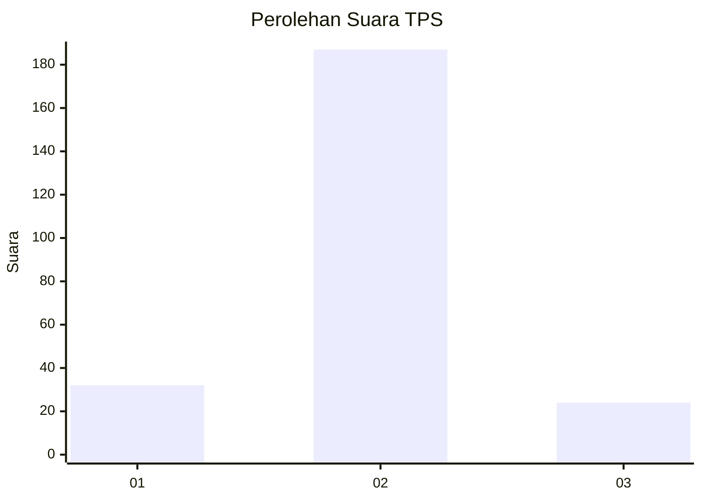
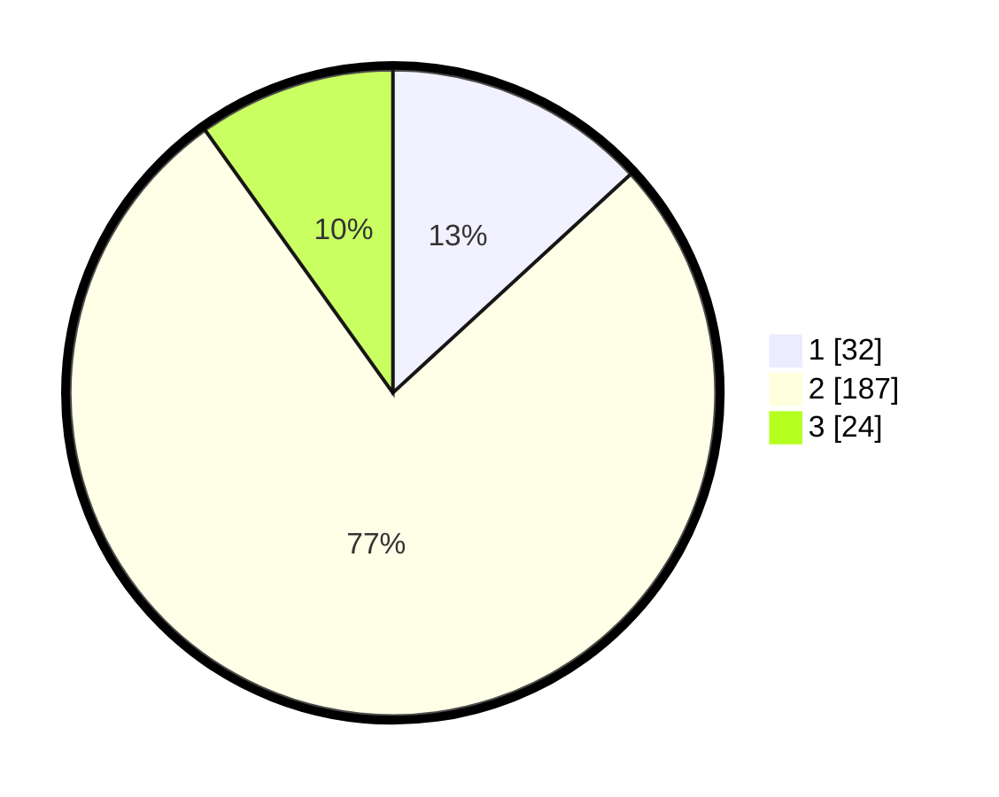

# Hasil

## Grafik

## Tabel

| No. | Nama Paslon    | Suara | Suara (raw) | Persentase |
|:--- |:-------------- | -----:| -----------:| ----------:|
| 1   | ANIES MUHAIMIN | 32    | [32][p-1]   | 13,17      |
| 2   | PRABOWO GIBRAN | 187   | [187][p-2]  | 76,95      |
| 3   | GANJAR MAHFUD  | 24    | [24][p-3]   | 9,88       |

[p-1]: https://github.com/gigit-pemilu/pemilu-2024/blob/main/pilpres/hitung-suara/sub/35-jawa-timur/sub/13-probolinggo/sub/23-tongas/sub/2014-tanjungrejo/sub/002-tps/sub/paslon-1.txt
[p-2]: https://github.com/gigit-pemilu/pemilu-2024/blob/main/pilpres/hitung-suara/sub/35-jawa-timur/sub/13-probolinggo/sub/23-tongas/sub/2014-tanjungrejo/sub/002-tps/sub/paslon-2.txt
[p-3]: https://github.com/gigit-pemilu/pemilu-2024/blob/main/pilpres/hitung-suara/sub/35-jawa-timur/sub/13-probolinggo/sub/23-tongas/sub/2014-tanjungrejo/sub/002-tps/sub/paslon-3.txt

## Foto C Plano

https://sirekap-obj-formc.kpu.go.id/297c/pemilu/ppwp/35/13/23/20/14/3513232014002-20240219-180052--4be61b5b-f42d-4bc8-8df2-a7a4dfceccfd.jpg

https://sirekap-obj-formc.kpu.go.id/297c/pemilu/ppwp/35/13/23/20/14/3513232014002-20240215-004630--5a8d52ef-7ccf-4bfd-9489-06d7fb62b673.jpg

https://sirekap-obj-formc.kpu.go.id/297c/pemilu/ppwp/35/13/23/20/14/3513232014002-20240215-004700--38ff163e-23cc-447b-88af-eca6faa4a4e1.jpg

## Metadata

| Key        | Value               |
| ---------- | ------------------- |
| Time Stamp | 2024-02-19 19:00:00 |

