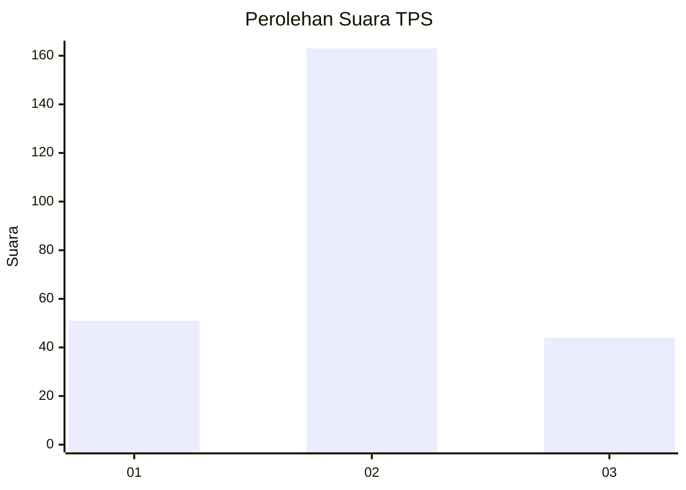

# Hasil

## Grafik

## Tabel

| No. | Nama Paslon    | Suara | Suara (raw) | Persentase |
|:--- |:-------------- | -----:| -----------:| ----------:|
| 1   | ANIES MUHAIMIN | 51    | [51][p-1]   | 19,77      |
| 2   | PRABOWO GIBRAN | 163   | [163][p-2]  | 63,18      |
| 3   | GANJAR MAHFUD  | 44    | [44][p-3]   | 17,05      |

[p-1]: https://github.com/gigit-pemilu/pemilu-2024/blob/main/pilpres/hitung-suara/sub/35-jawa-timur/sub/13-probolinggo/sub/23-tongas/sub/2014-tanjungrejo/sub/015-tps/sub/paslon-1.txt
[p-2]: https://github.com/gigit-pemilu/pemilu-2024/blob/main/pilpres/hitung-suara/sub/35-jawa-timur/sub/13-probolinggo/sub/23-tongas/sub/2014-tanjungrejo/sub/015-tps/sub/paslon-2.txt
[p-3]: https://github.com/gigit-pemilu/pemilu-2024/blob/main/pilpres/hitung-suara/sub/35-jawa-timur/sub/13-probolinggo/sub/23-tongas/sub/2014-tanjungrejo/sub/015-tps/sub/paslon-3.txt

## Foto C Plano

https://sirekap-obj-formc.kpu.go.id/ccb8/pemilu/ppwp/35/13/23/20/14/3513232014015-20240215-033013--d4dd01f4-2cb3-4faf-8e35-65f9cb891c63.jpg

https://sirekap-obj-formc.kpu.go.id/ccb8/pemilu/ppwp/35/13/23/20/14/3513232014015-20240217-174341--e0a208bb-ef5f-4aef-9b58-ff476b748bd0.jpg

https://sirekap-obj-formc.kpu.go.id/ccb8/pemilu/ppwp/35/13/23/20/14/3513232014015-20240217-174614--87a44e07-7e57-487c-a9ac-b33e19d3edec.jpg

## Metadata

| Key        | Value               |
| ---------- | ------------------- |
| Time Stamp | 2024-02-25 15:00:00 |

