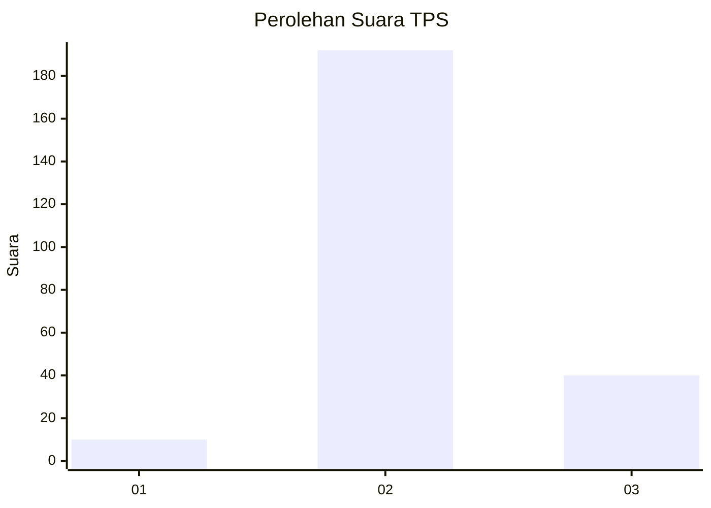
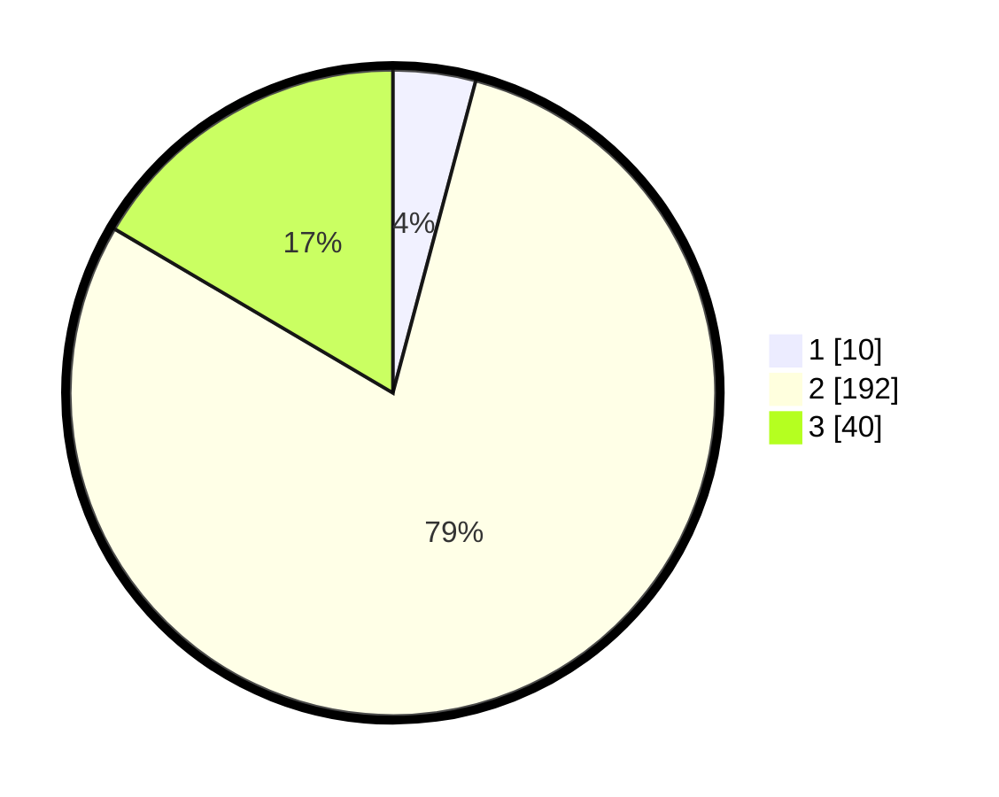

# Hasil

## Grafik

## Tabel

| No. | Nama Paslon    | Suara | Suara (raw) | Persentase |
|:--- |:-------------- | -----:| -----------:| ----------:|
| 1   | ANIES MUHAIMIN | 10    | [10][p-1]   | 4,13       |
| 2   | PRABOWO GIBRAN | 192   | [192][p-2]  | 79,34      |
| 3   | GANJAR MAHFUD  | 40    | [40][p-3]   | 16,53      |

[p-1]: https://github.com/gigit-pemilu/pemilu-2024/blob/main/pilpres/hitung-suara/sub/35-jawa-timur/sub/13-probolinggo/sub/24-lumbang/sub/2005-wonogoro/sub/001-tps/sub/paslon-1.txt
[p-2]: https://github.com/gigit-pemilu/pemilu-2024/blob/main/pilpres/hitung-suara/sub/35-jawa-timur/sub/13-probolinggo/sub/24-lumbang/sub/2005-wonogoro/sub/001-tps/sub/paslon-2.txt
[p-3]: https://github.com/gigit-pemilu/pemilu-2024/blob/main/pilpres/hitung-suara/sub/35-jawa-timur/sub/13-probolinggo/sub/24-lumbang/sub/2005-wonogoro/sub/001-tps/sub/paslon-3.txt

## Foto C Plano

https://sirekap-obj-formc.kpu.go.id/77f0/pemilu/ppwp/35/13/24/20/05/3513242005001-20240215-002807--a61fdfd7-d2ea-4bea-8187-5caa4726d820.jpg

https://sirekap-obj-formc.kpu.go.id/77f0/pemilu/ppwp/35/13/24/20/05/3513242005001-20240215-003314--ab9d4def-d5cd-40dc-9e68-2f8be586a4bb.jpg

https://sirekap-obj-formc.kpu.go.id/77f0/pemilu/ppwp/35/13/24/20/05/3513242005001-20240215-003524--27ea6d03-c3b9-4f52-93d9-4a7347b2d3ed.jpg

## Metadata

| Key        | Value               |
| ---------- | ------------------- |
| Time Stamp | 2024-02-24 22:31:28 |

