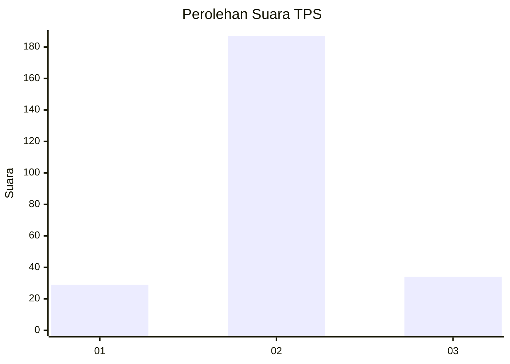
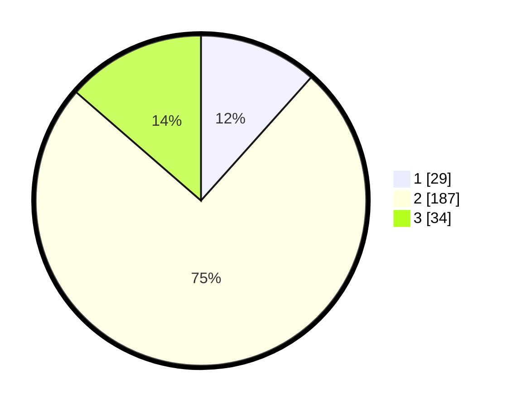

# Hasil

## Grafik

## Tabel

| No. | Nama Paslon    | Suara | Suara (raw) | Persentase |
|:--- |:-------------- | -----:| -----------:| ----------:|
| 1   | ANIES MUHAIMIN | 29    | [29][p-1]   | 11,60      |
| 2   | PRABOWO GIBRAN | 187   | [187][p-2]  | 74,80      |
| 3   | GANJAR MAHFUD  | 34    | [34][p-3]   | 13,60      |

[p-1]: https://github.com/gigit-pemilu/pemilu-2024-35-jawa-timur/blob/main/pilpres/hitung-suara/sub/35-jawa-timur/sub/14-pasuruan/sub/01-purwodadi/sub/2001-gerbo/sub/001-tps/sub/paslon-1.txt
[p-2]: https://github.com/gigit-pemilu/pemilu-2024-35-jawa-timur/blob/main/pilpres/hitung-suara/sub/35-jawa-timur/sub/14-pasuruan/sub/01-purwodadi/sub/2001-gerbo/sub/001-tps/sub/paslon-2.txt
[p-3]: https://github.com/gigit-pemilu/pemilu-2024-35-jawa-timur/blob/main/pilpres/hitung-suara/sub/35-jawa-timur/sub/14-pasuruan/sub/01-purwodadi/sub/2001-gerbo/sub/001-tps/sub/paslon-3.txt

## Foto C Plano

https://sirekap-obj-formc.kpu.go.id/07fa/pemilu/ppwp/35/14/01/20/01/3514012001001-20240217-090230--7b2204ba-f5a7-4cee-a3a6-b569b038bd64.jpg

https://sirekap-obj-formc.kpu.go.id/07fa/pemilu/ppwp/35/14/01/20/01/3514012001001-20240217-085600--9cf95b72-bac2-4472-9256-52e3c7f47680.jpg

https://sirekap-obj-formc.kpu.go.id/07fa/pemilu/ppwp/35/14/01/20/01/3514012001001-20240217-085659--6bc7d28c-cd1a-4c44-8ccf-a8bb94929a3a.jpg

## Metadata

| Key        | Value               |
| ---------- | ------------------- |
| Time Stamp | 2024-02-17 16:36:25 |

## DATA PEMILIH TETAP

Jumlah pemilih dalam DPT: **294**.
 * L: **152**.
 * P: **142**.

## DATA PENGGUNA HAK PILIH

Jumlah pengguna hak pilih dalam DPT: **256**.
 * L: **126**.
 * P: **130**.

Jumlah pengguna hak pilih dalam DPTb: **0**.
 * L: **0**.
 * P: **0**.

Jumlah pengguna hak pilih dalam DPK: **5**.
 * L: **2**.
 * P: **3**.

Jumlah pengguna hak pilih: **261**.
 * L: **128**.
 * P: **133**.

## JUMLAH SUARA SAH DAN TIDAK SAH

JUMLAH SELURUH SUARA SAH: **250**.

JUMLAH SUARA TIDAK SAH: **11**.

JUMLAH SELURUH SUARA SAH DAN SUARA TIDAK SAH: **261**.

