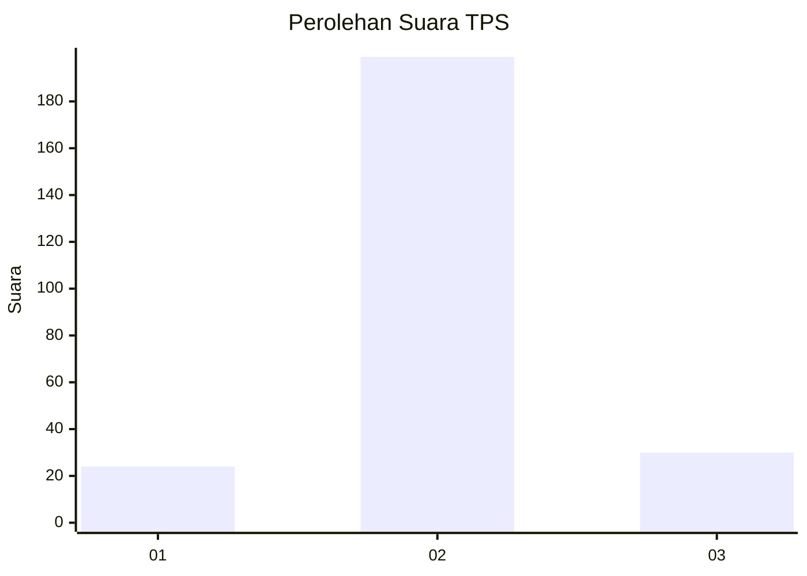
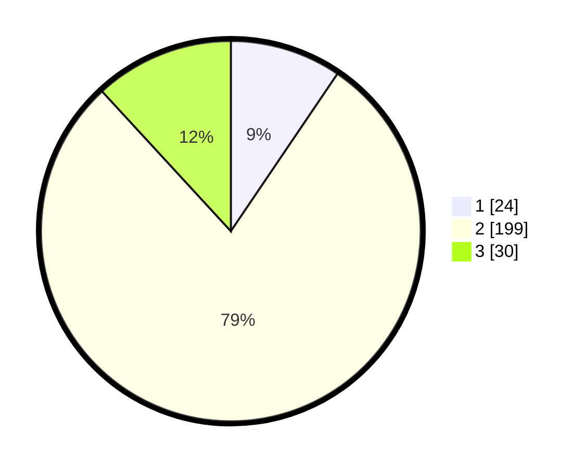

# Hasil

## Grafik

## Tabel

| No. | Nama Paslon    | Suara | Suara (raw) | Persentase |
|:--- |:-------------- | -----:| -----------:| ----------:|
| 1   | ANIES MUHAIMIN | 24    | [24][p-1]   | 9,49       |
| 2   | PRABOWO GIBRAN | 199   | [199][p-2]  | 78,66      |
| 3   | GANJAR MAHFUD  | 30    | [30][p-3]   | 11,86      |

[p-1]: https://github.com/gigit-pemilu/pemilu-2024/blob/main/pilpres/hitung-suara/sub/35-jawa-timur/sub/14-pasuruan/sub/01-purwodadi/sub/2001-gerbo/sub/005-tps/sub/paslon-1.txt
[p-2]: https://github.com/gigit-pemilu/pemilu-2024/blob/main/pilpres/hitung-suara/sub/35-jawa-timur/sub/14-pasuruan/sub/01-purwodadi/sub/2001-gerbo/sub/005-tps/sub/paslon-2.txt
[p-3]: https://github.com/gigit-pemilu/pemilu-2024/blob/main/pilpres/hitung-suara/sub/35-jawa-timur/sub/14-pasuruan/sub/01-purwodadi/sub/2001-gerbo/sub/005-tps/sub/paslon-3.txt

## Foto C Plano

https://sirekap-obj-formc.kpu.go.id/88c8/pemilu/ppwp/35/14/01/20/01/3514012001005-20240216-080855--720a25d2-9c5a-4a89-a18f-081b73d22d25.jpg

https://sirekap-obj-formc.kpu.go.id/88c8/pemilu/ppwp/35/14/01/20/01/3514012001005-20240216-082930--74eb67c5-89cf-47c1-b2e6-ffc51c8566fa.jpg

https://sirekap-obj-formc.kpu.go.id/88c8/pemilu/ppwp/35/14/01/20/01/3514012001005-20240216-081249--5731dd85-4092-4b08-b980-4f422ab2854a.jpg

## Metadata

| Key        | Value               |
| ---------- | ------------------- |
| Time Stamp | 2024-02-16 08:30:27 |

## DATA PEMILIH TETAP

Jumlah pemilih dalam DPT: **281**.
 * L: **128**.
 * P: **153**.

## DATA PENGGUNA HAK PILIH

Jumlah pengguna hak pilih dalam DPT: **264**.
 * L: **121**.
 * P: **143**.

Jumlah pengguna hak pilih dalam DPTb: **3**.
 * L: **1**.
 * P: **2**.

Jumlah pengguna hak pilih dalam DPK: **0**.
 * L: **0**.
 * P: **0**.

Jumlah pengguna hak pilih: **267**.
 * L: **122**.
 * P: **145**.

## JUMLAH SUARA SAH DAN TIDAK SAH

JUMLAH SELURUH SUARA SAH: **253**.

JUMLAH SUARA TIDAK SAH: **14**.

JUMLAH SELURUH SUARA SAH DAN SUARA TIDAK SAH: **267**.

