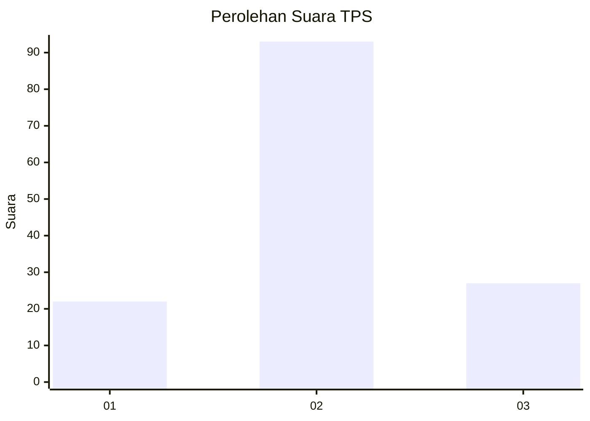
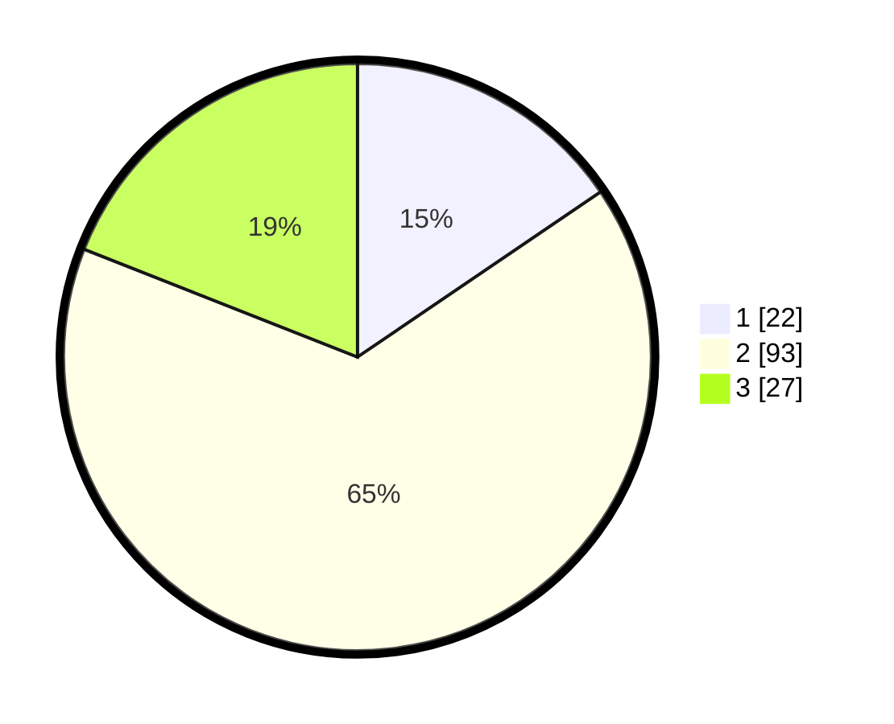

# Hasil

## Grafik

## Tabel

| No. | Nama Paslon    | Suara | Suara (raw) | Persentase |
|:--- |:-------------- | -----:| -----------:| ----------:|
| 1   | ANIES MUHAIMIN | 22    | [22][p-1]   | 15,49      |
| 2   | PRABOWO GIBRAN | 93    | [93][p-2]   | 65,49      |
| 3   | GANJAR MAHFUD  | 27    | [27][p-3]   | 19,01      |

[p-1]: https://github.com/gigit-pemilu/pemilu-2024/blob/main/pilpres/hitung-suara/sub/35-jawa-timur/sub/14-pasuruan/sub/01-purwodadi/sub/2004-cowek/sub/001-tps/sub/paslon-1.txt
[p-2]: https://github.com/gigit-pemilu/pemilu-2024/blob/main/pilpres/hitung-suara/sub/35-jawa-timur/sub/14-pasuruan/sub/01-purwodadi/sub/2004-cowek/sub/001-tps/sub/paslon-2.txt
[p-3]: https://github.com/gigit-pemilu/pemilu-2024/blob/main/pilpres/hitung-suara/sub/35-jawa-timur/sub/14-pasuruan/sub/01-purwodadi/sub/2004-cowek/sub/001-tps/sub/paslon-3.txt

## Foto C Plano

https://sirekap-obj-formc.kpu.go.id/9136/pemilu/ppwp/35/14/01/20/04/3514012004001-20240218-154218--76429be4-7f93-4880-b360-7b30c99c47b0.jpg

https://sirekap-obj-formc.kpu.go.id/9136/pemilu/ppwp/35/14/01/20/04/3514012004001-20240217-174922--a75b1dd9-2355-4a70-a417-18a5d4e6a8a5.jpg

https://sirekap-obj-formc.kpu.go.id/9136/pemilu/ppwp/35/14/01/20/04/3514012004001-20240217-175526--f26e8b18-3517-4448-af50-8385a44f2157.jpg

## Metadata

| Key        | Value               |
| ---------- | ------------------- |
| Time Stamp | 2024-02-19 06:16:00 |

