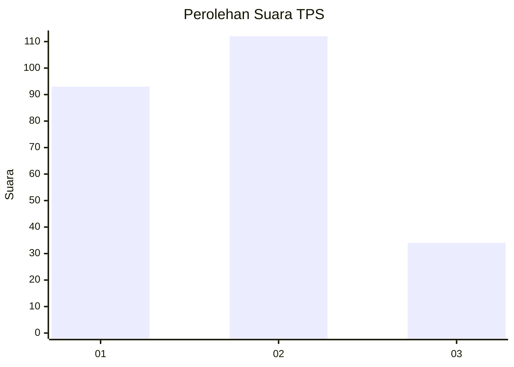
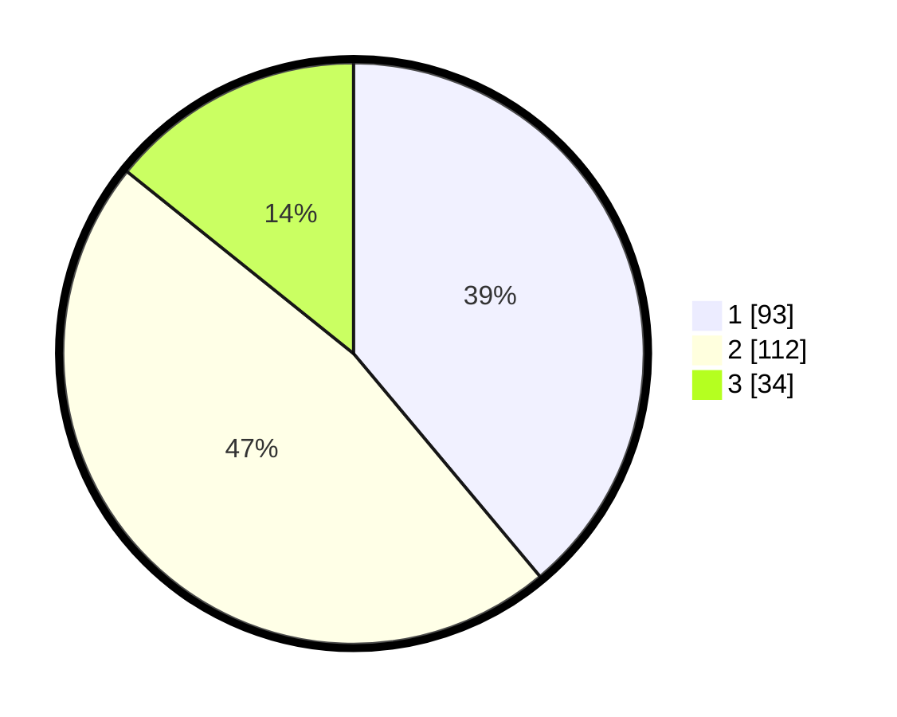

# Hasil

## Grafik

## Tabel

| No. | Nama Paslon    | Suara | Suara (raw) | Persentase |
|:--- |:-------------- | -----:| -----------:| ----------:|
| 1   | ANIES MUHAIMIN | 93    | [93][p-1]   | 38,91      |
| 2   | PRABOWO GIBRAN | 112   | [112][p-2]  | 46,86      |
| 3   | GANJAR MAHFUD  | 34    | [34][p-3]   | 14,23      |

[p-1]: https://github.com/gigit-pemilu/pemilu-2024-35-jawa-timur/blob/main/pilpres/hitung-suara/sub/35-jawa-timur/sub/14-pasuruan/sub/03-puspo/sub/2001-kemiri/sub/002-tps/sub/paslon-1.txt
[p-2]: https://github.com/gigit-pemilu/pemilu-2024-35-jawa-timur/blob/main/pilpres/hitung-suara/sub/35-jawa-timur/sub/14-pasuruan/sub/03-puspo/sub/2001-kemiri/sub/002-tps/sub/paslon-2.txt
[p-3]: https://github.com/gigit-pemilu/pemilu-2024-35-jawa-timur/blob/main/pilpres/hitung-suara/sub/35-jawa-timur/sub/14-pasuruan/sub/03-puspo/sub/2001-kemiri/sub/002-tps/sub/paslon-3.txt

## Foto C Plano

https://sirekap-obj-formc.kpu.go.id/f32c/pemilu/ppwp/35/14/03/20/01/3514032001002-20240217-164614--7a947571-370d-4be3-a2e9-1621172f095b.jpg

https://sirekap-obj-formc.kpu.go.id/f32c/pemilu/ppwp/35/14/03/20/01/3514032001002-20240217-163835--bfa077ac-82c3-4e7c-9fb9-d0d7e85dae44.jpg

https://sirekap-obj-formc.kpu.go.id/f32c/pemilu/ppwp/35/14/03/20/01/3514032001002-20240217-193615--0dab6f1e-3759-467d-9f82-b7dc93100466.jpg

## Metadata

| Key        | Value               |
| ---------- | ------------------- |
| Time Stamp | 2024-02-19 06:16:00 |

