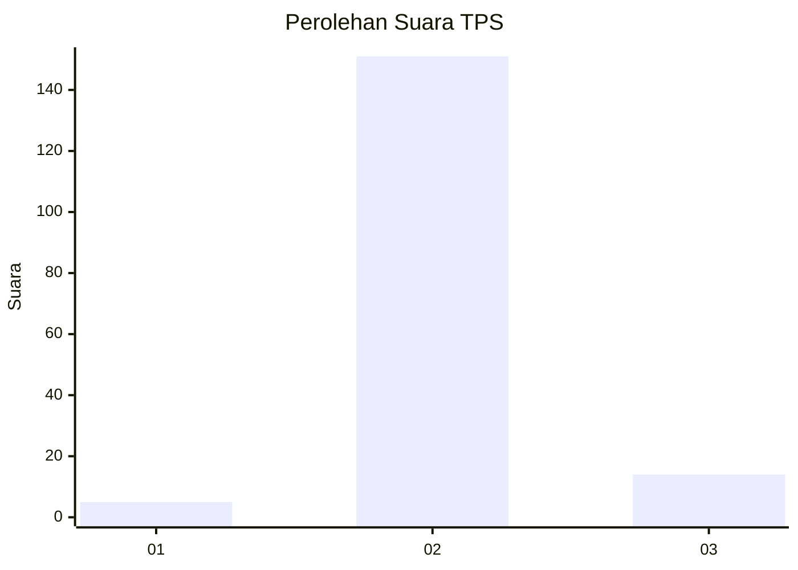
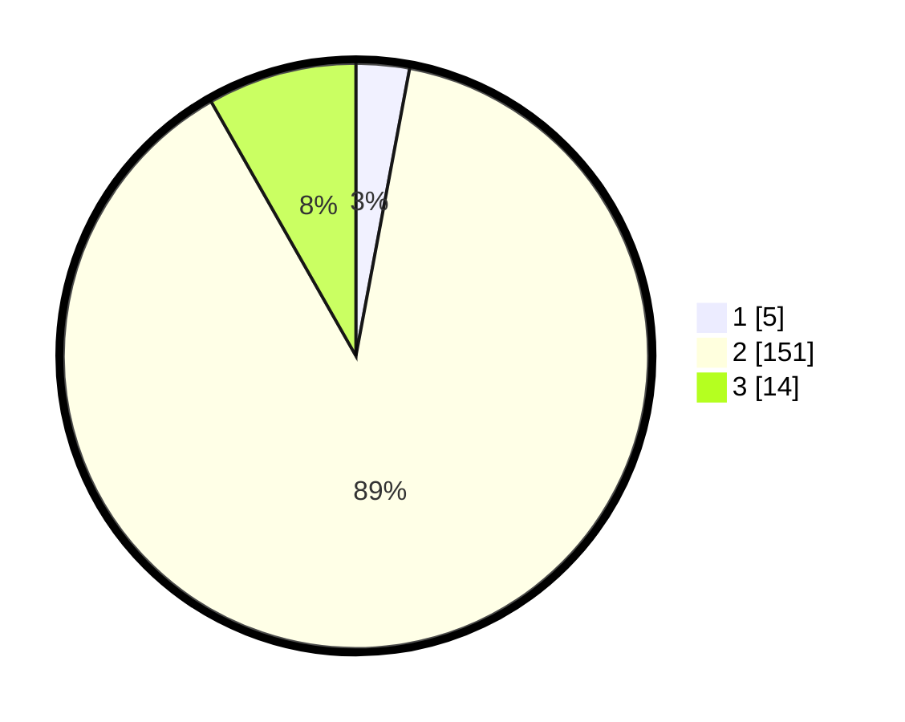

# Hasil

## Grafik

## Tabel

| No. | Nama Paslon    | Suara | Suara (raw) | Persentase |
|:--- |:-------------- | -----:| -----------:| ----------:|
| 1   | ANIES MUHAIMIN | 5     | [5][p-1]    | 2,94       |
| 2   | PRABOWO GIBRAN | 151   | [151][p-2]  | 88,82      |
| 3   | GANJAR MAHFUD  | 14    | [14][p-3]   | 8,24       |

[p-1]: https://github.com/gigit-pemilu/pemilu-2024-35-jawa-timur/blob/main/pilpres/hitung-suara/sub/35-jawa-timur/sub/14-pasuruan/sub/03-puspo/sub/2007-keduwung/sub/006-tps/sub/paslon-1.txt
[p-2]: https://github.com/gigit-pemilu/pemilu-2024-35-jawa-timur/blob/main/pilpres/hitung-suara/sub/35-jawa-timur/sub/14-pasuruan/sub/03-puspo/sub/2007-keduwung/sub/006-tps/sub/paslon-2.txt
[p-3]: https://github.com/gigit-pemilu/pemilu-2024-35-jawa-timur/blob/main/pilpres/hitung-suara/sub/35-jawa-timur/sub/14-pasuruan/sub/03-puspo/sub/2007-keduwung/sub/006-tps/sub/paslon-3.txt

## Foto C Plano

https://sirekap-obj-formc.kpu.go.id/23cf/pemilu/ppwp/35/14/03/20/07/3514032007006-20240218-202230--20de8076-40c6-4e12-aa72-03cb8f54abef.jpg

https://sirekap-obj-formc.kpu.go.id/23cf/pemilu/ppwp/35/14/03/20/07/3514032007006-20240219-065216--a98692f3-c476-4cce-9998-68bffb72cac1.jpg

https://sirekap-obj-formc.kpu.go.id/23cf/pemilu/ppwp/35/14/03/20/07/3514032007006-20240220-182904--f3427d20-3e7f-43bc-a2b9-59a5d710fb8a.jpg

## Metadata

| Key        | Value               |
| ---------- | ------------------- |
| Time Stamp | 2024-02-20 19:00:00 |

