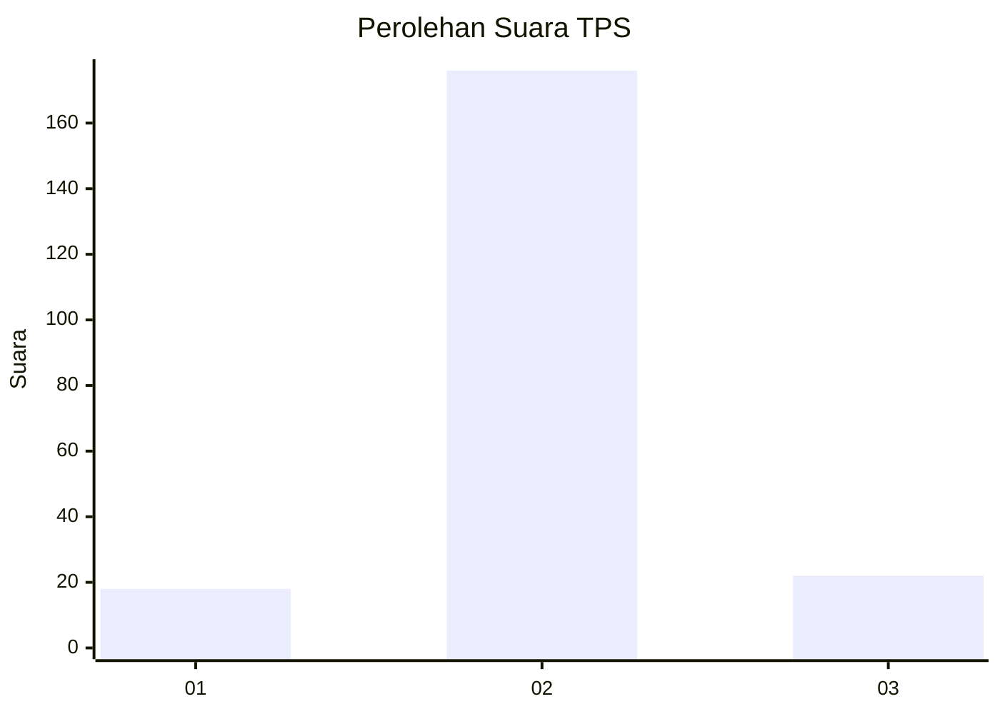
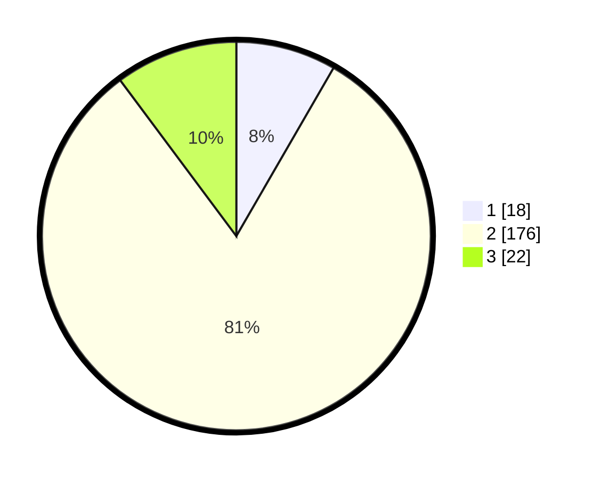

# Hasil

## Grafik

## Tabel

| No. | Nama Paslon    | Suara | Suara (raw) | Persentase |
|:--- |:-------------- | -----:| -----------:| ----------:|
| 1   | ANIES MUHAIMIN | 18    | [18][p-1]   | 8,33       |
| 2   | PRABOWO GIBRAN | 176   | [176][p-2]  | 81,48      |
| 3   | GANJAR MAHFUD  | 22    | [22][p-3]   | 10,19      |

[p-1]: https://github.com/gigit-pemilu/pemilu-2024-35-jawa-timur/blob/main/pilpres/hitung-suara/sub/35-jawa-timur/sub/14-pasuruan/sub/05-pasrepan/sub/2003-petung/sub/005-tps/sub/paslon-1.txt
[p-2]: https://github.com/gigit-pemilu/pemilu-2024-35-jawa-timur/blob/main/pilpres/hitung-suara/sub/35-jawa-timur/sub/14-pasuruan/sub/05-pasrepan/sub/2003-petung/sub/005-tps/sub/paslon-2.txt
[p-3]: https://github.com/gigit-pemilu/pemilu-2024-35-jawa-timur/blob/main/pilpres/hitung-suara/sub/35-jawa-timur/sub/14-pasuruan/sub/05-pasrepan/sub/2003-petung/sub/005-tps/sub/paslon-3.txt

## Foto C Plano

https://sirekap-obj-formc.kpu.go.id/ca81/pemilu/ppwp/35/14/05/20/03/3514052003005-20240217-204405--4f1faac0-b0fb-4406-9396-3f63e84ea950.jpg

https://sirekap-obj-formc.kpu.go.id/ca81/pemilu/ppwp/35/14/05/20/03/3514052003005-20240218-163134--a67d5fa9-3eef-4afa-847e-fd0731a1c5e2.jpg

https://sirekap-obj-formc.kpu.go.id/ca81/pemilu/ppwp/35/14/05/20/03/3514052003005-20240218-171736--96b3da4a-4884-46ca-b7d8-d4493c1ec996.jpg

## Metadata

| Key        | Value               |
| ---------- | ------------------- |
| Time Stamp | 2024-02-19 06:16:00 |

