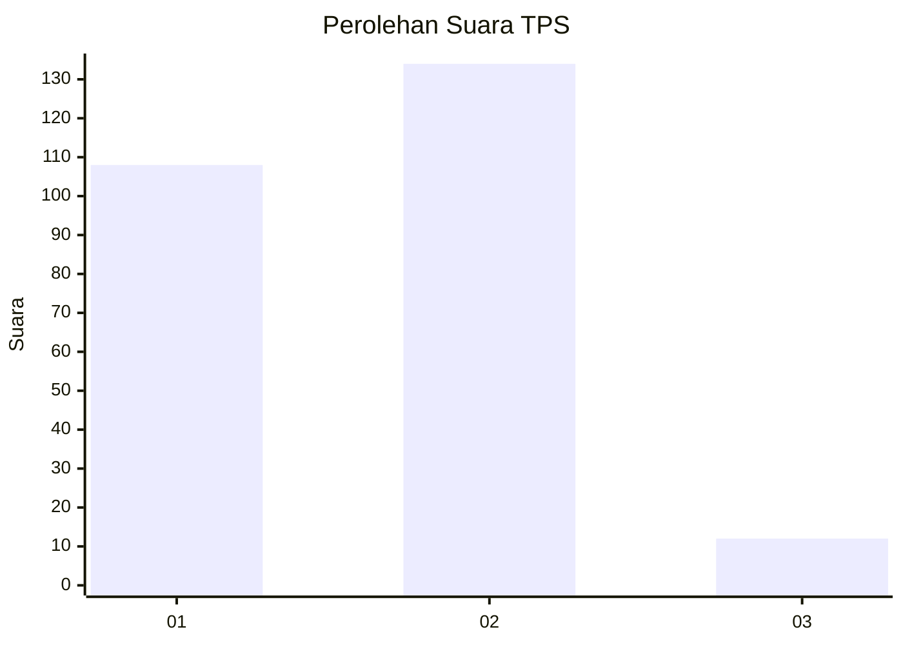
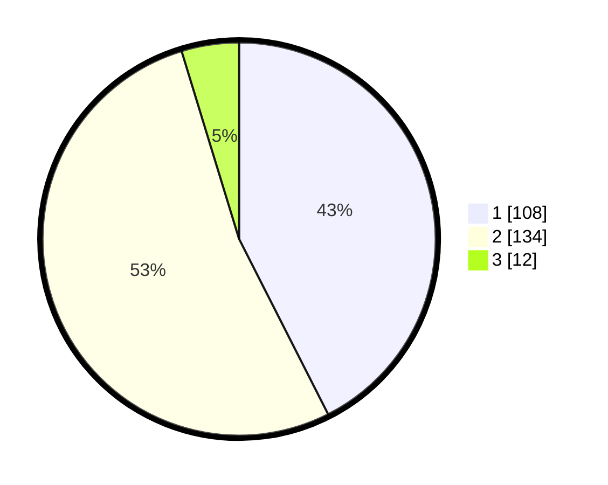

# Hasil

## Grafik

## Tabel

| No. | Nama Paslon    | Suara | Suara (raw) | Persentase |
|:--- |:-------------- | -----:| -----------:| ----------:|
| 1   | ANIES MUHAIMIN | 108   | [108][p-1]  | 42,52      |
| 2   | PRABOWO GIBRAN | 134   | [134][p-2]  | 52,76      |
| 3   | GANJAR MAHFUD  | 12    | [12][p-3]   | 4,72       |

[p-1]: https://github.com/gigit-pemilu/pemilu-2024-35-jawa-timur/blob/main/pilpres/hitung-suara/sub/35-jawa-timur/sub/14-pasuruan/sub/05-pasrepan/sub/2012-rejosalam/sub/007-tps/sub/paslon-1.txt
[p-2]: https://github.com/gigit-pemilu/pemilu-2024-35-jawa-timur/blob/main/pilpres/hitung-suara/sub/35-jawa-timur/sub/14-pasuruan/sub/05-pasrepan/sub/2012-rejosalam/sub/007-tps/sub/paslon-2.txt
[p-3]: https://github.com/gigit-pemilu/pemilu-2024-35-jawa-timur/blob/main/pilpres/hitung-suara/sub/35-jawa-timur/sub/14-pasuruan/sub/05-pasrepan/sub/2012-rejosalam/sub/007-tps/sub/paslon-3.txt

## Foto C Plano

https://sirekap-obj-formc.kpu.go.id/c477/pemilu/ppwp/35/14/05/20/12/3514052012007-20240217-201150--c08d221e-d98c-4ce5-bf0f-2ad60615b02a.jpg

https://sirekap-obj-formc.kpu.go.id/c477/pemilu/ppwp/35/14/05/20/12/3514052012007-20240217-165024--cbc8f861-85f1-4411-bb6e-d92887c6ec28.jpg

https://sirekap-obj-formc.kpu.go.id/c477/pemilu/ppwp/35/14/05/20/12/3514052012007-20240217-201356--81a3e52f-c169-4a2f-b33a-8983fb69e9f0.jpg

## Metadata

| Key        | Value               |
| ---------- | ------------------- |
| Time Stamp | 2024-02-19 06:16:00 |

