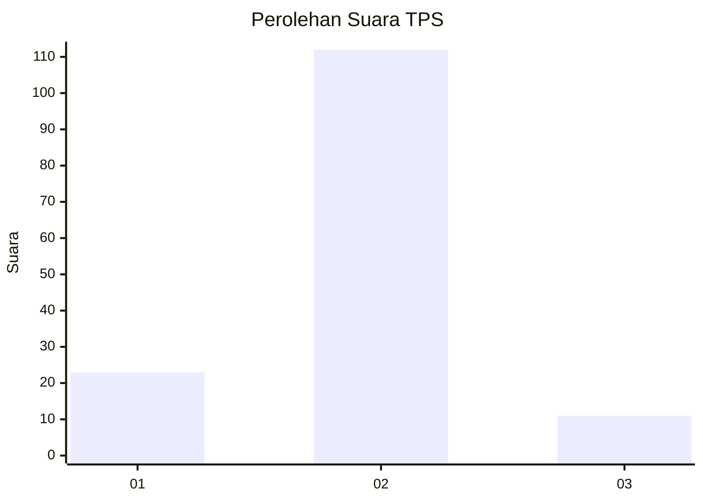
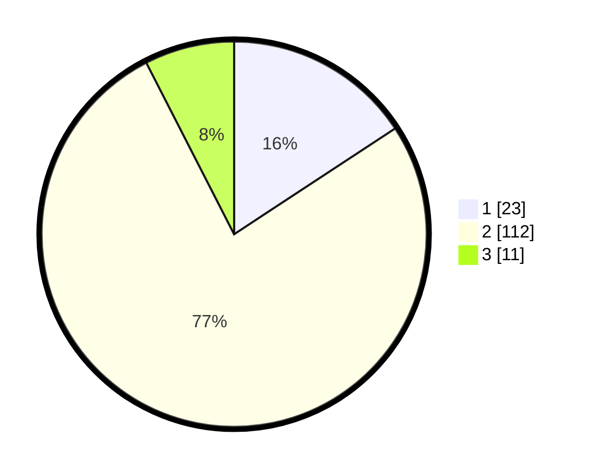

# Hasil

## Grafik

## Tabel

| No. | Nama Paslon    | Suara | Suara (raw) | Persentase |
|:--- |:-------------- | -----:| -----------:| ----------:|
| 1   | ANIES MUHAIMIN | 23    | [23][p-1]   | 15,75      |
| 2   | PRABOWO GIBRAN | 112   | [112][p-2]  | 76,71      |
| 3   | GANJAR MAHFUD  | 11    | [11][p-3]   | 7,53       |

[p-1]: https://github.com/gigit-pemilu/pemilu-2024-35-jawa-timur/blob/main/pilpres/hitung-suara/sub/35-jawa-timur/sub/14-pasuruan/sub/06-kejayan/sub/1024-kejayan/sub/008-tps/sub/paslon-1.txt
[p-2]: https://github.com/gigit-pemilu/pemilu-2024-35-jawa-timur/blob/main/pilpres/hitung-suara/sub/35-jawa-timur/sub/14-pasuruan/sub/06-kejayan/sub/1024-kejayan/sub/008-tps/sub/paslon-2.txt
[p-3]: https://github.com/gigit-pemilu/pemilu-2024-35-jawa-timur/blob/main/pilpres/hitung-suara/sub/35-jawa-timur/sub/14-pasuruan/sub/06-kejayan/sub/1024-kejayan/sub/008-tps/sub/paslon-3.txt

## Foto C Plano

https://sirekap-obj-formc.kpu.go.id/0068/pemilu/ppwp/35/14/06/10/24/3514061024008-20240215-001928--b7eb490e-8b77-45f0-afb6-17fbc3a8d938.jpg

https://sirekap-obj-formc.kpu.go.id/0068/pemilu/ppwp/35/14/06/10/24/3514061024008-20240215-002221--6cfc8e6b-da0a-4a4e-aa05-59e267166047.jpg

https://sirekap-obj-formc.kpu.go.id/0068/pemilu/ppwp/35/14/06/10/24/3514061024008-20240215-002341--abea33b7-7af8-4ca1-ab20-026f9f9a82de.jpg

## Metadata

| Key        | Value               |
| ---------- | ------------------- |
| Time Stamp | 2024-02-16 14:00:34 |

