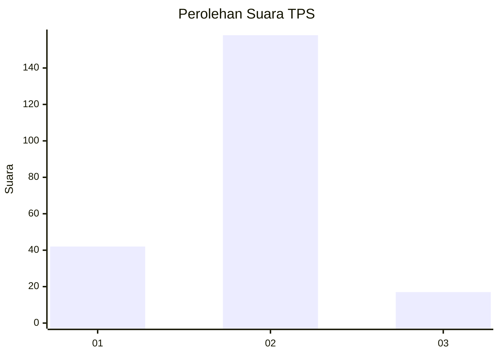
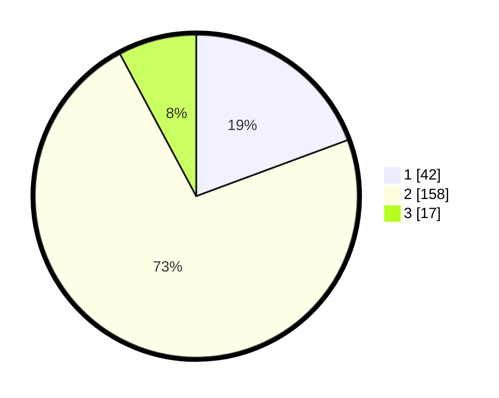

# Hasil

## Grafik

## Tabel

| No. | Nama Paslon    | Suara | Suara (raw) | Persentase |
|:--- |:-------------- | -----:| -----------:| ----------:|
| 1   | ANIES MUHAIMIN | 42    | [42][p-1]   | 19,35      |
| 2   | PRABOWO GIBRAN | 158   | [158][p-2]  | 72,81      |
| 3   | GANJAR MAHFUD  | 17    | [17][p-3]   | 7,83       |

[p-1]: https://github.com/gigit-pemilu/pemilu-2024/blob/main/pilpres/hitung-suara/sub/35-jawa-timur/sub/14-pasuruan/sub/06-kejayan/sub/2002-kedungpengaron/sub/002-tps/sub/paslon-1.txt
[p-2]: https://github.com/gigit-pemilu/pemilu-2024/blob/main/pilpres/hitung-suara/sub/35-jawa-timur/sub/14-pasuruan/sub/06-kejayan/sub/2002-kedungpengaron/sub/002-tps/sub/paslon-2.txt
[p-3]: https://github.com/gigit-pemilu/pemilu-2024/blob/main/pilpres/hitung-suara/sub/35-jawa-timur/sub/14-pasuruan/sub/06-kejayan/sub/2002-kedungpengaron/sub/002-tps/sub/paslon-3.txt

## Foto C Plano

https://sirekap-obj-formc.kpu.go.id/7905/pemilu/ppwp/35/14/06/20/02/3514062002002-20240215-065859--b69a09aa-7823-4cf4-a684-ae0d4b28c635.jpg

https://sirekap-obj-formc.kpu.go.id/7905/pemilu/ppwp/35/14/06/20/02/3514062002002-20240215-072340--964dc325-d7bd-46b9-8447-a1cd98d931e1.jpg

https://sirekap-obj-formc.kpu.go.id/7905/pemilu/ppwp/35/14/06/20/02/3514062002002-20240215-072453--928a7a26-2232-438e-bc20-bd327361c863.jpg

## Metadata

| Key        | Value               |
| ---------- | ------------------- |
| Time Stamp | 2024-02-15 19:30:26 |

