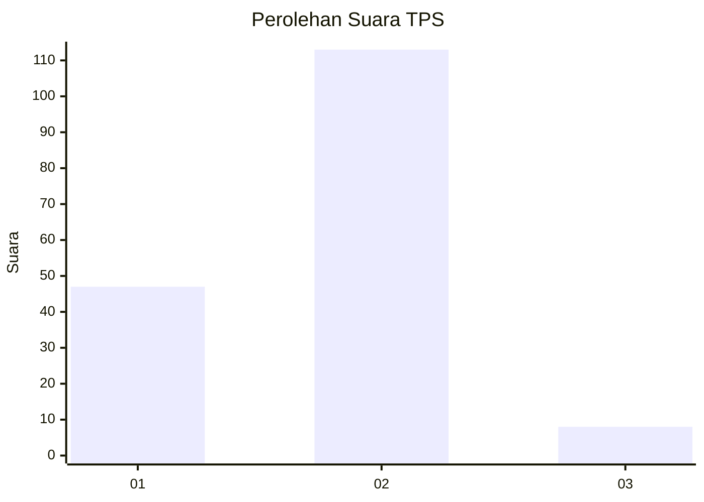
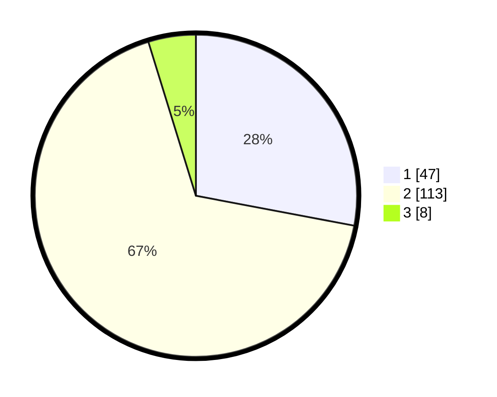

# Hasil

## Grafik

## Tabel

| No. | Nama Paslon    | Suara | Suara (raw) | Persentase |
|:--- |:-------------- | -----:| -----------:| ----------:|
| 1   | ANIES MUHAIMIN | 47    | [47][p-1]   | 27,98      |
| 2   | PRABOWO GIBRAN | 113   | [113][p-2]  | 67,26      |
| 3   | GANJAR MAHFUD  | 8     | [8][p-3]    | 4,76       |

[p-1]: https://github.com/gigit-pemilu/pemilu-2024-35-jawa-timur/blob/main/pilpres/hitung-suara/sub/35-jawa-timur/sub/14-pasuruan/sub/06-kejayan/sub/2015-sumber-banteng/sub/004-tps/sub/paslon-1.txt
[p-2]: https://github.com/gigit-pemilu/pemilu-2024-35-jawa-timur/blob/main/pilpres/hitung-suara/sub/35-jawa-timur/sub/14-pasuruan/sub/06-kejayan/sub/2015-sumber-banteng/sub/004-tps/sub/paslon-2.txt
[p-3]: https://github.com/gigit-pemilu/pemilu-2024-35-jawa-timur/blob/main/pilpres/hitung-suara/sub/35-jawa-timur/sub/14-pasuruan/sub/06-kejayan/sub/2015-sumber-banteng/sub/004-tps/sub/paslon-3.txt

## Foto C Plano

https://sirekap-obj-formc.kpu.go.id/e3e6/pemilu/ppwp/35/14/06/20/15/3514062015004-20240214-222322--5d5a69a5-48c2-4fe7-8a23-e26a73c5031e.jpg

https://sirekap-obj-formc.kpu.go.id/e3e6/pemilu/ppwp/35/14/06/20/15/3514062015004-20240214-222110--fe5f20fd-b7de-4261-a822-97b918857550.jpg

https://sirekap-obj-formc.kpu.go.id/e3e6/pemilu/ppwp/35/14/06/20/15/3514062015004-20240214-222458--186ca7b5-0543-49fd-861d-9e2dff385e48.jpg

## Metadata

| Key        | Value               |
| ---------- | ------------------- |
| Time Stamp | 2024-02-16 14:30:33 |

