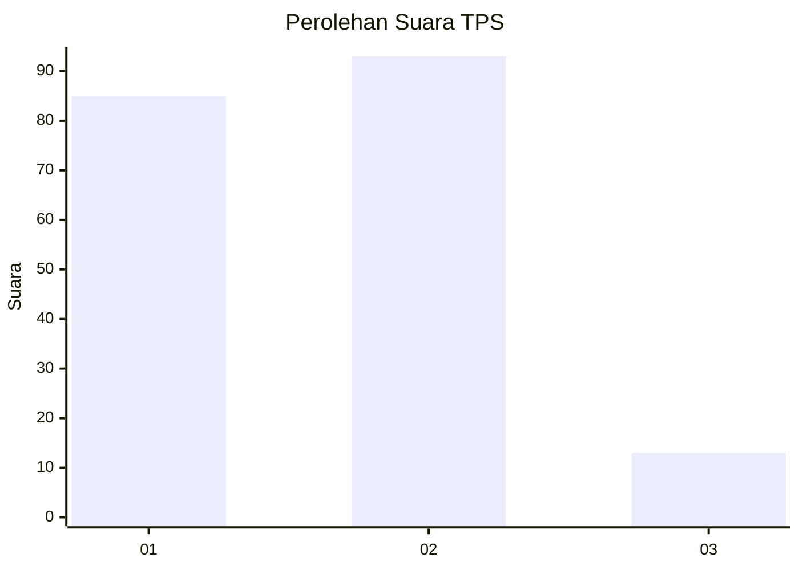
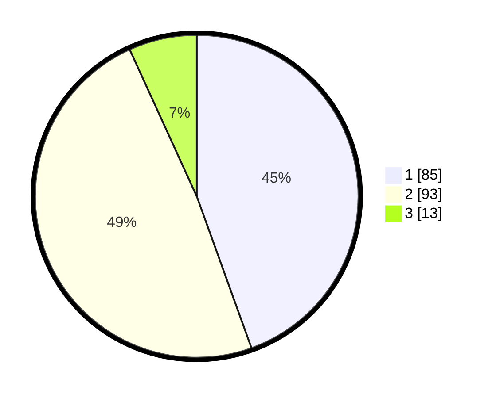

# Hasil

## Grafik

## Tabel

| No. | Nama Paslon    | Suara | Suara (raw) | Persentase |
|:--- |:-------------- | -----:| -----------:| ----------:|
| 1   | ANIES MUHAIMIN | 85    | [85][p-1]   | 44,50      |
| 2   | PRABOWO GIBRAN | 93    | [93][p-2]   | 48,69      |
| 3   | GANJAR MAHFUD  | 13    | [13][p-3]   | 6,81       |

[p-1]: https://github.com/gigit-pemilu/pemilu-2024-35-jawa-timur/blob/main/pilpres/hitung-suara/sub/35-jawa-timur/sub/14-pasuruan/sub/06-kejayan/sub/2015-sumber-banteng/sub/006-tps/sub/paslon-1.txt
[p-2]: https://github.com/gigit-pemilu/pemilu-2024-35-jawa-timur/blob/main/pilpres/hitung-suara/sub/35-jawa-timur/sub/14-pasuruan/sub/06-kejayan/sub/2015-sumber-banteng/sub/006-tps/sub/paslon-2.txt
[p-3]: https://github.com/gigit-pemilu/pemilu-2024-35-jawa-timur/blob/main/pilpres/hitung-suara/sub/35-jawa-timur/sub/14-pasuruan/sub/06-kejayan/sub/2015-sumber-banteng/sub/006-tps/sub/paslon-3.txt

## Foto C Plano

https://sirekap-obj-formc.kpu.go.id/54e5/pemilu/ppwp/35/14/06/20/15/3514062015006-20240214-232157--ac1f0480-69eb-441a-9c98-0ac93ef0e88a.jpg

https://sirekap-obj-formc.kpu.go.id/54e5/pemilu/ppwp/35/14/06/20/15/3514062015006-20240214-232730--7bccd1f5-7e25-4d4e-9a3a-893780529ac3.jpg

https://sirekap-obj-formc.kpu.go.id/54e5/pemilu/ppwp/35/14/06/20/15/3514062015006-20240214-232923--43b95ada-59ac-4c95-90d4-7a76e32f8bb7.jpg

## Metadata

| Key        | Value               |
| ---------- | ------------------- |
| Time Stamp | 2024-02-16 14:30:33 |

