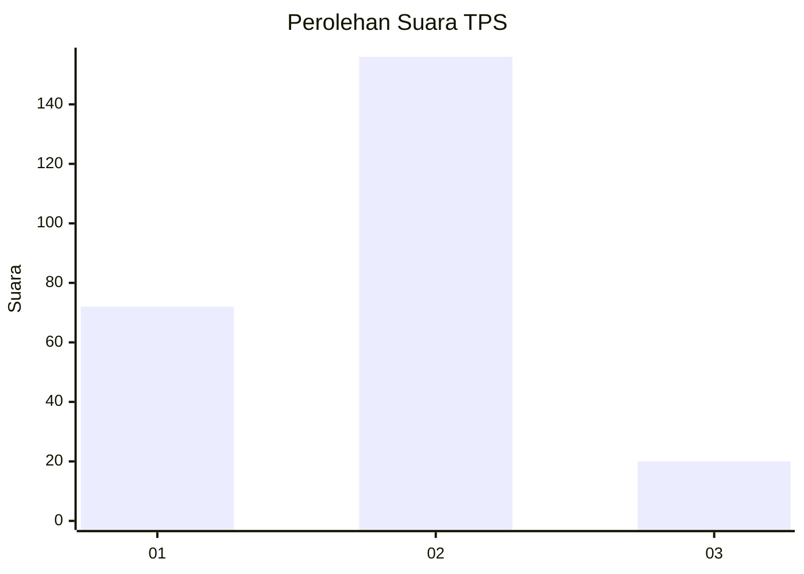
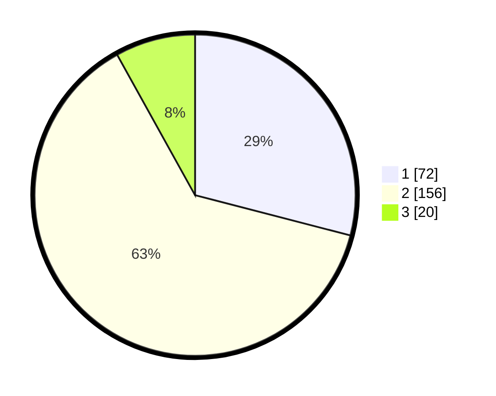

# Hasil

## Grafik

## Tabel

| No. | Nama Paslon    | Suara | Suara (raw) | Persentase |
|:--- |:-------------- | -----:| -----------:| ----------:|
| 1   | ANIES MUHAIMIN | 72    | [72][p-1]   | 29,03      |
| 2   | PRABOWO GIBRAN | 156   | [156][p-2]  | 62,90      |
| 3   | GANJAR MAHFUD  | 20    | [20][p-3]   | 8,06       |

[p-1]: https://github.com/gigit-pemilu/pemilu-2024-35-jawa-timur/blob/main/pilpres/hitung-suara/sub/35-jawa-timur/sub/14-pasuruan/sub/06-kejayan/sub/2017-tanggulangin/sub/002-tps/sub/paslon-1.txt
[p-2]: https://github.com/gigit-pemilu/pemilu-2024-35-jawa-timur/blob/main/pilpres/hitung-suara/sub/35-jawa-timur/sub/14-pasuruan/sub/06-kejayan/sub/2017-tanggulangin/sub/002-tps/sub/paslon-2.txt
[p-3]: https://github.com/gigit-pemilu/pemilu-2024-35-jawa-timur/blob/main/pilpres/hitung-suara/sub/35-jawa-timur/sub/14-pasuruan/sub/06-kejayan/sub/2017-tanggulangin/sub/002-tps/sub/paslon-3.txt

## Foto C Plano

https://sirekap-obj-formc.kpu.go.id/8c42/pemilu/ppwp/35/14/06/20/17/3514062017002-20240217-203002--375d2752-c333-4b97-b536-25f66606b775.jpg

https://sirekap-obj-formc.kpu.go.id/8c42/pemilu/ppwp/35/14/06/20/17/3514062017002-20240217-201755--8b8f3533-c77d-4a5e-90f6-ce71c4b6dadd.jpg

https://sirekap-obj-formc.kpu.go.id/8c42/pemilu/ppwp/35/14/06/20/17/3514062017002-20240217-202244--7f3d0d3b-b01d-403d-b113-9645e9d66f88.jpg

## Metadata

| Key        | Value               |
| ---------- | ------------------- |
| Time Stamp | 2024-02-19 06:16:00 |

