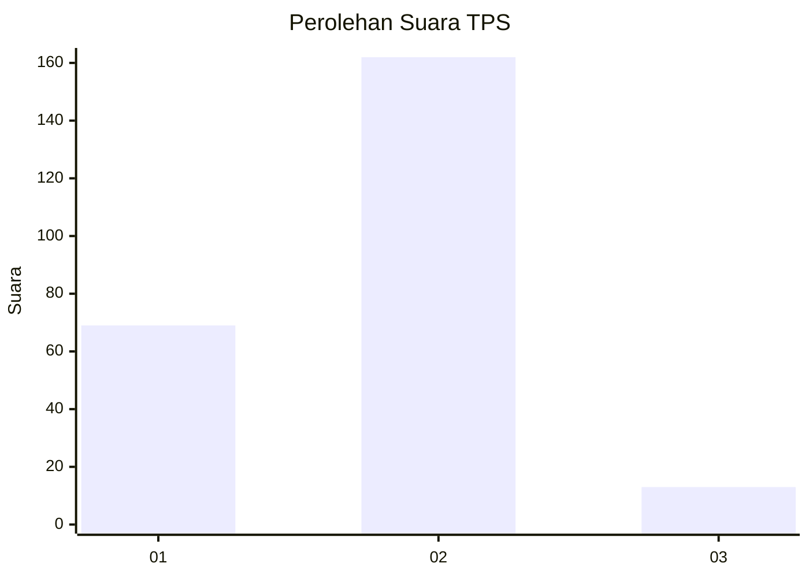
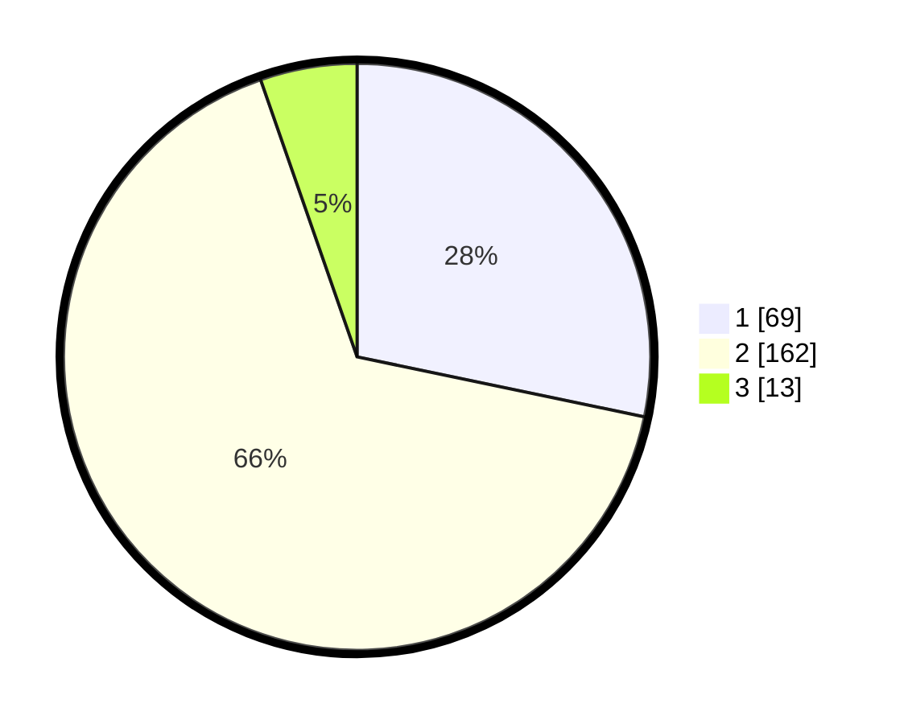

# Hasil

## Grafik

## Tabel

| No. | Nama Paslon    | Suara | Suara (raw) | Persentase |
|:--- |:-------------- | -----:| -----------:| ----------:|
| 1   | ANIES MUHAIMIN | 69    | [69][p-1]   | 28,28      |
| 2   | PRABOWO GIBRAN | 162   | [162][p-2]  | 66,39      |
| 3   | GANJAR MAHFUD  | 13    | [13][p-3]   | 5,33       |

[p-1]: https://github.com/gigit-pemilu/pemilu-2024/blob/main/pilpres/hitung-suara/sub/35-jawa-timur/sub/14-pasuruan/sub/06-kejayan/sub/2017-tanggulangin/sub/004-tps/sub/paslon-1.txt
[p-2]: https://github.com/gigit-pemilu/pemilu-2024/blob/main/pilpres/hitung-suara/sub/35-jawa-timur/sub/14-pasuruan/sub/06-kejayan/sub/2017-tanggulangin/sub/004-tps/sub/paslon-2.txt
[p-3]: https://github.com/gigit-pemilu/pemilu-2024/blob/main/pilpres/hitung-suara/sub/35-jawa-timur/sub/14-pasuruan/sub/06-kejayan/sub/2017-tanggulangin/sub/004-tps/sub/paslon-3.txt

## Foto C Plano

https://sirekap-obj-formc.kpu.go.id/44e8/pemilu/ppwp/35/14/06/20/17/3514062017004-20240219-185509--3affe600-5e8f-4c19-9f0d-bdb4d203d9f5.jpg

https://sirekap-obj-formc.kpu.go.id/44e8/pemilu/ppwp/35/14/06/20/17/3514062017004-20240217-203229--512819ad-f9b2-4441-a94e-e7cdc663632f.jpg

https://sirekap-obj-formc.kpu.go.id/44e8/pemilu/ppwp/35/14/06/20/17/3514062017004-20240217-212226--a1d0cf80-084a-44b3-a002-c5534f09ccf0.jpg

## Metadata

| Key        | Value               |
| ---------- | ------------------- |
| Time Stamp | 2024-02-19 19:00:00 |

