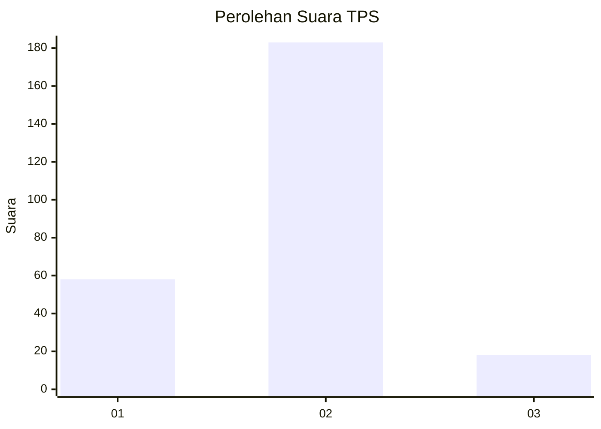

# Hasil

## Grafik

## Tabel

| No. | Nama Paslon    | Suara | Suara (raw) | Persentase |
|:--- |:-------------- | -----:| -----------:| ----------:|
| 1   | ANIES MUHAIMIN | 58    | [58][p-1]   | 22,39      |
| 2   | PRABOWO GIBRAN | 183   | [183][p-2]  | 70,66      |
| 3   | GANJAR MAHFUD  | 18    | [18][p-3]   | 6,95       |

[p-1]: https://github.com/gigit-pemilu/pemilu-2024-35-jawa-timur/blob/main/pilpres/hitung-suara/sub/35-jawa-timur/sub/14-pasuruan/sub/06-kejayan/sub/2020-klinter/sub/003-tps/sub/paslon-1.txt
[p-2]: https://github.com/gigit-pemilu/pemilu-2024-35-jawa-timur/blob/main/pilpres/hitung-suara/sub/35-jawa-timur/sub/14-pasuruan/sub/06-kejayan/sub/2020-klinter/sub/003-tps/sub/paslon-2.txt
[p-3]: https://github.com/gigit-pemilu/pemilu-2024-35-jawa-timur/blob/main/pilpres/hitung-suara/sub/35-jawa-timur/sub/14-pasuruan/sub/06-kejayan/sub/2020-klinter/sub/003-tps/sub/paslon-3.txt

## Foto C Plano

https://sirekap-obj-formc.kpu.go.id/3213/pemilu/ppwp/35/14/06/20/20/3514062020003-20240214-192029--df682303-40f9-449f-9c08-6b0930388dcb.jpg

https://sirekap-obj-formc.kpu.go.id/3213/pemilu/ppwp/35/14/06/20/20/3514062020003-20240214-191744--860b6492-0bfe-4612-932b-29cec7489f07.jpg

https://sirekap-obj-formc.kpu.go.id/3213/pemilu/ppwp/35/14/06/20/20/3514062020003-20240214-191814--c22da577-f9cd-4811-bab8-86676e5a9677.jpg

## Metadata

| Key        | Value               |
| ---------- | ------------------- |
| Time Stamp | 2024-02-14 21:46:01 |

