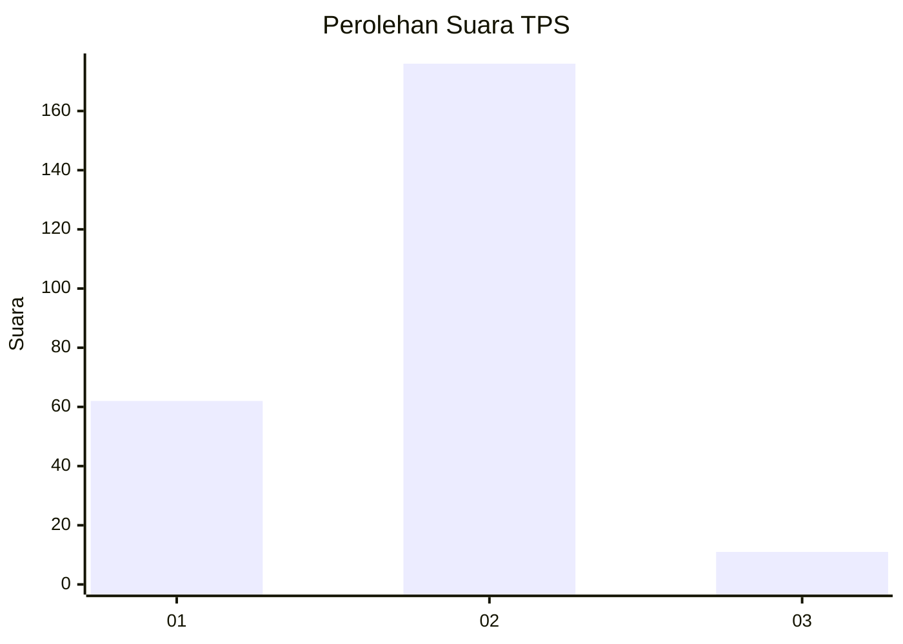
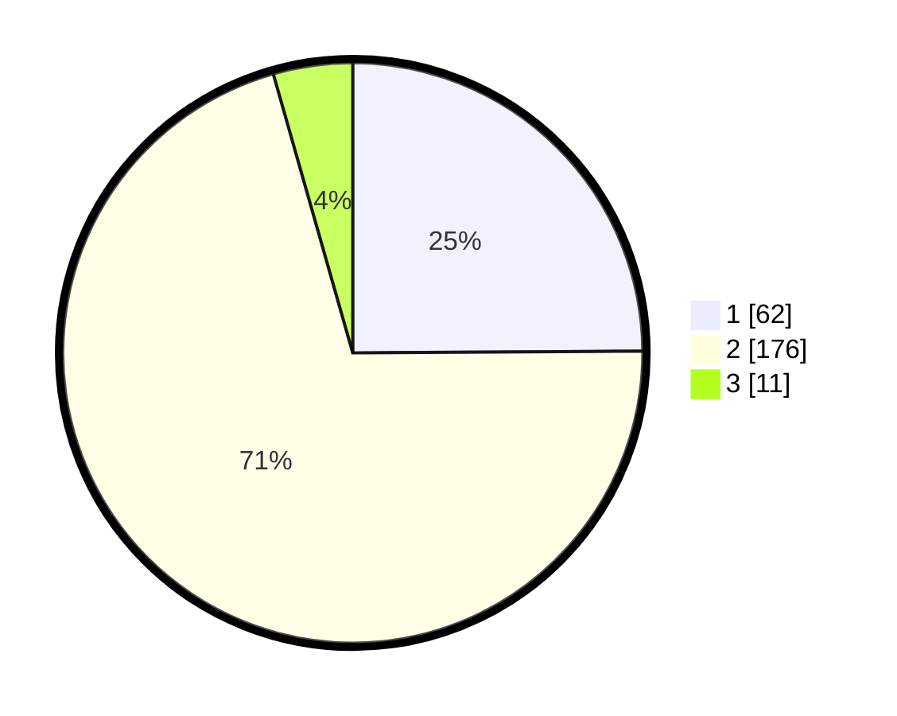

# Hasil

## Grafik

## Tabel

| No. | Nama Paslon    | Suara | Suara (raw) | Persentase |
|:--- |:-------------- | -----:| -----------:| ----------:|
| 1   | ANIES MUHAIMIN | 62    | [62][p-1]   | 24,90      |
| 2   | PRABOWO GIBRAN | 176   | [176][p-2]  | 70,68      |
| 3   | GANJAR MAHFUD  | 11    | [11][p-3]   | 4,42       |

[p-1]: https://github.com/gigit-pemilu/pemilu-2024/blob/main/pilpres/hitung-suara/sub/35-jawa-timur/sub/14-pasuruan/sub/06-kejayan/sub/2020-klinter/sub/005-tps/sub/paslon-1.txt
[p-2]: https://github.com/gigit-pemilu/pemilu-2024/blob/main/pilpres/hitung-suara/sub/35-jawa-timur/sub/14-pasuruan/sub/06-kejayan/sub/2020-klinter/sub/005-tps/sub/paslon-2.txt
[p-3]: https://github.com/gigit-pemilu/pemilu-2024/blob/main/pilpres/hitung-suara/sub/35-jawa-timur/sub/14-pasuruan/sub/06-kejayan/sub/2020-klinter/sub/005-tps/sub/paslon-3.txt

## Foto C Plano

https://sirekap-obj-formc.kpu.go.id/5cbc/pemilu/ppwp/35/14/06/20/20/3514062020005-20240217-205213--9e90373e-31bc-4588-960f-230cebdcca7c.jpg

https://sirekap-obj-formc.kpu.go.id/5cbc/pemilu/ppwp/35/14/06/20/20/3514062020005-20240217-194853--d0d7b1ec-93fe-4e96-ac83-97f5aedd02e2.jpg

https://sirekap-obj-formc.kpu.go.id/5cbc/pemilu/ppwp/35/14/06/20/20/3514062020005-20240217-210426--af8a0bd7-ef05-4d5b-af62-46235821434e.jpg

## Metadata

| Key        | Value               |
| ---------- | ------------------- |
| Time Stamp | 2024-02-19 06:16:00 |

