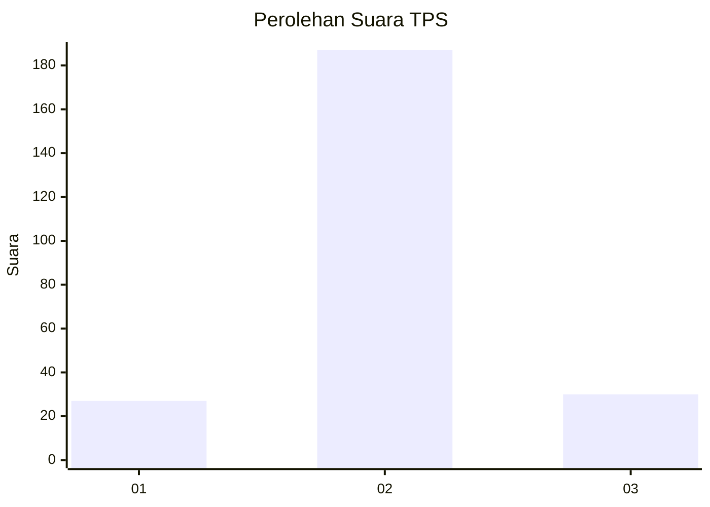
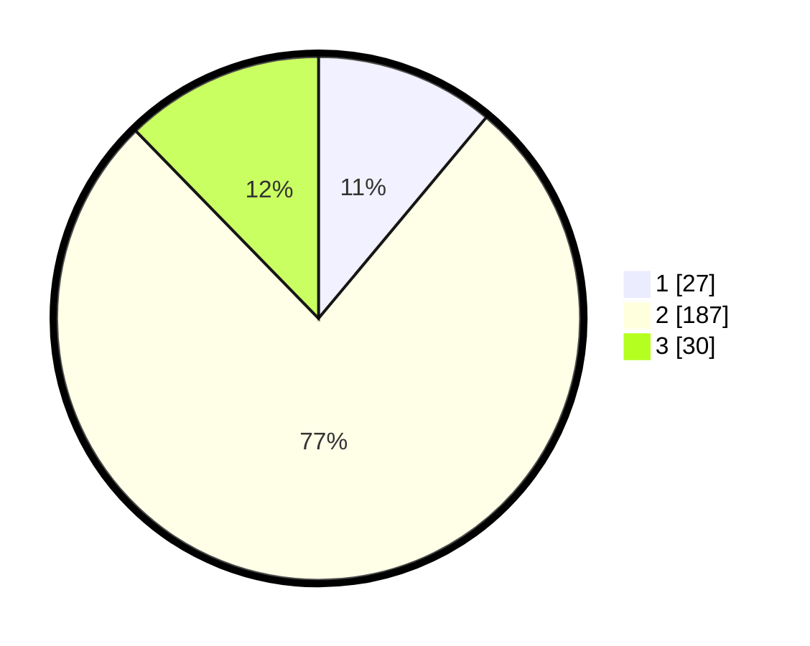

# Hasil

## Grafik

## Tabel

| No. | Nama Paslon    | Suara | Suara (raw) | Persentase |
|:--- |:-------------- | -----:| -----------:| ----------:|
| 1   | ANIES MUHAIMIN | 27    | [27][p-1]   | 11,07      |
| 2   | PRABOWO GIBRAN | 187   | [187][p-2]  | 76,64      |
| 3   | GANJAR MAHFUD  | 30    | [30][p-3]   | 12,30      |

[p-1]: https://github.com/gigit-pemilu/pemilu-2024/blob/main/pilpres/hitung-suara/sub/35-jawa-timur/sub/14-pasuruan/sub/08-purwosari/sub/2001-sumberrejo/sub/007-tps/sub/paslon-1.txt
[p-2]: https://github.com/gigit-pemilu/pemilu-2024/blob/main/pilpres/hitung-suara/sub/35-jawa-timur/sub/14-pasuruan/sub/08-purwosari/sub/2001-sumberrejo/sub/007-tps/sub/paslon-2.txt
[p-3]: https://github.com/gigit-pemilu/pemilu-2024/blob/main/pilpres/hitung-suara/sub/35-jawa-timur/sub/14-pasuruan/sub/08-purwosari/sub/2001-sumberrejo/sub/007-tps/sub/paslon-3.txt

## Foto C Plano

https://sirekap-obj-formc.kpu.go.id/e8bd/pemilu/ppwp/35/14/08/20/01/3514082001007-20240215-200059--19ed7a2f-f72c-4cb2-9eba-d67be2f56b56.jpg

https://sirekap-obj-formc.kpu.go.id/e8bd/pemilu/ppwp/35/14/08/20/01/3514082001007-20240215-200148--6a457bd2-c8dd-41c2-8565-90766f4c58db.jpg

https://sirekap-obj-formc.kpu.go.id/e8bd/pemilu/ppwp/35/14/08/20/01/3514082001007-20240215-200227--4800b60f-bc0c-4719-b68c-217d8da64b6a.jpg

## Metadata

| Key        | Value               |
| ---------- | ------------------- |
| Time Stamp | 2024-02-16 00:30:27 |

