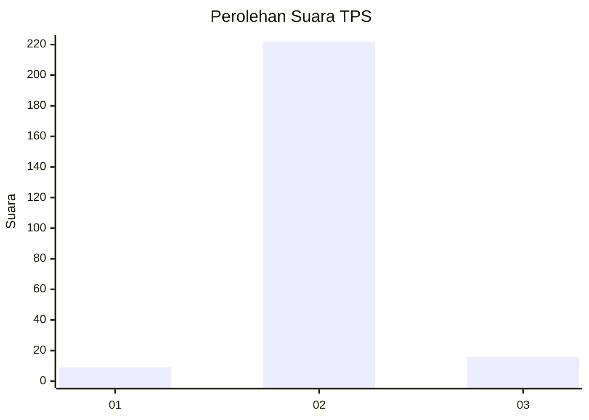
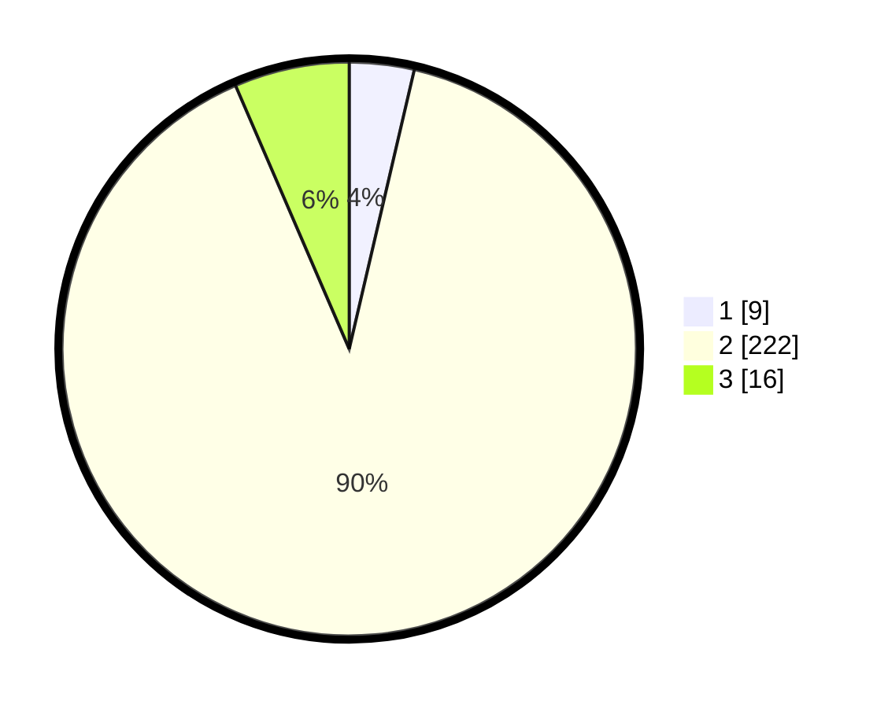

# Hasil

## Grafik

## Tabel

| No. | Nama Paslon    | Suara | Suara (raw) | Persentase |
|:--- |:-------------- | -----:| -----------:| ----------:|
| 1   | ANIES MUHAIMIN | 9     | [9][p-1]    | 3,64       |
| 2   | PRABOWO GIBRAN | 222   | [222][p-2]  | 89,88      |
| 3   | GANJAR MAHFUD  | 16    | [16][p-3]   | 6,48       |

[p-1]: https://github.com/gigit-pemilu/pemilu-2024/blob/main/pilpres/hitung-suara/sub/35-jawa-timur/sub/14-pasuruan/sub/08-purwosari/sub/2001-sumberrejo/sub/012-tps/sub/paslon-1.txt
[p-2]: https://github.com/gigit-pemilu/pemilu-2024/blob/main/pilpres/hitung-suara/sub/35-jawa-timur/sub/14-pasuruan/sub/08-purwosari/sub/2001-sumberrejo/sub/012-tps/sub/paslon-2.txt
[p-3]: https://github.com/gigit-pemilu/pemilu-2024/blob/main/pilpres/hitung-suara/sub/35-jawa-timur/sub/14-pasuruan/sub/08-purwosari/sub/2001-sumberrejo/sub/012-tps/sub/paslon-3.txt

## Foto C Plano

https://sirekap-obj-formc.kpu.go.id/c1dc/pemilu/ppwp/35/14/08/20/01/3514082001012-20240214-212703--1ce28017-75cf-455f-a4e7-8d6f70bf03f4.jpg

https://sirekap-obj-formc.kpu.go.id/c1dc/pemilu/ppwp/35/14/08/20/01/3514082001012-20240214-223601--5ce7afa0-402d-4dbe-bcda-0a9cd420f847.jpg

https://sirekap-obj-formc.kpu.go.id/c1dc/pemilu/ppwp/35/14/08/20/01/3514082001012-20240214-210944--c62bb5be-0fbf-4be6-9c1a-0c6a2529233a.jpg

## Metadata

| Key        | Value               |
| ---------- | ------------------- |
| Time Stamp | 2024-02-15 16:30:25 |

