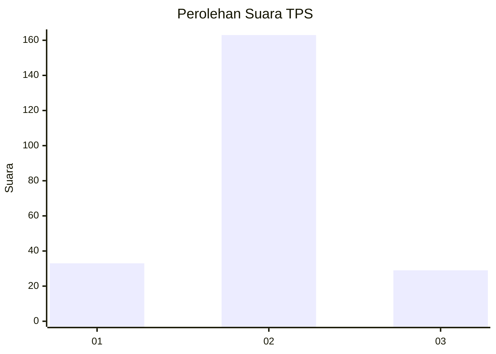
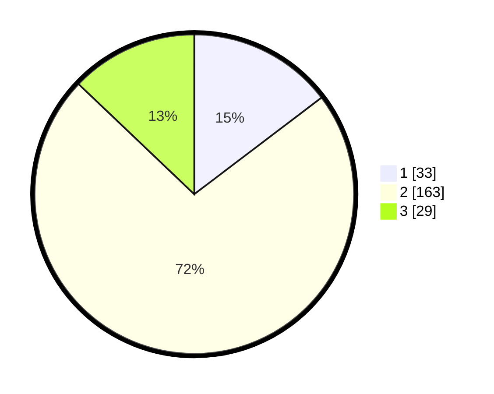

# Hasil

## Grafik

## Tabel

| No. | Nama Paslon    | Suara | Suara (raw) | Persentase |
|:--- |:-------------- | -----:| -----------:| ----------:|
| 1   | ANIES MUHAIMIN | 33    | [33][p-1]   | 14,67      |
| 2   | PRABOWO GIBRAN | 163   | [163][p-2]  | 72,44      |
| 3   | GANJAR MAHFUD  | 29    | [29][p-3]   | 12,89      |

[p-1]: https://github.com/gigit-pemilu/pemilu-2024/blob/main/pilpres/hitung-suara/sub/35-jawa-timur/sub/14-pasuruan/sub/08-purwosari/sub/2002-sekarmojo/sub/005-tps/sub/paslon-1.txt
[p-2]: https://github.com/gigit-pemilu/pemilu-2024/blob/main/pilpres/hitung-suara/sub/35-jawa-timur/sub/14-pasuruan/sub/08-purwosari/sub/2002-sekarmojo/sub/005-tps/sub/paslon-2.txt
[p-3]: https://github.com/gigit-pemilu/pemilu-2024/blob/main/pilpres/hitung-suara/sub/35-jawa-timur/sub/14-pasuruan/sub/08-purwosari/sub/2002-sekarmojo/sub/005-tps/sub/paslon-3.txt

## Foto C Plano

https://sirekap-obj-formc.kpu.go.id/7d8d/pemilu/ppwp/35/14/08/20/02/3514082002005-20240224-055531--78e41dd5-4e33-4630-a326-0360488d9f18.jpg

https://sirekap-obj-formc.kpu.go.id/7d8d/pemilu/ppwp/35/14/08/20/02/3514082002005-20240215-001825--3b1061f7-0fe6-4f56-a3cd-945e3a32b903.jpg

https://sirekap-obj-formc.kpu.go.id/7d8d/pemilu/ppwp/35/14/08/20/02/3514082002005-20240215-002610--8706a4c5-70b7-4706-8ec2-8705d6ce7500.jpg

## Metadata

| Key        | Value               |
| ---------- | ------------------- |
| Time Stamp | 2024-02-24 22:31:28 |

