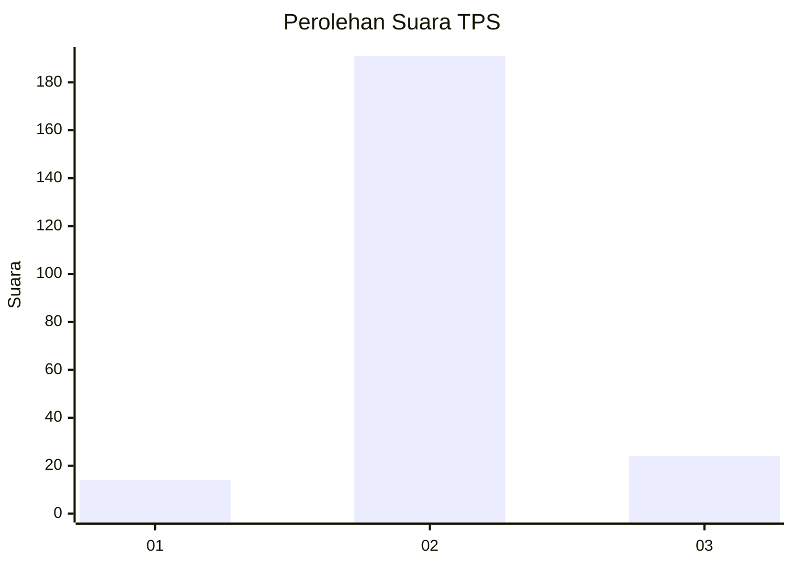
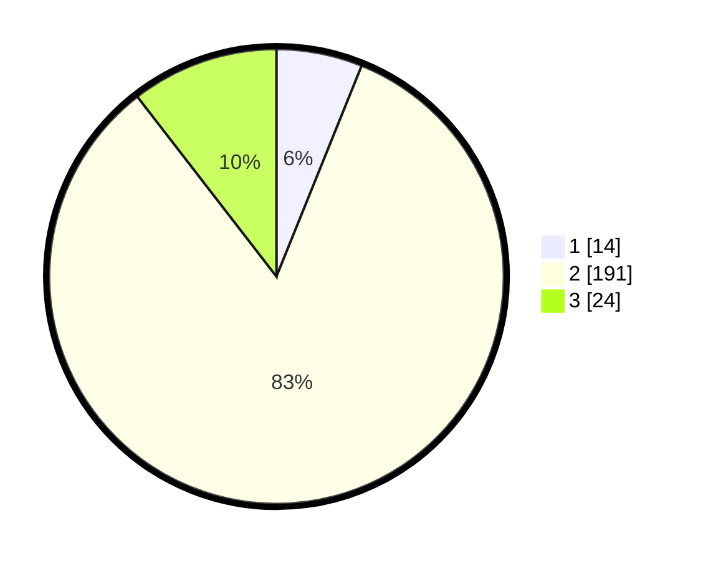

# Hasil

## Grafik

## Tabel

| No. | Nama Paslon    | Suara | Suara (raw) | Persentase |
|:--- |:-------------- | -----:| -----------:| ----------:|
| 1   | ANIES MUHAIMIN | 14    | [14][p-1]   | 6,11       |
| 2   | PRABOWO GIBRAN | 191   | [191][p-2]  | 83,41      |
| 3   | GANJAR MAHFUD  | 24    | [24][p-3]   | 10,48      |

[p-1]: https://github.com/gigit-pemilu/pemilu-2024/blob/main/pilpres/hitung-suara/sub/35-jawa-timur/sub/14-pasuruan/sub/08-purwosari/sub/2008-pager/sub/002-tps/sub/paslon-1.txt
[p-2]: https://github.com/gigit-pemilu/pemilu-2024/blob/main/pilpres/hitung-suara/sub/35-jawa-timur/sub/14-pasuruan/sub/08-purwosari/sub/2008-pager/sub/002-tps/sub/paslon-2.txt
[p-3]: https://github.com/gigit-pemilu/pemilu-2024/blob/main/pilpres/hitung-suara/sub/35-jawa-timur/sub/14-pasuruan/sub/08-purwosari/sub/2008-pager/sub/002-tps/sub/paslon-3.txt

## Foto C Plano

https://sirekap-obj-formc.kpu.go.id/5cf0/pemilu/ppwp/35/14/08/20/08/3514082008002-20240216-232352--8af3241e-abee-4da3-9ec1-4d98e7249ab7.jpg

https://sirekap-obj-formc.kpu.go.id/5cf0/pemilu/ppwp/35/14/08/20/08/3514082008002-20240217-055140--d053619a-d949-41ee-8333-f052fcdbf1aa.jpg

https://sirekap-obj-formc.kpu.go.id/5cf0/pemilu/ppwp/35/14/08/20/08/3514082008002-20240218-200406--1f647692-1c92-4e2d-8db3-334a3134b592.jpg

## Metadata

| Key        | Value               |
| ---------- | ------------------- |
| Time Stamp | 2024-02-19 06:16:00 |

