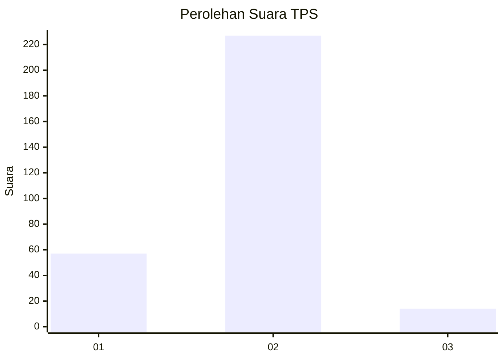
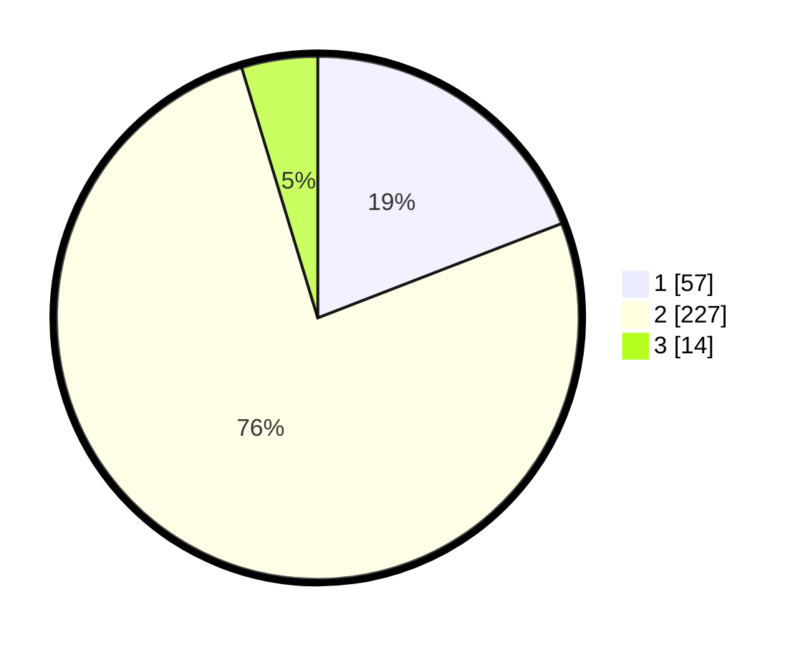

# Hasil

## Grafik

## Tabel

| No. | Nama Paslon    | Suara | Suara (raw) | Persentase |
|:--- |:-------------- | -----:| -----------:| ----------:|
| 1   | ANIES MUHAIMIN | 57    | [57][p-1]   | 19,13      |
| 2   | PRABOWO GIBRAN | 227   | [227][p-2]  | 76,17      |
| 3   | GANJAR MAHFUD  | 14    | [14][p-3]   | 4,70       |

[p-1]: https://github.com/gigit-pemilu/pemilu-2024-35-jawa-timur/blob/main/pilpres/hitung-suara/sub/35-jawa-timur/sub/14-pasuruan/sub/08-purwosari/sub/2013-kayoman/sub/004-tps/sub/paslon-1.txt
[p-2]: https://github.com/gigit-pemilu/pemilu-2024-35-jawa-timur/blob/main/pilpres/hitung-suara/sub/35-jawa-timur/sub/14-pasuruan/sub/08-purwosari/sub/2013-kayoman/sub/004-tps/sub/paslon-2.txt
[p-3]: https://github.com/gigit-pemilu/pemilu-2024-35-jawa-timur/blob/main/pilpres/hitung-suara/sub/35-jawa-timur/sub/14-pasuruan/sub/08-purwosari/sub/2013-kayoman/sub/004-tps/sub/paslon-3.txt

## Foto C Plano

https://sirekap-obj-formc.kpu.go.id/49f7/pemilu/ppwp/35/14/08/20/13/3514082013004-20240217-220141--d43cfb5c-9164-491f-b487-c6163a04f782.jpg

https://sirekap-obj-formc.kpu.go.id/49f7/pemilu/ppwp/35/14/08/20/13/3514082013004-20240216-075839--960e9459-8855-4f5c-8aa0-630c506e6e72.jpg

https://sirekap-obj-formc.kpu.go.id/49f7/pemilu/ppwp/35/14/08/20/13/3514082013004-20240217-184904--4fa23ef4-f68a-4137-af1f-4b52a0a1b7c1.jpg

## Metadata

| Key        | Value               |
| ---------- | ------------------- |
| Time Stamp | 2024-02-19 06:16:00 |

## DATA PEMILIH TETAP

Jumlah pemilih dalam DPT: **258**.
 * L: **119**.
 * P: **139**.

## DATA PENGGUNA HAK PILIH

Jumlah pengguna hak pilih dalam DPT: **3**.
 * L: **1**.
 * P: **2**.

Jumlah pengguna hak pilih dalam DPTb: **3**.
 * L: **2**.
 * P: **1**.

Jumlah pengguna hak pilih dalam DPK: **293**.
 * L: **138**.
 * P: **155**.

Jumlah pengguna hak pilih: **293**.
 * L: **138**.
 * P: **155**.

## JUMLAH SUARA SAH DAN TIDAK SAH

JUMLAH SELURUH SUARA SAH: **258**.

JUMLAH SUARA TIDAK SAH: **9**.

JUMLAH SELURUH SUARA SAH DAN SUARA TIDAK SAH: **267**.

