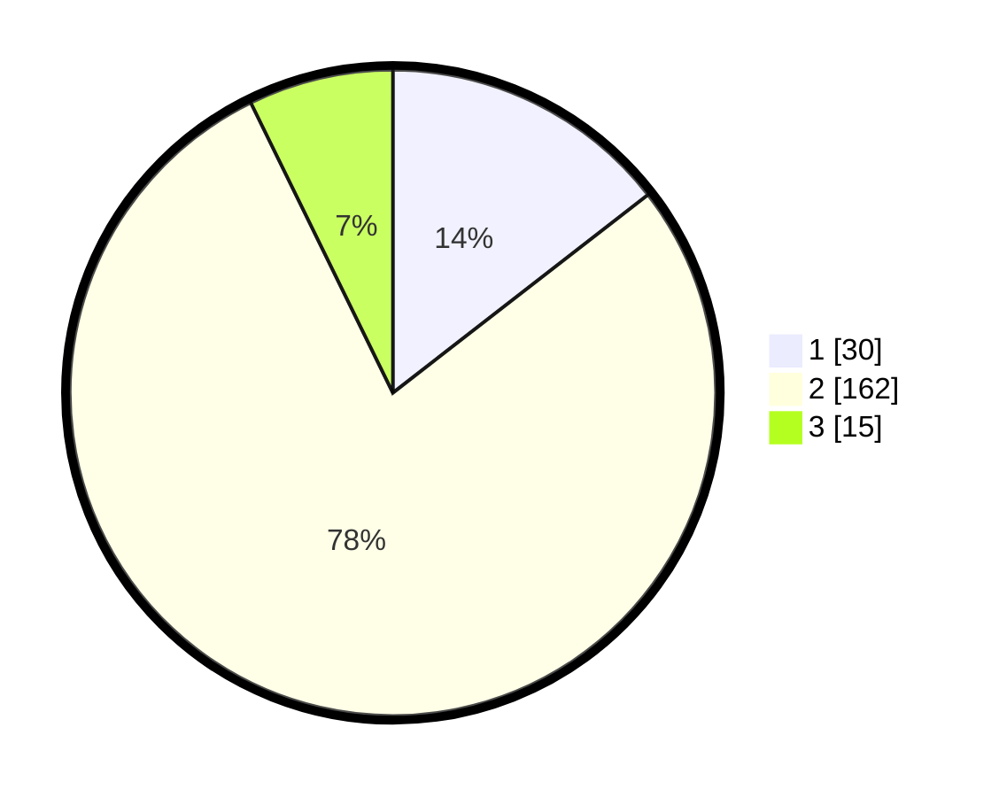

# Hasil

## Grafik

## Tabel

| No. | Nama Paslon    | Suara | Suara (raw) | Persentase |
|:--- |:-------------- | -----:| -----------:| ----------:|
| 1   | ANIES MUHAIMIN | 30    | [30][p-1]   | 14,49      |
| 2   | PRABOWO GIBRAN | 162   | [162][p-2]  | 78,26      |
| 3   | GANJAR MAHFUD  | 15    | [15][p-3]   | 7,25       |

[p-1]: https://github.com/gigit-pemilu/pemilu-2024/blob/main/pilpres/hitung-suara/sub/35-jawa-timur/sub/14-pasuruan/sub/08-purwosari/sub/2015-bakalan/sub/005-tps/sub/paslon-1.txt
[p-2]: https://github.com/gigit-pemilu/pemilu-2024/blob/main/pilpres/hitung-suara/sub/35-jawa-timur/sub/14-pasuruan/sub/08-purwosari/sub/2015-bakalan/sub/005-tps/sub/paslon-2.txt
[p-3]: https://github.com/gigit-pemilu/pemilu-2024/blob/main/pilpres/hitung-suara/sub/35-jawa-timur/sub/14-pasuruan/sub/08-purwosari/sub/2015-bakalan/sub/005-tps/sub/paslon-3.txt

## Foto C Plano

https://sirekap-obj-formc.kpu.go.id/5f9f/pemilu/ppwp/35/14/08/20/15/3514082015005-20240214-213231--90339225-522a-4e20-9753-aca19b2d575b.jpg

https://sirekap-obj-formc.kpu.go.id/5f9f/pemilu/ppwp/35/14/08/20/15/3514082015005-20240214-213817--7ab5ddd1-3184-44a7-bc55-abeb885f24ea.jpg

https://sirekap-obj-formc.kpu.go.id/5f9f/pemilu/ppwp/35/14/08/20/15/3514082015005-20240214-214037--2c5acdef-b404-423e-9111-9b0aee127979.jpg

## Metadata

| Key        | Value               |
| ---------- | ------------------- |
| Time Stamp | 2024-02-16 16:25:10 |

