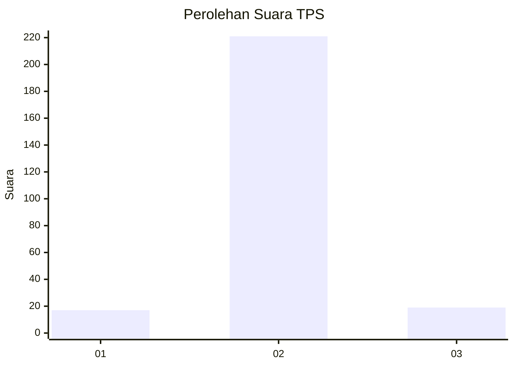
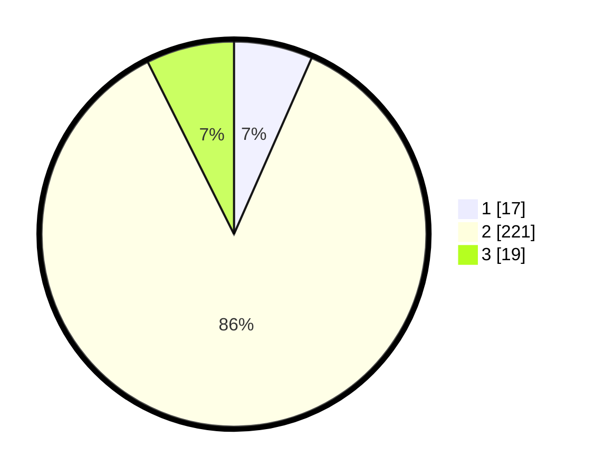

# Hasil

## Grafik

## Tabel

| No. | Nama Paslon    | Suara | Suara (raw) | Persentase |
|:--- |:-------------- | -----:| -----------:| ----------:|
| 1   | ANIES MUHAIMIN | 17    | [17][p-1]   | 6,61       |
| 2   | PRABOWO GIBRAN | 221   | [221][p-2]  | 85,99      |
| 3   | GANJAR MAHFUD  | 19    | [19][p-3]   | 7,39       |

[p-1]: https://github.com/gigit-pemilu/pemilu-2024-35-jawa-timur/blob/main/pilpres/hitung-suara/sub/35-jawa-timur/sub/14-pasuruan/sub/09-sukorejo/sub/2001-gunting/sub/014-tps/sub/paslon-1.txt
[p-2]: https://github.com/gigit-pemilu/pemilu-2024-35-jawa-timur/blob/main/pilpres/hitung-suara/sub/35-jawa-timur/sub/14-pasuruan/sub/09-sukorejo/sub/2001-gunting/sub/014-tps/sub/paslon-2.txt
[p-3]: https://github.com/gigit-pemilu/pemilu-2024-35-jawa-timur/blob/main/pilpres/hitung-suara/sub/35-jawa-timur/sub/14-pasuruan/sub/09-sukorejo/sub/2001-gunting/sub/014-tps/sub/paslon-3.txt

## Foto C Plano

https://sirekap-obj-formc.kpu.go.id/7979/pemilu/ppwp/35/14/09/20/01/3514092001014-20240215-033939--30378836-90c4-4097-a0d8-810e8500024f.jpg

https://sirekap-obj-formc.kpu.go.id/7979/pemilu/ppwp/35/14/09/20/01/3514092001014-20240215-041911--53fa2074-1ac9-48ac-ba9e-df356f3fe7e2.jpg

https://sirekap-obj-formc.kpu.go.id/7979/pemilu/ppwp/35/14/09/20/01/3514092001014-20240215-033948--613d7f9b-7fc2-4128-9047-85893eba73f2.jpg

## Metadata

| Key        | Value               |
| ---------- | ------------------- |
| Time Stamp | 2024-02-19 06:16:00 |

