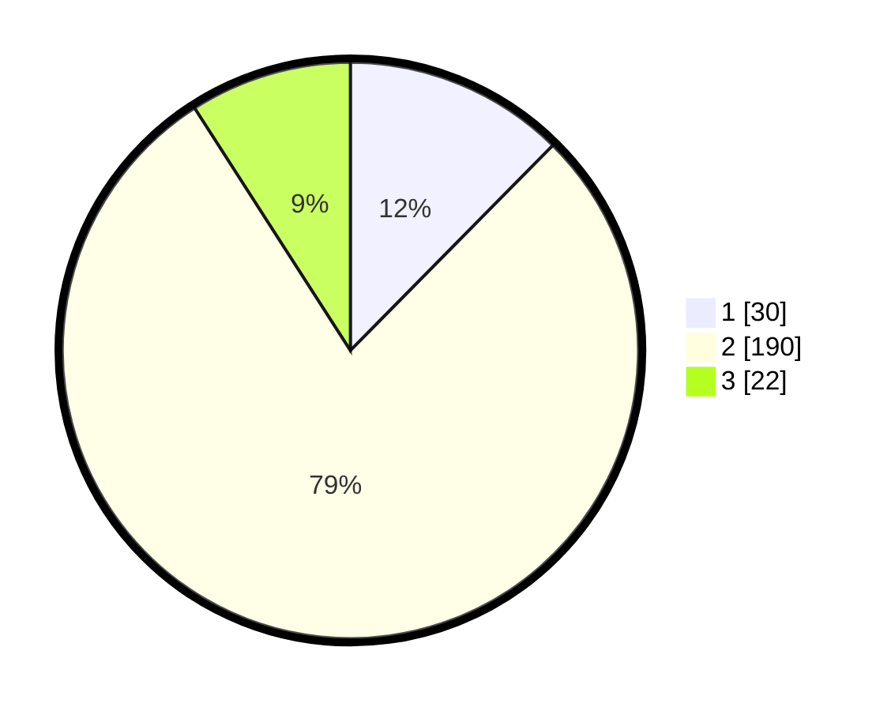

# Hasil

## Grafik

## Tabel

| No. | Nama Paslon    | Suara | Suara (raw) | Persentase |
|:--- |:-------------- | -----:| -----------:| ----------:|
| 1   | ANIES MUHAIMIN | 30    | [30][p-1]   | 12,40      |
| 2   | PRABOWO GIBRAN | 190   | [190][p-2]  | 78,51      |
| 3   | GANJAR MAHFUD  | 22    | [22][p-3]   | 9,09       |

[p-1]: https://github.com/gigit-pemilu/pemilu-2024/blob/main/pilpres/hitung-suara/sub/35-jawa-timur/sub/14-pasuruan/sub/09-sukorejo/sub/2002-pakukerto/sub/004-tps/sub/paslon-1.txt
[p-2]: https://github.com/gigit-pemilu/pemilu-2024/blob/main/pilpres/hitung-suara/sub/35-jawa-timur/sub/14-pasuruan/sub/09-sukorejo/sub/2002-pakukerto/sub/004-tps/sub/paslon-2.txt
[p-3]: https://github.com/gigit-pemilu/pemilu-2024/blob/main/pilpres/hitung-suara/sub/35-jawa-timur/sub/14-pasuruan/sub/09-sukorejo/sub/2002-pakukerto/sub/004-tps/sub/paslon-3.txt

## Foto C Plano

https://sirekap-obj-formc.kpu.go.id/83af/pemilu/ppwp/35/14/09/20/02/3514092002004-20240214-210211--4e8f76d9-cbe6-48e4-8981-536adbfb35aa.jpg

https://sirekap-obj-formc.kpu.go.id/83af/pemilu/ppwp/35/14/09/20/02/3514092002004-20240214-210413--05cf4d38-6640-48c5-80a1-70eeac198b1d.jpg

https://sirekap-obj-formc.kpu.go.id/83af/pemilu/ppwp/35/14/09/20/02/3514092002004-20240214-210520--16b96fb3-96a3-4e6c-9267-0ac9ddcafb51.jpg

## Metadata

| Key        | Value               |
| ---------- | ------------------- |
| Time Stamp | 2024-02-19 06:16:00 |

