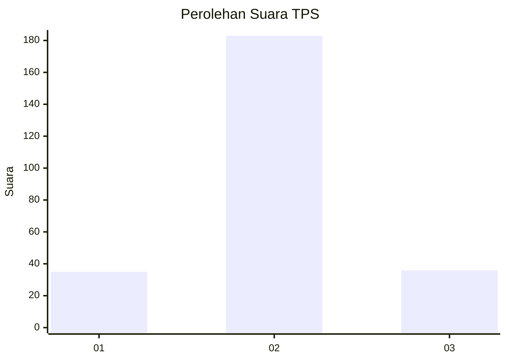
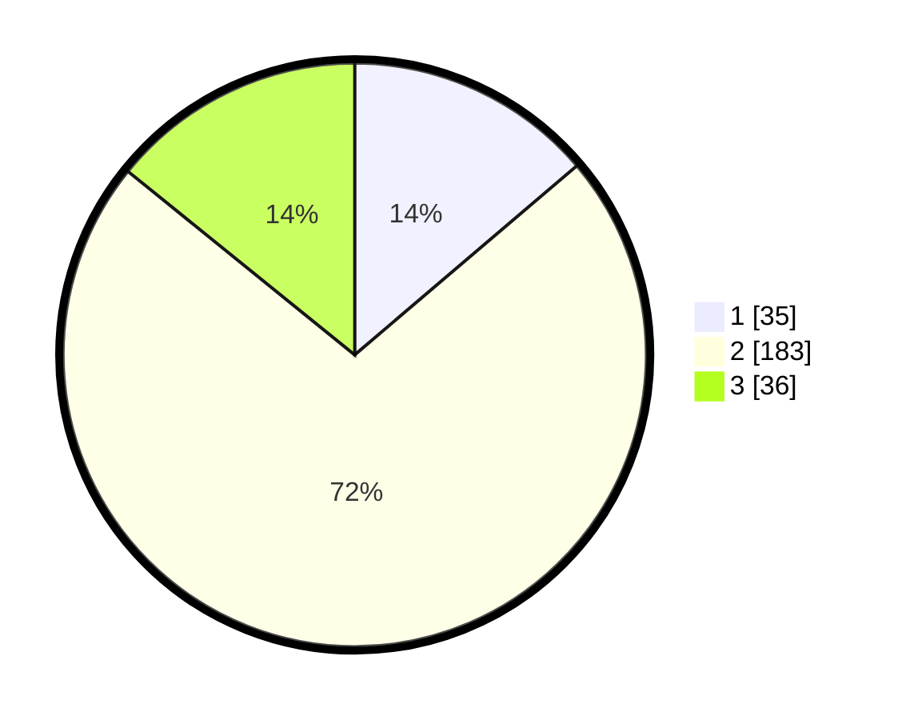

# Hasil

## Grafik

## Tabel

| No. | Nama Paslon    | Suara | Suara (raw) | Persentase |
|:--- |:-------------- | -----:| -----------:| ----------:|
| 1   | ANIES MUHAIMIN | 35    | [35][p-1]   | 13,78      |
| 2   | PRABOWO GIBRAN | 183   | [183][p-2]  | 72,05      |
| 3   | GANJAR MAHFUD  | 36    | [36][p-3]   | 14,17      |

[p-1]: https://github.com/gigit-pemilu/pemilu-2024-35-jawa-timur/blob/main/pilpres/hitung-suara/sub/35-jawa-timur/sub/14-pasuruan/sub/09-sukorejo/sub/2004-sukorejo/sub/003-tps/sub/paslon-1.txt
[p-2]: https://github.com/gigit-pemilu/pemilu-2024-35-jawa-timur/blob/main/pilpres/hitung-suara/sub/35-jawa-timur/sub/14-pasuruan/sub/09-sukorejo/sub/2004-sukorejo/sub/003-tps/sub/paslon-2.txt
[p-3]: https://github.com/gigit-pemilu/pemilu-2024-35-jawa-timur/blob/main/pilpres/hitung-suara/sub/35-jawa-timur/sub/14-pasuruan/sub/09-sukorejo/sub/2004-sukorejo/sub/003-tps/sub/paslon-3.txt

## Foto C Plano

https://sirekap-obj-formc.kpu.go.id/577c/pemilu/ppwp/35/14/09/20/04/3514092004003-20240217-114306--ac4c8d83-ec5e-43fa-80d9-0a5fb026da25.jpg

https://sirekap-obj-formc.kpu.go.id/577c/pemilu/ppwp/35/14/09/20/04/3514092004003-20240217-184835--9fd35a62-ef25-499d-a076-892fa8682357.jpg

https://sirekap-obj-formc.kpu.go.id/577c/pemilu/ppwp/35/14/09/20/04/3514092004003-20240217-120159--cafb9320-8673-48bb-80d3-2dcf12ffdc16.jpg

## Metadata

| Key        | Value               |
| ---------- | ------------------- |
| Time Stamp | 2024-02-19 06:16:00 |

