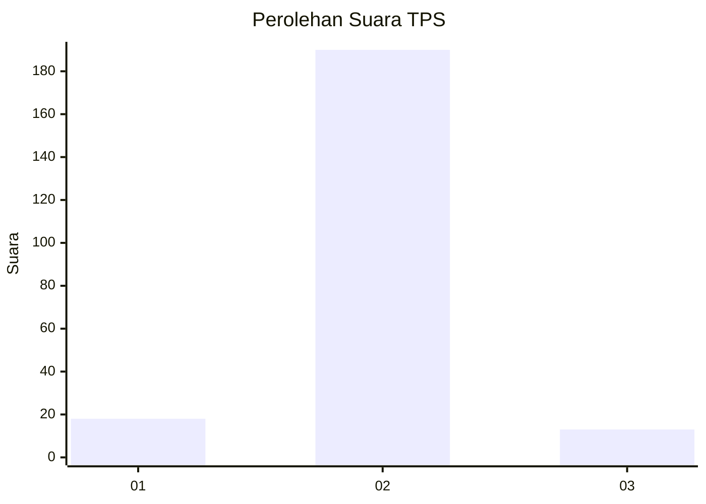
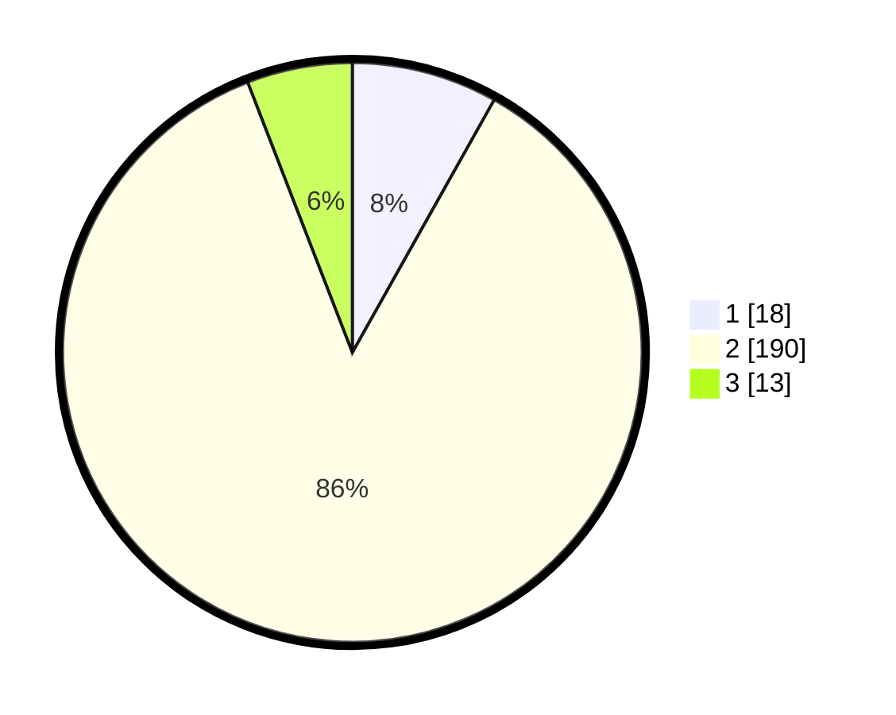

# Hasil

## Grafik

## Tabel

| No. | Nama Paslon    | Suara | Suara (raw) | Persentase |
|:--- |:-------------- | -----:| -----------:| ----------:|
| 1   | ANIES MUHAIMIN | 18    | [18][p-1]   | 8,14       |
| 2   | PRABOWO GIBRAN | 190   | [190][p-2]  | 85,97      |
| 3   | GANJAR MAHFUD  | 13    | [13][p-3]   | 5,88       |

[p-1]: https://github.com/gigit-pemilu/pemilu-2024-35-jawa-timur/blob/main/pilpres/hitung-suara/sub/35-jawa-timur/sub/14-pasuruan/sub/09-sukorejo/sub/2006-sebandung/sub/003-tps/sub/paslon-1.txt
[p-2]: https://github.com/gigit-pemilu/pemilu-2024-35-jawa-timur/blob/main/pilpres/hitung-suara/sub/35-jawa-timur/sub/14-pasuruan/sub/09-sukorejo/sub/2006-sebandung/sub/003-tps/sub/paslon-2.txt
[p-3]: https://github.com/gigit-pemilu/pemilu-2024-35-jawa-timur/blob/main/pilpres/hitung-suara/sub/35-jawa-timur/sub/14-pasuruan/sub/09-sukorejo/sub/2006-sebandung/sub/003-tps/sub/paslon-3.txt

## Foto C Plano

https://sirekap-obj-formc.kpu.go.id/9d50/pemilu/ppwp/35/14/09/20/06/3514092006003-20240214-200226--892bb87e-a61d-433d-bb22-60738aaf4271.jpg

https://sirekap-obj-formc.kpu.go.id/9d50/pemilu/ppwp/35/14/09/20/06/3514092006003-20240214-200232--4380d4f4-ffd2-4663-98a3-19f1f92c597d.jpg

https://sirekap-obj-formc.kpu.go.id/9d50/pemilu/ppwp/35/14/09/20/06/3514092006003-20240214-200238--b1f7eb34-e56c-4fca-ad9f-5ae4aa0566c9.jpg

## Metadata

| Key        | Value               |
| ---------- | ------------------- |
| Time Stamp | 2024-02-15 00:41:44 |

