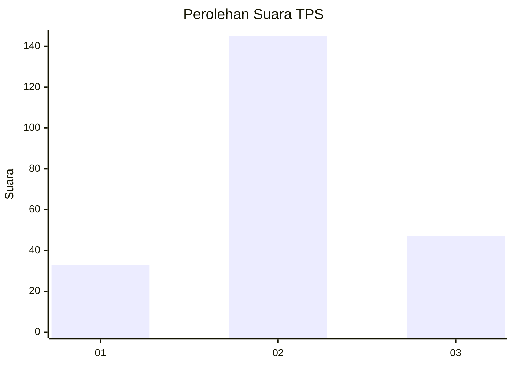
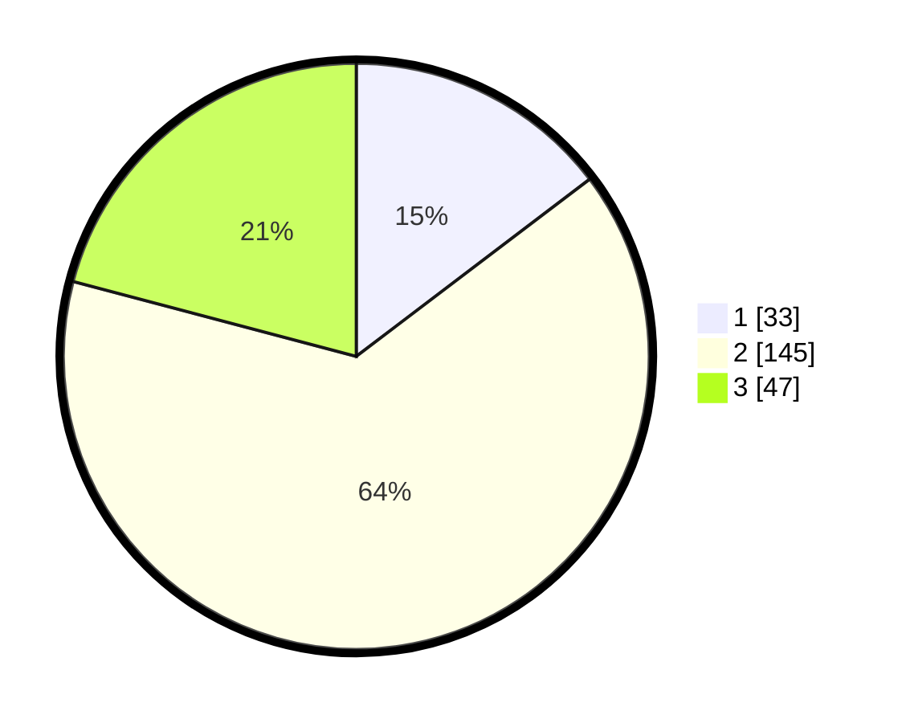

# Hasil

## Grafik

## Tabel

| No. | Nama Paslon    | Suara | Suara (raw) | Persentase |
|:--- |:-------------- | -----:| -----------:| ----------:|
| 1   | ANIES MUHAIMIN | 33    | [33][p-1]   | 14,67      |
| 2   | PRABOWO GIBRAN | 145   | [145][p-2]  | 64,44      |
| 3   | GANJAR MAHFUD  | 47    | [47][p-3]   | 20,89      |

[p-1]: https://github.com/gigit-pemilu/pemilu-2024/blob/main/pilpres/hitung-suara/sub/35-jawa-timur/sub/14-pasuruan/sub/09-sukorejo/sub/2012-suwayuwo/sub/006-tps/sub/paslon-1.txt
[p-2]: https://github.com/gigit-pemilu/pemilu-2024/blob/main/pilpres/hitung-suara/sub/35-jawa-timur/sub/14-pasuruan/sub/09-sukorejo/sub/2012-suwayuwo/sub/006-tps/sub/paslon-2.txt
[p-3]: https://github.com/gigit-pemilu/pemilu-2024/blob/main/pilpres/hitung-suara/sub/35-jawa-timur/sub/14-pasuruan/sub/09-sukorejo/sub/2012-suwayuwo/sub/006-tps/sub/paslon-3.txt

## Foto C Plano

https://sirekap-obj-formc.kpu.go.id/6c7c/pemilu/ppwp/35/14/09/20/12/3514092012006-20240217-173543--f3a8dbd0-f862-41dd-b7ab-8bb38ca672f1.jpg

https://sirekap-obj-formc.kpu.go.id/6c7c/pemilu/ppwp/35/14/09/20/12/3514092012006-20240216-155736--a4cd374b-54c0-4b5e-bc60-b7d42c713fdd.jpg

https://sirekap-obj-formc.kpu.go.id/6c7c/pemilu/ppwp/35/14/09/20/12/3514092012006-20240216-160743--b95236ae-1555-4302-bb37-e8ef743f7a40.jpg

## Metadata

| Key        | Value               |
| ---------- | ------------------- |
| Time Stamp | 2024-02-19 06:16:00 |

