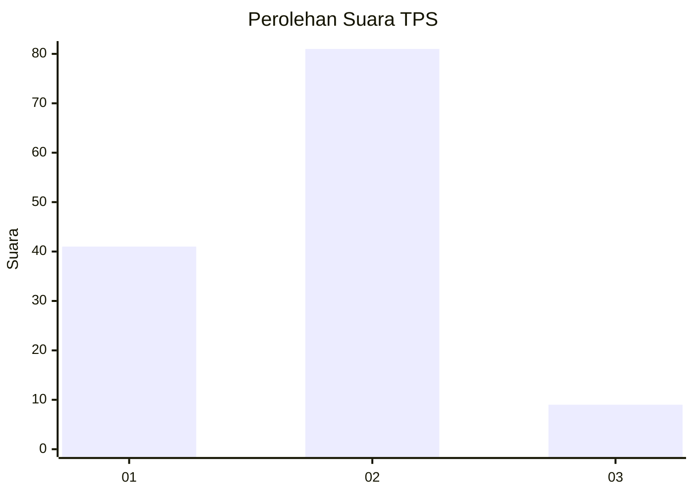
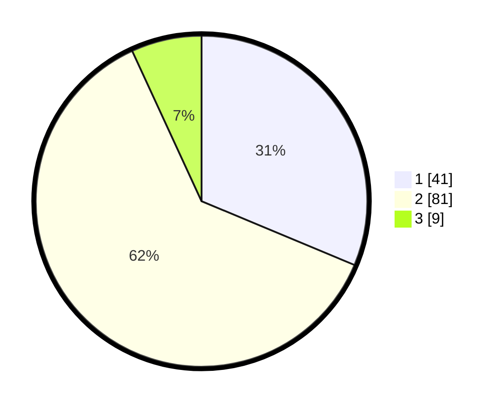

# Hasil

## Grafik

## Tabel

| No. | Nama Paslon    | Suara | Suara (raw) | Persentase |
|:--- |:-------------- | -----:| -----------:| ----------:|
| 1   | ANIES MUHAIMIN | 41    | [41][p-1]   | 31,30      |
| 2   | PRABOWO GIBRAN | 81    | [81][p-2]   | 61,83      |
| 3   | GANJAR MAHFUD  | 9     | [9][p-3]    | 6,87       |

[p-1]: https://github.com/gigit-pemilu/pemilu-2024-35-jawa-timur/blob/main/pilpres/hitung-suara/sub/35-jawa-timur/sub/14-pasuruan/sub/09-sukorejo/sub/2014-kalirejo/sub/013-tps/sub/paslon-1.txt
[p-2]: https://github.com/gigit-pemilu/pemilu-2024-35-jawa-timur/blob/main/pilpres/hitung-suara/sub/35-jawa-timur/sub/14-pasuruan/sub/09-sukorejo/sub/2014-kalirejo/sub/013-tps/sub/paslon-2.txt
[p-3]: https://github.com/gigit-pemilu/pemilu-2024-35-jawa-timur/blob/main/pilpres/hitung-suara/sub/35-jawa-timur/sub/14-pasuruan/sub/09-sukorejo/sub/2014-kalirejo/sub/013-tps/sub/paslon-3.txt

## Foto C Plano

https://sirekap-obj-formc.kpu.go.id/a571/pemilu/ppwp/35/14/09/20/14/3514092014013-20240216-172102--7764d893-71c0-44dd-8cbf-3e11cdf52a31.jpg

https://sirekap-obj-formc.kpu.go.id/a571/pemilu/ppwp/35/14/09/20/14/3514092014013-20240216-165306--30dd57a2-31a9-429d-afac-358dd9f92bbf.jpg

https://sirekap-obj-formc.kpu.go.id/a571/pemilu/ppwp/35/14/09/20/14/3514092014013-20240214-223206--62ca8a5d-75a8-4e32-abac-ea39fc520bf3.jpg

## Metadata

| Key        | Value               |
| ---------- | ------------------- |
| Time Stamp | 2024-02-19 06:16:00 |

