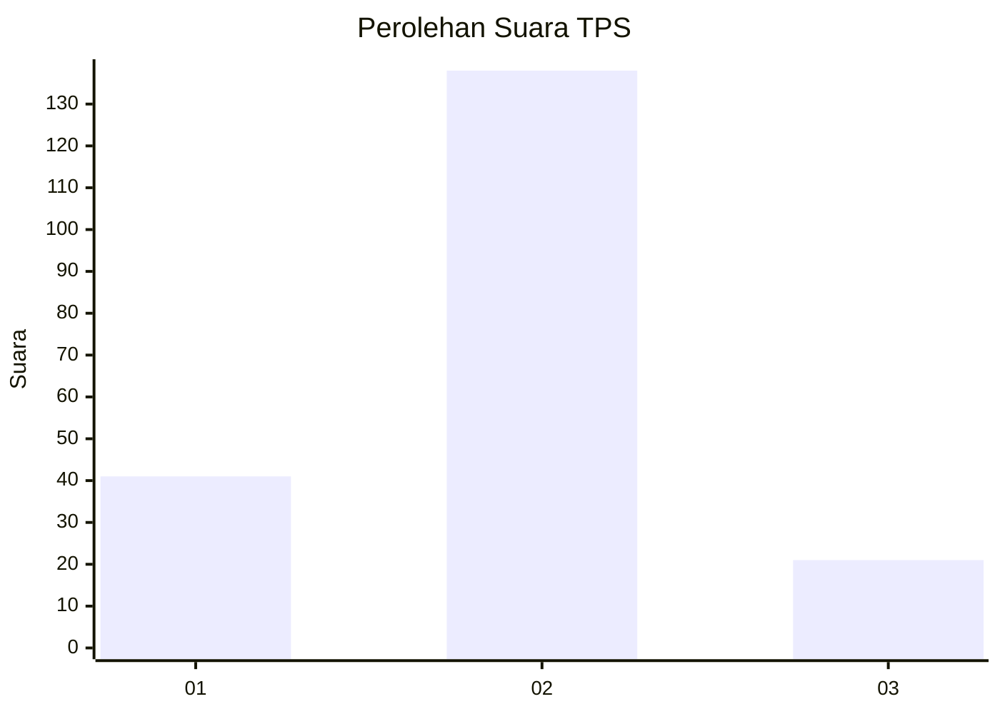
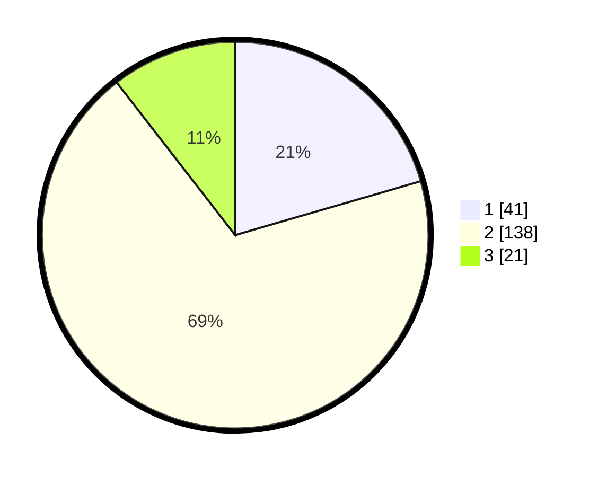

# Hasil

## Grafik

## Tabel

| No. | Nama Paslon    | Suara | Suara (raw) | Persentase |
|:--- |:-------------- | -----:| -----------:| ----------:|
| 1   | ANIES MUHAIMIN | 41    | [41][p-1]   | 20,50      |
| 2   | PRABOWO GIBRAN | 138   | [138][p-2]  | 69,00      |
| 3   | GANJAR MAHFUD  | 21    | [21][p-3]   | 10,50      |

[p-1]: https://github.com/gigit-pemilu/pemilu-2024/blob/main/pilpres/hitung-suara/sub/35-jawa-timur/sub/14-pasuruan/sub/09-sukorejo/sub/2017-sukorame/sub/001-tps/sub/paslon-1.txt
[p-2]: https://github.com/gigit-pemilu/pemilu-2024/blob/main/pilpres/hitung-suara/sub/35-jawa-timur/sub/14-pasuruan/sub/09-sukorejo/sub/2017-sukorame/sub/001-tps/sub/paslon-2.txt
[p-3]: https://github.com/gigit-pemilu/pemilu-2024/blob/main/pilpres/hitung-suara/sub/35-jawa-timur/sub/14-pasuruan/sub/09-sukorejo/sub/2017-sukorame/sub/001-tps/sub/paslon-3.txt

## Foto C Plano

https://sirekap-obj-formc.kpu.go.id/4911/pemilu/ppwp/35/14/09/20/17/3514092017001-20240214-155523--851542dd-e85e-48c2-bbaa-37deb8df3180.jpg

https://sirekap-obj-formc.kpu.go.id/4911/pemilu/ppwp/35/14/09/20/17/3514092017001-20240217-212551--d3510d2e-34cb-4c0c-975c-d12358949d61.jpg

https://sirekap-obj-formc.kpu.go.id/4911/pemilu/ppwp/35/14/09/20/17/3514092017001-20240217-211417--7f796e49-a487-4453-887d-e5beb7aa16c2.jpg

## Metadata

| Key        | Value               |
| ---------- | ------------------- |
| Time Stamp | 2024-02-19 06:16:00 |

