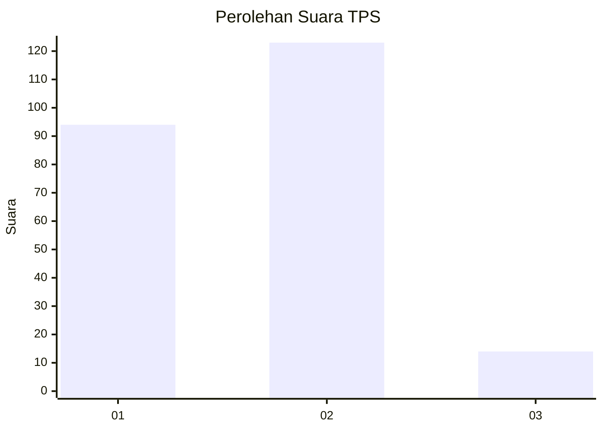
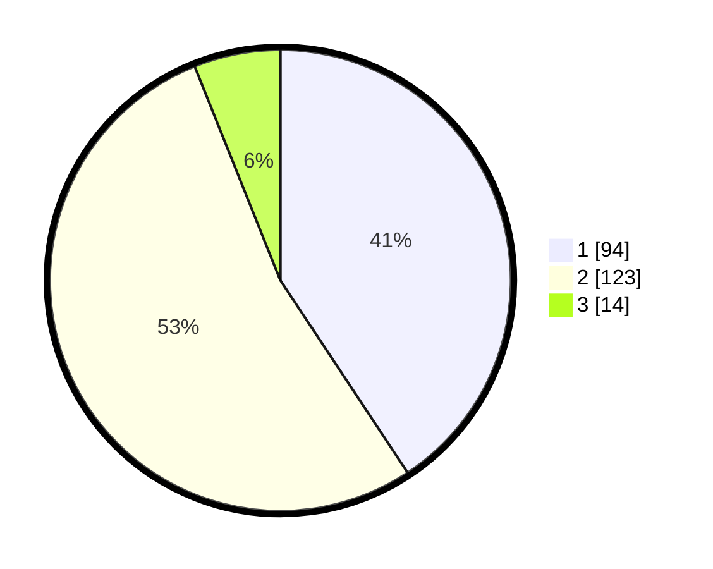

# Hasil

## Grafik

## Tabel

| No. | Nama Paslon    | Suara | Suara (raw) | Persentase |
|:--- |:-------------- | -----:| -----------:| ----------:|
| 1   | ANIES MUHAIMIN | 94    | [94][p-1]   | 40,69      |
| 2   | PRABOWO GIBRAN | 123   | [123][p-2]  | 53,25      |
| 3   | GANJAR MAHFUD  | 14    | [14][p-3]   | 6,06       |

[p-1]: https://github.com/gigit-pemilu/pemilu-2024/blob/main/pilpres/hitung-suara/sub/35-jawa-timur/sub/14-pasuruan/sub/09-sukorejo/sub/2017-sukorame/sub/003-tps/sub/paslon-1.txt
[p-2]: https://github.com/gigit-pemilu/pemilu-2024/blob/main/pilpres/hitung-suara/sub/35-jawa-timur/sub/14-pasuruan/sub/09-sukorejo/sub/2017-sukorame/sub/003-tps/sub/paslon-2.txt
[p-3]: https://github.com/gigit-pemilu/pemilu-2024/blob/main/pilpres/hitung-suara/sub/35-jawa-timur/sub/14-pasuruan/sub/09-sukorejo/sub/2017-sukorame/sub/003-tps/sub/paslon-3.txt

## Foto C Plano

https://sirekap-obj-formc.kpu.go.id/0635/pemilu/ppwp/35/14/09/20/17/3514092017003-20240215-012025--c523259d-547e-4453-b2d3-23a47f8cf7e4.jpg

https://sirekap-obj-formc.kpu.go.id/0635/pemilu/ppwp/35/14/09/20/17/3514092017003-20240215-012212--bb7aa38a-e409-44f1-9bfa-86e6df092cae.jpg

https://sirekap-obj-formc.kpu.go.id/0635/pemilu/ppwp/35/14/09/20/17/3514092017003-20240215-014314--348a3926-6997-4c6b-ab02-6f9dee2ce9f2.jpg

## Metadata

| Key        | Value               |
| ---------- | ------------------- |
| Time Stamp | 2024-02-26 02:00:00 |

