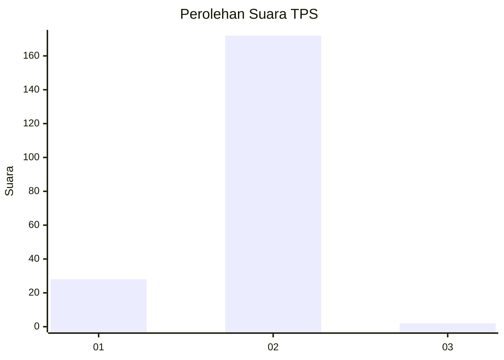
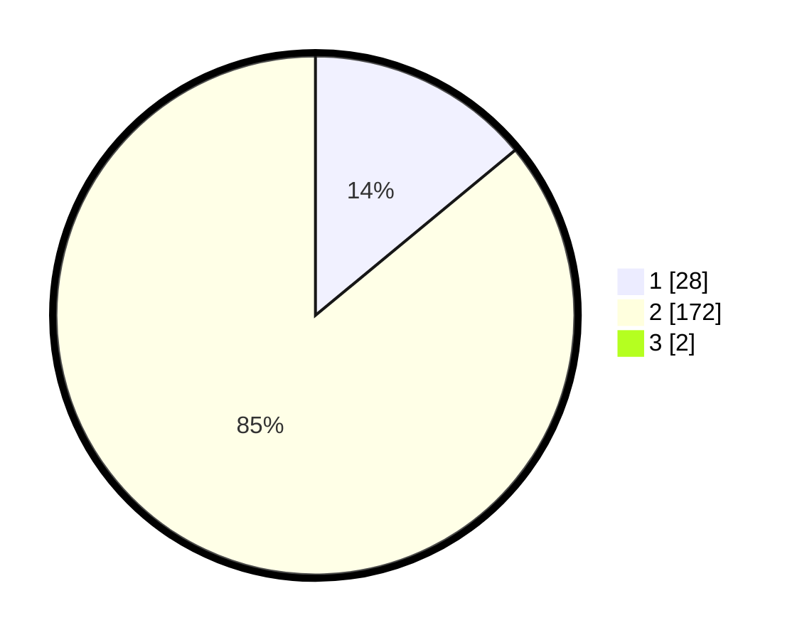

# Hasil

## Grafik

## Tabel

| No. | Nama Paslon    | Suara | Suara (raw) | Persentase |
|:--- |:-------------- | -----:| -----------:| ----------:|
| 1   | ANIES MUHAIMIN | 28    | [28][p-1]   | 13,86      |
| 2   | PRABOWO GIBRAN | 172   | [172][p-2]  | 85,15      |
| 3   | GANJAR MAHFUD  | 2     | [2][p-3]    | 0,99       |

[p-1]: https://github.com/gigit-pemilu/pemilu-2024/blob/main/pilpres/hitung-suara/sub/35-jawa-timur/sub/14-pasuruan/sub/09-sukorejo/sub/2017-sukorame/sub/006-tps/sub/paslon-1.txt
[p-2]: https://github.com/gigit-pemilu/pemilu-2024/blob/main/pilpres/hitung-suara/sub/35-jawa-timur/sub/14-pasuruan/sub/09-sukorejo/sub/2017-sukorame/sub/006-tps/sub/paslon-2.txt
[p-3]: https://github.com/gigit-pemilu/pemilu-2024/blob/main/pilpres/hitung-suara/sub/35-jawa-timur/sub/14-pasuruan/sub/09-sukorejo/sub/2017-sukorame/sub/006-tps/sub/paslon-3.txt

## Foto C Plano

https://sirekap-obj-formc.kpu.go.id/4279/pemilu/ppwp/35/14/09/20/17/3514092017006-20240215-003500--cffb656b-36f4-482d-8e74-409120a3e40e.jpg

https://sirekap-obj-formc.kpu.go.id/4279/pemilu/ppwp/35/14/09/20/17/3514092017006-20240215-003552--90e2a468-4080-439b-8f58-6de10205c75c.jpg

https://sirekap-obj-formc.kpu.go.id/4279/pemilu/ppwp/35/14/09/20/17/3514092017006-20240215-000542--f1bb6aff-3582-464d-9640-4a67cce5886f.jpg

## Metadata

| Key        | Value               |
| ---------- | ------------------- |
| Time Stamp | 2024-02-19 06:16:00 |

