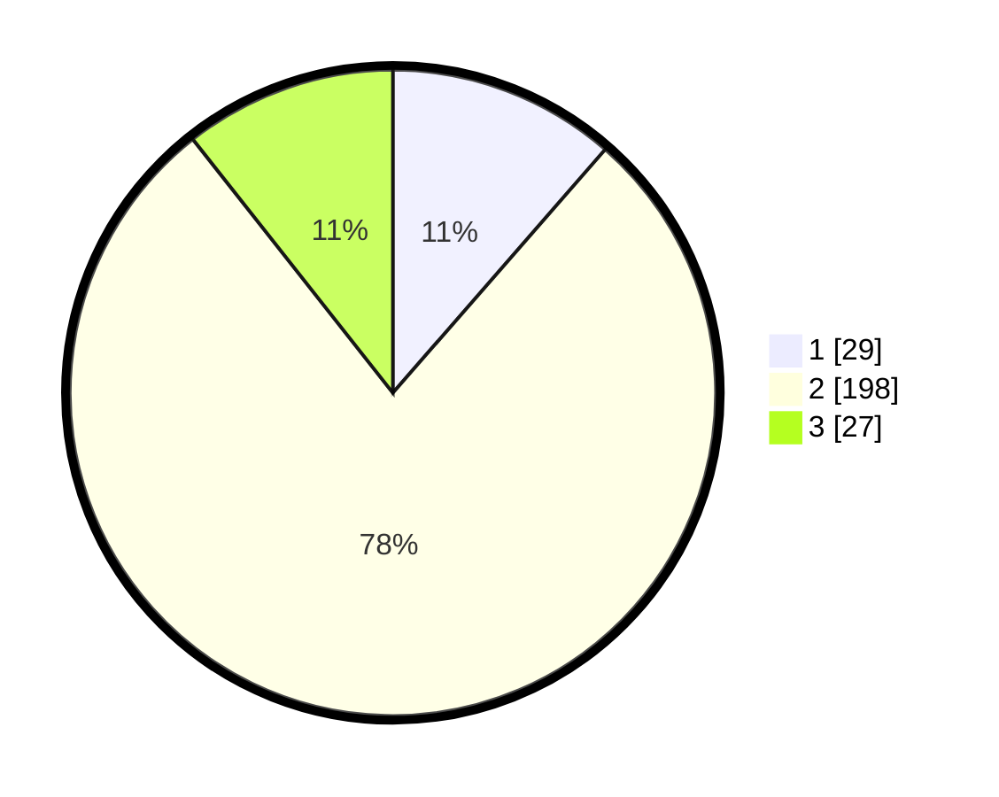

# Hasil

## Grafik

## Tabel

| No. | Nama Paslon    | Suara | Suara (raw) | Persentase |
|:--- |:-------------- | -----:| -----------:| ----------:|
| 1   | ANIES MUHAIMIN | 29    | [29][p-1]   | 11,42      |
| 2   | PRABOWO GIBRAN | 198   | [198][p-2]  | 77,95      |
| 3   | GANJAR MAHFUD  | 27    | [27][p-3]   | 10,63      |

[p-1]: https://github.com/gigit-pemilu/pemilu-2024-35-jawa-timur/blob/main/pilpres/hitung-suara/sub/35-jawa-timur/sub/14-pasuruan/sub/09-sukorejo/sub/2019-wonokerto/sub/003-tps/sub/paslon-1.txt
[p-2]: https://github.com/gigit-pemilu/pemilu-2024-35-jawa-timur/blob/main/pilpres/hitung-suara/sub/35-jawa-timur/sub/14-pasuruan/sub/09-sukorejo/sub/2019-wonokerto/sub/003-tps/sub/paslon-2.txt
[p-3]: https://github.com/gigit-pemilu/pemilu-2024-35-jawa-timur/blob/main/pilpres/hitung-suara/sub/35-jawa-timur/sub/14-pasuruan/sub/09-sukorejo/sub/2019-wonokerto/sub/003-tps/sub/paslon-3.txt

## Foto C Plano

https://sirekap-obj-formc.kpu.go.id/66ae/pemilu/ppwp/35/14/09/20/19/3514092019003-20240215-003104--52ee3edc-972b-46d7-9276-043e0f1d1e49.jpg

https://sirekap-obj-formc.kpu.go.id/66ae/pemilu/ppwp/35/14/09/20/19/3514092019003-20240215-001004--01a5ce25-707b-4284-b193-add1f58c06b0.jpg

https://sirekap-obj-formc.kpu.go.id/66ae/pemilu/ppwp/35/14/09/20/19/3514092019003-20240215-001105--bb4aab96-edbd-4cff-9b6f-64618a67ab9d.jpg

## Metadata

| Key        | Value               |
| ---------- | ------------------- |
| Time Stamp | 2024-02-15 12:00:28 |

