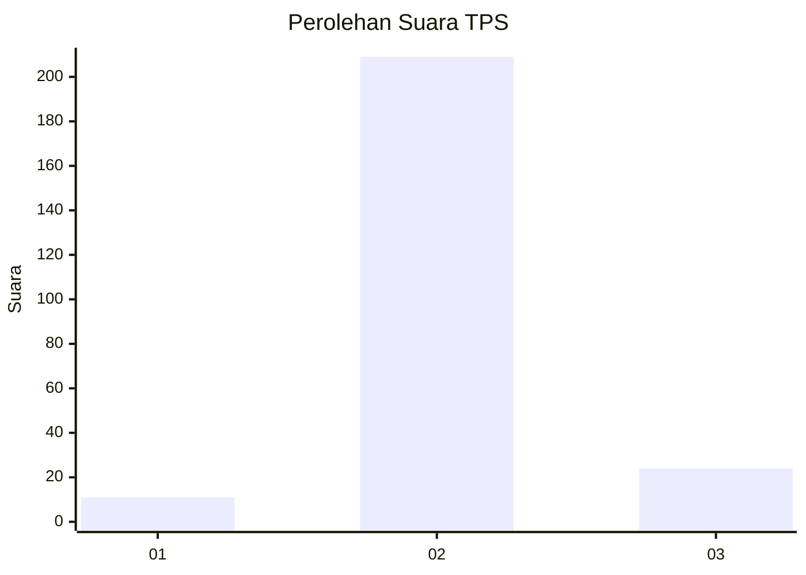
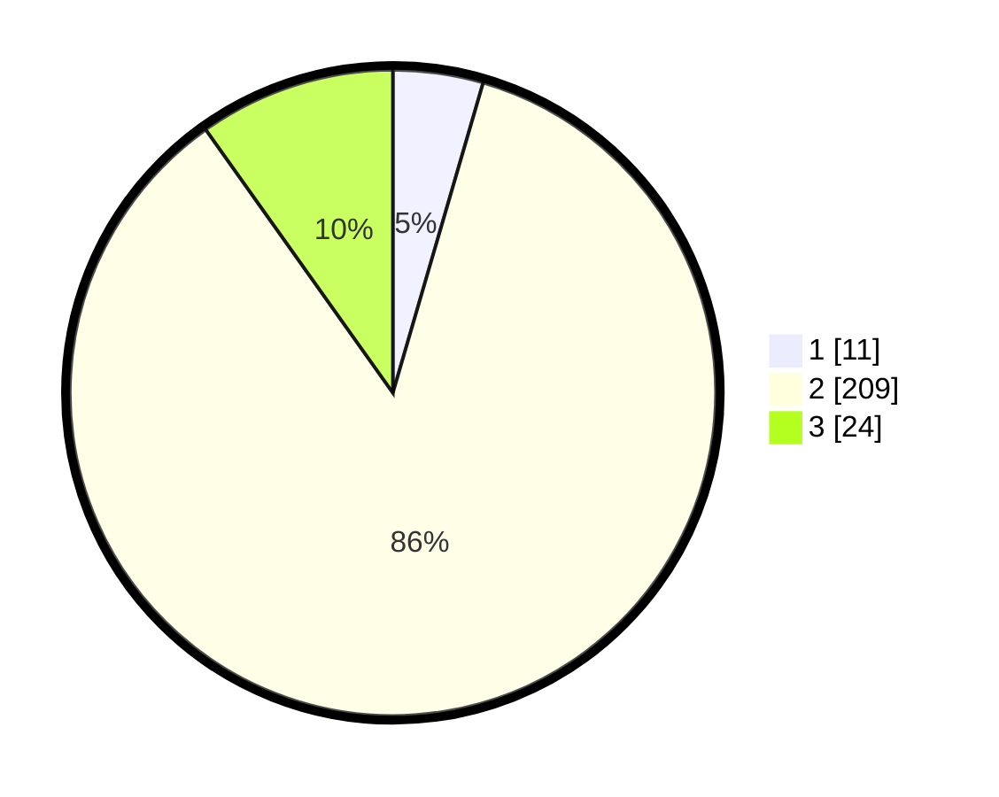

# Hasil

## Grafik

## Tabel

| No. | Nama Paslon    | Suara | Suara (raw) | Persentase |
|:--- |:-------------- | -----:| -----------:| ----------:|
| 1   | ANIES MUHAIMIN | 11    | [11][p-1]   | 4,51       |
| 2   | PRABOWO GIBRAN | 209   | [209][p-2]  | 85,66      |
| 3   | GANJAR MAHFUD  | 24    | [24][p-3]   | 9,84       |

[p-1]: https://github.com/gigit-pemilu/pemilu-2024-35-jawa-timur/blob/main/pilpres/hitung-suara/sub/35-jawa-timur/sub/14-pasuruan/sub/11-pandaan/sub/2002-durensewu/sub/005-tps/sub/paslon-1.txt
[p-2]: https://github.com/gigit-pemilu/pemilu-2024-35-jawa-timur/blob/main/pilpres/hitung-suara/sub/35-jawa-timur/sub/14-pasuruan/sub/11-pandaan/sub/2002-durensewu/sub/005-tps/sub/paslon-2.txt
[p-3]: https://github.com/gigit-pemilu/pemilu-2024-35-jawa-timur/blob/main/pilpres/hitung-suara/sub/35-jawa-timur/sub/14-pasuruan/sub/11-pandaan/sub/2002-durensewu/sub/005-tps/sub/paslon-3.txt

## Foto C Plano

https://sirekap-obj-formc.kpu.go.id/5783/pemilu/ppwp/35/14/11/20/02/3514112002005-20240214-224831--a5707f11-e71c-48f2-8997-dc08d4a2137b.jpg

https://sirekap-obj-formc.kpu.go.id/5783/pemilu/ppwp/35/14/11/20/02/3514112002005-20240217-113500--4f5e757c-9603-4d6a-80e5-8c7aa9848356.jpg

https://sirekap-obj-formc.kpu.go.id/5783/pemilu/ppwp/35/14/11/20/02/3514112002005-20240218-084148--88cccec5-640b-480a-8506-cdf698b58225.jpg

## Metadata

| Key        | Value               |
| ---------- | ------------------- |
| Time Stamp | 2024-02-19 15:00:00 |

