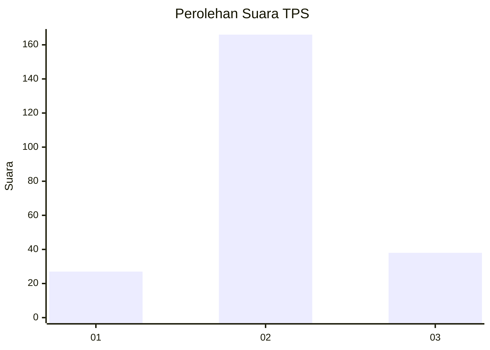
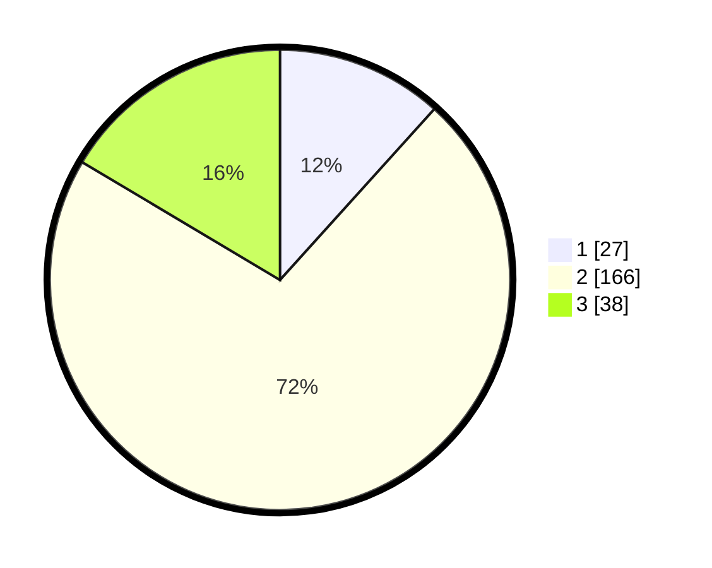

# Hasil

## Grafik

## Tabel

| No. | Nama Paslon    | Suara | Suara (raw) | Persentase |
|:--- |:-------------- | -----:| -----------:| ----------:|
| 1   | ANIES MUHAIMIN | 27    | [27][p-1]   | 11,69      |
| 2   | PRABOWO GIBRAN | 166   | [166][p-2]  | 71,86      |
| 3   | GANJAR MAHFUD  | 38    | [38][p-3]   | 16,45      |

[p-1]: https://github.com/gigit-pemilu/pemilu-2024-35-jawa-timur/blob/main/pilpres/hitung-suara/sub/35-jawa-timur/sub/14-pasuruan/sub/12-gempol/sub/2001-wonosunyo/sub/003-tps/sub/paslon-1.txt
[p-2]: https://github.com/gigit-pemilu/pemilu-2024-35-jawa-timur/blob/main/pilpres/hitung-suara/sub/35-jawa-timur/sub/14-pasuruan/sub/12-gempol/sub/2001-wonosunyo/sub/003-tps/sub/paslon-2.txt
[p-3]: https://github.com/gigit-pemilu/pemilu-2024-35-jawa-timur/blob/main/pilpres/hitung-suara/sub/35-jawa-timur/sub/14-pasuruan/sub/12-gempol/sub/2001-wonosunyo/sub/003-tps/sub/paslon-3.txt

## Foto C Plano

https://sirekap-obj-formc.kpu.go.id/7a1c/pemilu/ppwp/35/14/12/20/01/3514122001003-20240217-163103--c9db08da-6cbc-4985-8f80-406b68a98719.jpg

https://sirekap-obj-formc.kpu.go.id/7a1c/pemilu/ppwp/35/14/12/20/01/3514122001003-20240217-124345--a0912d86-e75f-40ca-867c-b8d84db7144a.jpg

https://sirekap-obj-formc.kpu.go.id/7a1c/pemilu/ppwp/35/14/12/20/01/3514122001003-20240217-124429--8426e2fd-a7e0-4121-8910-c481a525cc55.jpg

## Metadata

| Key        | Value               |
| ---------- | ------------------- |
| Time Stamp | 2024-02-19 06:16:00 |

