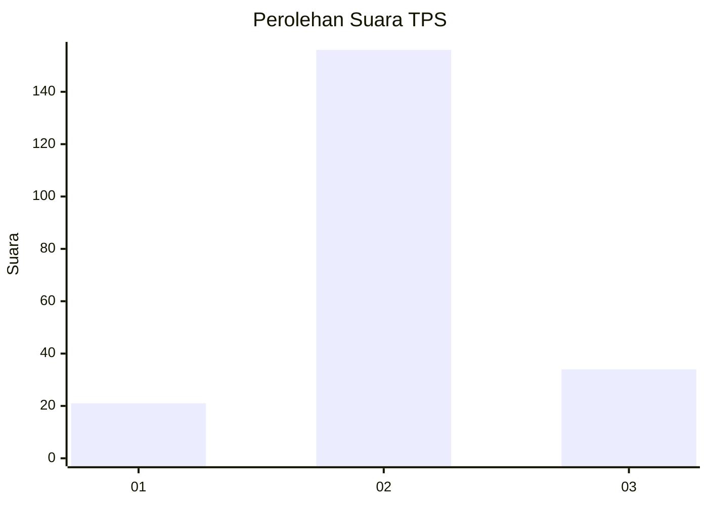
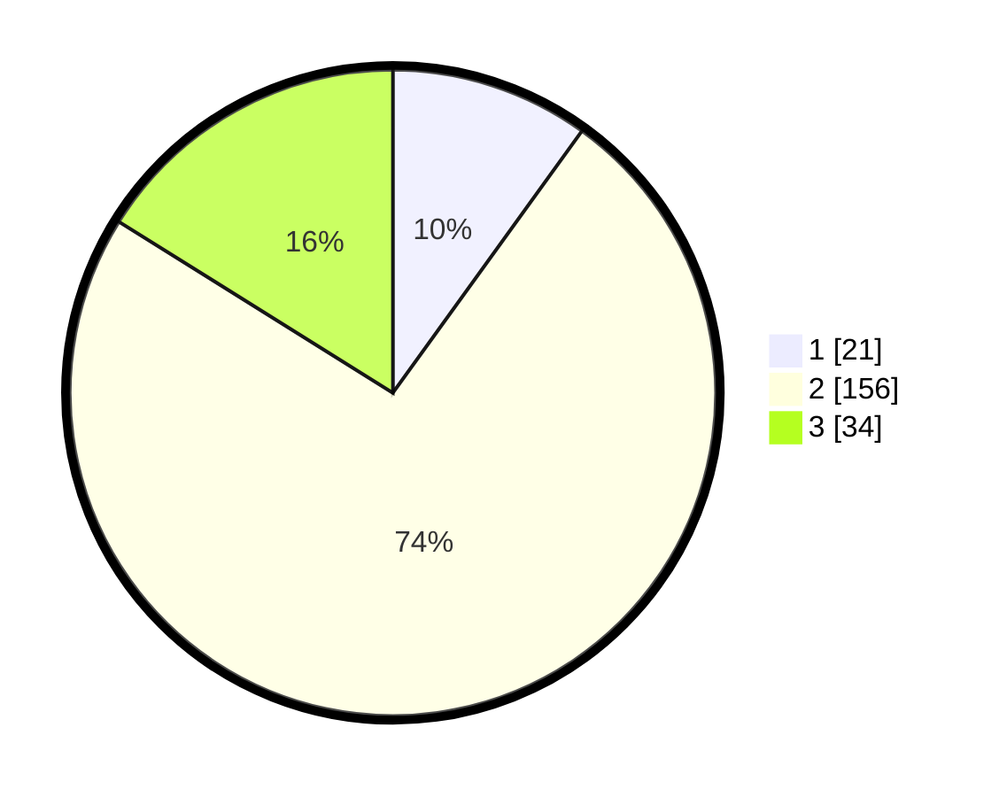

# Hasil

## Grafik

## Tabel

| No. | Nama Paslon    | Suara | Suara (raw) | Persentase |
|:--- |:-------------- | -----:| -----------:| ----------:|
| 1   | ANIES MUHAIMIN | 21    | [21][p-1]   | 9,95       |
| 2   | PRABOWO GIBRAN | 156   | [156][p-2]  | 73,93      |
| 3   | GANJAR MAHFUD  | 34    | [34][p-3]   | 16,11      |

[p-1]: https://github.com/gigit-pemilu/pemilu-2024-35-jawa-timur/blob/main/pilpres/hitung-suara/sub/35-jawa-timur/sub/14-pasuruan/sub/12-gempol/sub/2001-wonosunyo/sub/004-tps/sub/paslon-1.txt
[p-2]: https://github.com/gigit-pemilu/pemilu-2024-35-jawa-timur/blob/main/pilpres/hitung-suara/sub/35-jawa-timur/sub/14-pasuruan/sub/12-gempol/sub/2001-wonosunyo/sub/004-tps/sub/paslon-2.txt
[p-3]: https://github.com/gigit-pemilu/pemilu-2024-35-jawa-timur/blob/main/pilpres/hitung-suara/sub/35-jawa-timur/sub/14-pasuruan/sub/12-gempol/sub/2001-wonosunyo/sub/004-tps/sub/paslon-3.txt

## Foto C Plano

https://sirekap-obj-formc.kpu.go.id/ed03/pemilu/ppwp/35/14/12/20/01/3514122001004-20240216-115218--02d02eb9-c0f9-4974-a6ae-10a8adb44237.jpg

https://sirekap-obj-formc.kpu.go.id/ed03/pemilu/ppwp/35/14/12/20/01/3514122001004-20240216-115639--9c4c630a-e40e-41a7-8a13-04950196bc20.jpg

https://sirekap-obj-formc.kpu.go.id/ed03/pemilu/ppwp/35/14/12/20/01/3514122001004-20240216-121133--fdd2da1e-fff5-4731-9225-5aaf7469ffa6.jpg

## Metadata

| Key        | Value               |
| ---------- | ------------------- |
| Time Stamp | 2024-02-17 11:30:03 |

