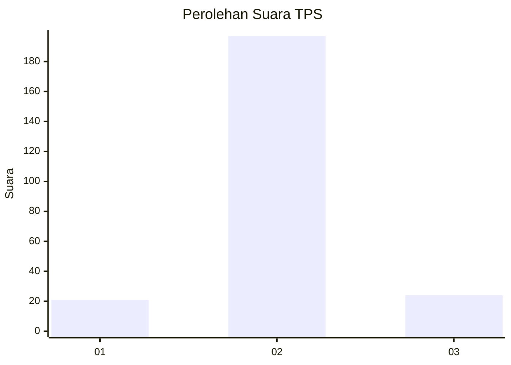
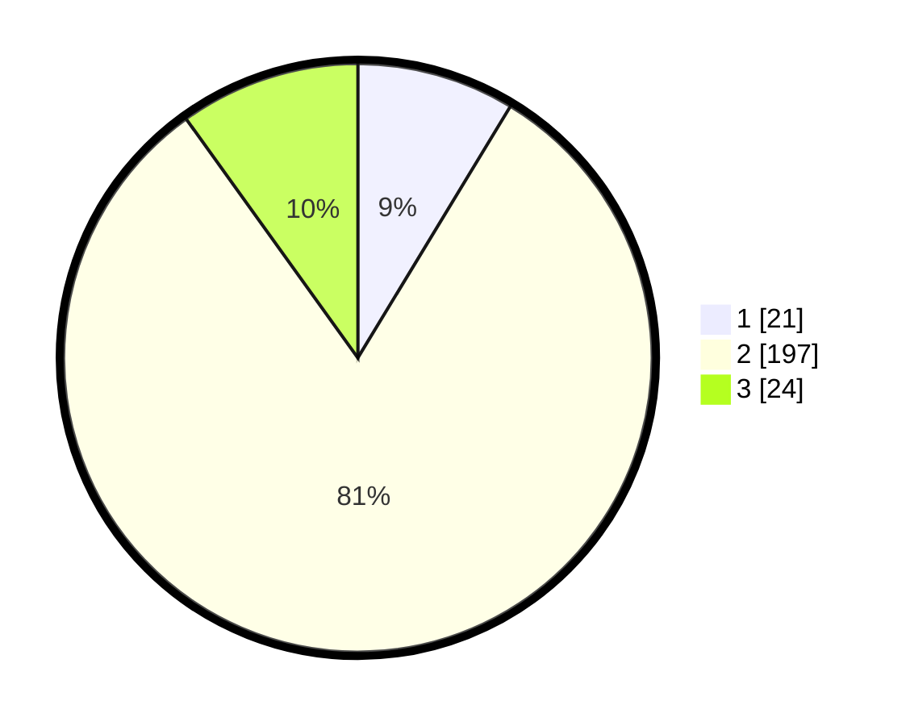

# Hasil

## Grafik

## Tabel

| No. | Nama Paslon    | Suara | Suara (raw) | Persentase |
|:--- |:-------------- | -----:| -----------:| ----------:|
| 1   | ANIES MUHAIMIN | 21    | [21][p-1]   | 8,68       |
| 2   | PRABOWO GIBRAN | 197   | [197][p-2]  | 81,40      |
| 3   | GANJAR MAHFUD  | 24    | [24][p-3]   | 9,92       |

[p-1]: https://github.com/gigit-pemilu/pemilu-2024/blob/main/pilpres/hitung-suara/sub/35-jawa-timur/sub/14-pasuruan/sub/12-gempol/sub/2006-ngerong/sub/003-tps/sub/paslon-1.txt
[p-2]: https://github.com/gigit-pemilu/pemilu-2024/blob/main/pilpres/hitung-suara/sub/35-jawa-timur/sub/14-pasuruan/sub/12-gempol/sub/2006-ngerong/sub/003-tps/sub/paslon-2.txt
[p-3]: https://github.com/gigit-pemilu/pemilu-2024/blob/main/pilpres/hitung-suara/sub/35-jawa-timur/sub/14-pasuruan/sub/12-gempol/sub/2006-ngerong/sub/003-tps/sub/paslon-3.txt

## Foto C Plano

https://sirekap-obj-formc.kpu.go.id/0ed7/pemilu/ppwp/35/14/12/20/06/3514122006003-20240215-190134--dd00d02e-f9e9-4847-ad24-beb09d583c82.jpg

https://sirekap-obj-formc.kpu.go.id/0ed7/pemilu/ppwp/35/14/12/20/06/3514122006003-20240216-082713--6aa05823-2a0d-4ea8-b055-d8efc36a577b.jpg

https://sirekap-obj-formc.kpu.go.id/0ed7/pemilu/ppwp/35/14/12/20/06/3514122006003-20240215-192320--9e79e2c2-0307-485b-867d-15f8b6430ede.jpg

## Metadata

| Key        | Value               |
| ---------- | ------------------- |
| Time Stamp | 2024-02-16 08:30:27 |

