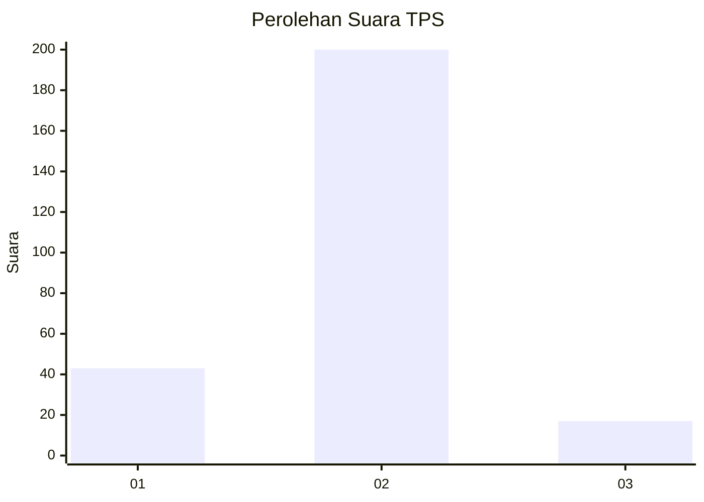
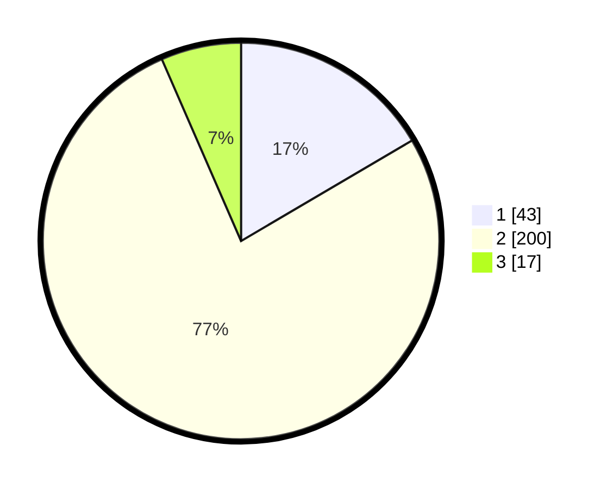

# Hasil

## Grafik

## Tabel

| No. | Nama Paslon    | Suara | Suara (raw) | Persentase |
|:--- |:-------------- | -----:| -----------:| ----------:|
| 1   | ANIES MUHAIMIN | 43    | [43][p-1]   | 16,54      |
| 2   | PRABOWO GIBRAN | 200   | [200][p-2]  | 76,92      |
| 3   | GANJAR MAHFUD  | 17    | [17][p-3]   | 6,54       |

[p-1]: https://github.com/gigit-pemilu/pemilu-2024/blob/main/pilpres/hitung-suara/sub/35-jawa-timur/sub/14-pasuruan/sub/12-gempol/sub/2006-ngerong/sub/019-tps/sub/paslon-1.txt
[p-2]: https://github.com/gigit-pemilu/pemilu-2024/blob/main/pilpres/hitung-suara/sub/35-jawa-timur/sub/14-pasuruan/sub/12-gempol/sub/2006-ngerong/sub/019-tps/sub/paslon-2.txt
[p-3]: https://github.com/gigit-pemilu/pemilu-2024/blob/main/pilpres/hitung-suara/sub/35-jawa-timur/sub/14-pasuruan/sub/12-gempol/sub/2006-ngerong/sub/019-tps/sub/paslon-3.txt

## Foto C Plano

https://sirekap-obj-formc.kpu.go.id/714a/pemilu/ppwp/35/14/12/20/06/3514122006019-20240218-103613--38809789-fe4f-453e-8380-be76501a0c6e.jpg

https://sirekap-obj-formc.kpu.go.id/714a/pemilu/ppwp/35/14/12/20/06/3514122006019-20240218-110541--3af78781-1a98-4d03-8823-45a3dd7a33c2.jpg

https://sirekap-obj-formc.kpu.go.id/714a/pemilu/ppwp/35/14/12/20/06/3514122006019-20240216-101218--d15858f0-f9b2-4b4c-9d7c-6d2342b29dee.jpg

## Metadata

| Key        | Value               |
| ---------- | ------------------- |
| Time Stamp | 2024-02-19 06:16:00 |

