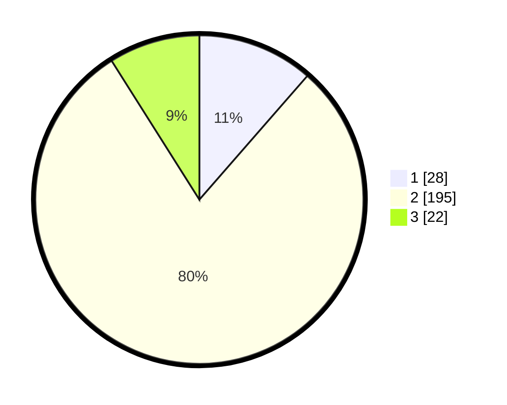

# Hasil

## Grafik

## Tabel

| No. | Nama Paslon    | Suara | Suara (raw) | Persentase |
|:--- |:-------------- | -----:| -----------:| ----------:|
| 1   | ANIES MUHAIMIN | 28    | [28][p-1]   | 11,43      |
| 2   | PRABOWO GIBRAN | 195   | [195][p-2]  | 79,59      |
| 3   | GANJAR MAHFUD  | 22    | [22][p-3]   | 8,98       |

[p-1]: https://github.com/gigit-pemilu/pemilu-2024-35-jawa-timur/blob/main/pilpres/hitung-suara/sub/35-jawa-timur/sub/14-pasuruan/sub/12-gempol/sub/2008-bulusari/sub/002-tps/sub/paslon-1.txt
[p-2]: https://github.com/gigit-pemilu/pemilu-2024-35-jawa-timur/blob/main/pilpres/hitung-suara/sub/35-jawa-timur/sub/14-pasuruan/sub/12-gempol/sub/2008-bulusari/sub/002-tps/sub/paslon-2.txt
[p-3]: https://github.com/gigit-pemilu/pemilu-2024-35-jawa-timur/blob/main/pilpres/hitung-suara/sub/35-jawa-timur/sub/14-pasuruan/sub/12-gempol/sub/2008-bulusari/sub/002-tps/sub/paslon-3.txt

## Foto C Plano

https://sirekap-obj-formc.kpu.go.id/151d/pemilu/ppwp/35/14/12/20/08/3514122008002-20240214-211404--caac1b57-1508-420c-a1df-bdc06636e32b.jpg

https://sirekap-obj-formc.kpu.go.id/151d/pemilu/ppwp/35/14/12/20/08/3514122008002-20240214-223914--5ed2f4e5-7637-4028-b577-5355a485f2fb.jpg

https://sirekap-obj-formc.kpu.go.id/151d/pemilu/ppwp/35/14/12/20/08/3514122008002-20240214-211626--9d851251-db77-468b-9f7d-94532d0d0a87.jpg

## Metadata

| Key        | Value               |
| ---------- | ------------------- |
| Time Stamp | 2024-02-15 16:00:26 |

