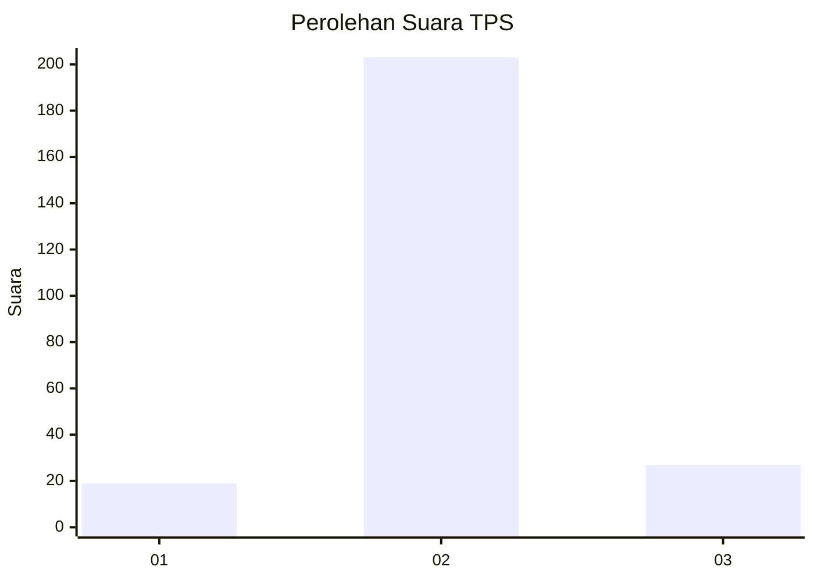
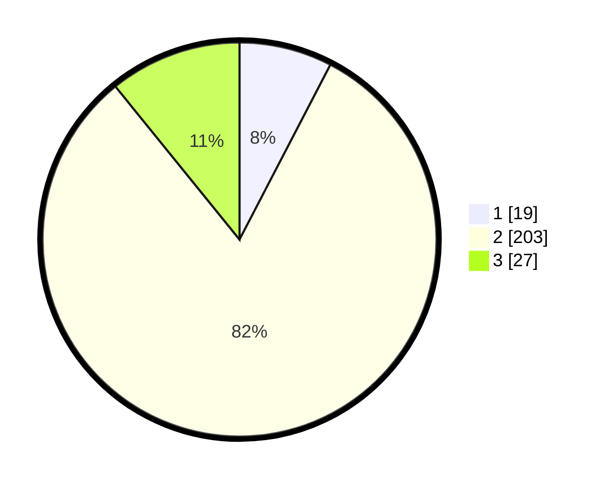

# Hasil

## Grafik

## Tabel

| No. | Nama Paslon    | Suara | Suara (raw) | Persentase |
|:--- |:-------------- | -----:| -----------:| ----------:|
| 1   | ANIES MUHAIMIN | 19    | [19][p-1]   | 7,63       |
| 2   | PRABOWO GIBRAN | 203   | [203][p-2]  | 81,53      |
| 3   | GANJAR MAHFUD  | 27    | [27][p-3]   | 10,84      |

[p-1]: https://github.com/gigit-pemilu/pemilu-2024/blob/main/pilpres/hitung-suara/sub/35-jawa-timur/sub/14-pasuruan/sub/12-gempol/sub/2010-watukosek/sub/010-tps/sub/paslon-1.txt
[p-2]: https://github.com/gigit-pemilu/pemilu-2024/blob/main/pilpres/hitung-suara/sub/35-jawa-timur/sub/14-pasuruan/sub/12-gempol/sub/2010-watukosek/sub/010-tps/sub/paslon-2.txt
[p-3]: https://github.com/gigit-pemilu/pemilu-2024/blob/main/pilpres/hitung-suara/sub/35-jawa-timur/sub/14-pasuruan/sub/12-gempol/sub/2010-watukosek/sub/010-tps/sub/paslon-3.txt

## Foto C Plano

https://sirekap-obj-formc.kpu.go.id/e131/pemilu/ppwp/35/14/12/20/10/3514122010010-20240217-175427--b35ded9c-d056-4896-8185-d5b08eb2003c.jpg

https://sirekap-obj-formc.kpu.go.id/e131/pemilu/ppwp/35/14/12/20/10/3514122010010-20240217-132303--cdf7627f-fb19-4579-8e0b-e0a577c971e6.jpg

https://sirekap-obj-formc.kpu.go.id/e131/pemilu/ppwp/35/14/12/20/10/3514122010010-20240217-174400--b0d7c462-1e8c-4b81-aed9-c8e13e5edcc2.jpg

## Metadata

| Key        | Value               |
| ---------- | ------------------- |
| Time Stamp | 2024-02-20 07:00:00 |

