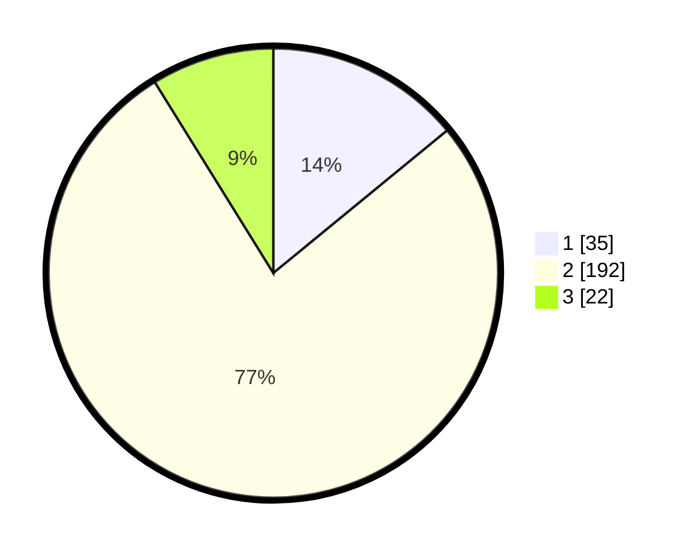

# Hasil

## Grafik

## Tabel

| No. | Nama Paslon    | Suara | Suara (raw) | Persentase |
|:--- |:-------------- | -----:| -----------:| ----------:|
| 1   | ANIES MUHAIMIN | 35    | [35][p-1]   | 14,06      |
| 2   | PRABOWO GIBRAN | 192   | [192][p-2]  | 77,11      |
| 3   | GANJAR MAHFUD  | 22    | [22][p-3]   | 8,84       |

[p-1]: https://github.com/gigit-pemilu/pemilu-2024/blob/main/pilpres/hitung-suara/sub/35-jawa-timur/sub/14-pasuruan/sub/12-gempol/sub/2012-kejapanan/sub/005-tps/sub/paslon-1.txt
[p-2]: https://github.com/gigit-pemilu/pemilu-2024/blob/main/pilpres/hitung-suara/sub/35-jawa-timur/sub/14-pasuruan/sub/12-gempol/sub/2012-kejapanan/sub/005-tps/sub/paslon-2.txt
[p-3]: https://github.com/gigit-pemilu/pemilu-2024/blob/main/pilpres/hitung-suara/sub/35-jawa-timur/sub/14-pasuruan/sub/12-gempol/sub/2012-kejapanan/sub/005-tps/sub/paslon-3.txt

## Foto C Plano

https://sirekap-obj-formc.kpu.go.id/07e7/pemilu/ppwp/35/14/12/20/12/3514122012005-20240218-215129--80845ff7-627d-42ab-a291-f2dfb6a08efb.jpg

https://sirekap-obj-formc.kpu.go.id/07e7/pemilu/ppwp/35/14/12/20/12/3514122012005-20240218-230338--6c706039-c3e7-4dc7-be43-500350a1399a.jpg

https://sirekap-obj-formc.kpu.go.id/07e7/pemilu/ppwp/35/14/12/20/12/3514122012005-20240218-215450--d97ca0fb-3abd-4af3-be12-e1c3715457b2.jpg

## Metadata

| Key        | Value               |
| ---------- | ------------------- |
| Time Stamp | 2024-02-19 17:00:00 |

